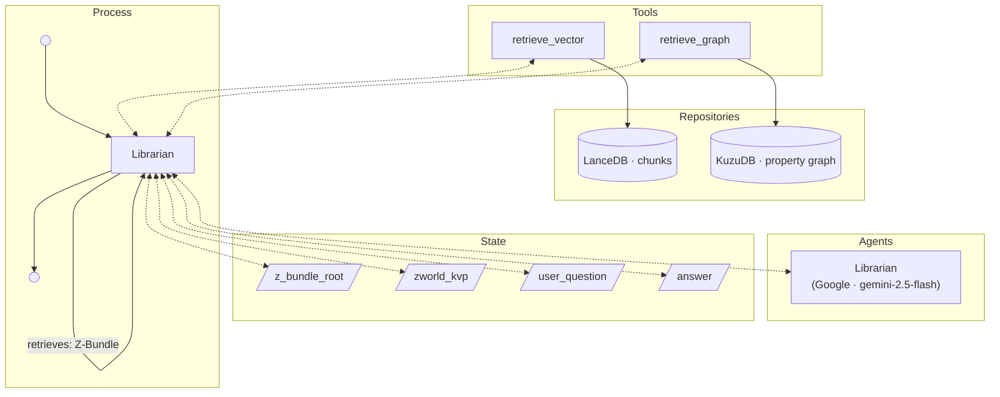

# Ask About World Process
The following [Process](Processes.md) answers a user's question about a specific [Z-World](Z-World.md) using a single Librarian agent with Agentic RAG over the world's Z-Bundle. It is invoked from the [World Details screen](User%20Experience.md#world-details-screen).



## Input
- `z_bundle_root`: the file-system path to the world's Z-Bundle root directory (used to open the vector store and property graph)
- `zworld_kvp`: the full KVP JSON object for the Z-World (used in the secondary system prompt)
- `user_question`: the raw user text submitted from the World Details screen

## Agents

### Librarian
A single LLM call that answers questions about the fictional world. The Librarian receives a single system prompt (the primary prompt followed by the world context) and the user question, and may invoke the retriever tools zero or more times before producing its final plain-text answer.

#### System Prompt (authoritative)
> You are a reference librarian for a library of interactive fiction worlds. You will receive a JSON document describing a fictional world, e.g. title and brief summary. You will have access to vector and graph databases to provide more information. You will be asked a question about this world and will provide a clear and simple plain-text answer. This will typically be 1-3 sentences, though longer responses are acceptable for complex questions.

#### User Prompt (authoritative)
The world context and user question are combined into a single `HumanMessage`:

> The following is a description of the fictional world about which you will answer questions.
>
> {zworld_kvp serialised as a JSON string}
>
> Question: {user_question}

## Output
`answer`: a plain-text string (typically 1–3 sentences; longer for complex questions) placed directly into the answer area of the World Details screen.

## Implementation
- **Process slug:** `ask_about_world`
- **Librarian node slug:** `librarian`
- **Default provider:** Google
- **Default model:** `gemini-2.5-flash`
- **Graph file:** `src/zforge/graphs/ask_about_world_graph.py`
- The Librarian agent follows the [LangGraph tool call pattern](Processes.md#langgraph-tool-call-pattern): it calls `model.bind_tools([retrieve_vector, retrieve_graph]).invoke(messages)` directly and loops until the model emits no further tool calls, then writes `answer` from the final message content.
- The system prompt is a single `SystemMessage` containing only the behavioural instruction. The world context JSON is placed in the `HumanMessage`, prepended to the question. See pitfall below regarding JSON in the system prompt on Groq/Llama models.
- **`retrieve_vector`** performs a semantic similarity search over the LanceDB `chunks` table (local embedding via llama.cpp).
- **`retrieve_graph`** is produced by `graph_utils.make_retrieve_graph_tool(z_bundle_root)` and has two branches:
  - **Cypher branch** — if the query starts with `MATCH`, `WITH`, `CALL`, `OPTIONAL`, or `UNWIND`, it is executed directly via `KuzuGraph.query()`. On error or empty results the schema is appended.
  - **Keyword branch** — otherwise the query is matched case-insensitively against the `id` property of every standard entity node table (`Character`, `Location`, `Faction`, `Event`, `Occupation`, `Species`, `Concept`, `Artifact`, `Prophecy`, `Era`, `Culture`, `Deity`, `Trope`, `Mechanic`). For every hit, one hop of outgoing and incoming relationships is expanded (Chunk nodes excluded), returning relationship type, neighbour type, and neighbour id. The schema is only returned when no entities are found.
- The same shared `make_retrieve_graph_tool` factory is used by the Summarizer node in [World Generation](World%20Generation.md).
- The process is registered in `src/zforge/models/process_config.py` under `ask_about_world` / `librarian`.
- The UI entry point is `WorldDetailsScreen` ([src/zforge/ui/screens/world_details_screen.py](../src/zforge/ui/screens/world_details_screen.py)), which calls `ZWorldManager.ask(slug, question)` and writes the returned string to the answer area.

### Pitfall: World JSON in the system prompt causes malformed tool calls on Groq/Llama models
Embedding variable JSON content (such as `zworld_kvp`) in the system prompt for `llama-3.3-70b-versatile` (and related Llama models) via Groq causes the model to generate tool calls in a broken format:
```
<function=retrieve_vector{"query": "…"}</function>
```
Note the missing `>` delimiter. Groq rejects this with HTTP 400 `tool_use_failed`. The underlying cause is that Groq's server-side Llama chat template embeds tool definitions using `<function=name>` delimiters; any `<` or `>` characters present in the system turn (common in world text containing arrows, comparisons, or HTML) corrupt the template tokenisation.

**The correct pattern** is to keep the system prompt to plain, static behavioural instructions only, and place any variable data (including the world context JSON) in the `HumanMessage`. This applies to any Groq-hosted Llama model.

### Pitfall: `response.content` is a list for thinking-capable models
Models with reasoning/thinking capabilities — including **Gemini 2.5 Flash** (Google) and Anthropic extended-thinking models — return `response.content` as a **list of typed content-block dicts** rather than a plain string. Example:
```json
[{"type": "text", "text": "The answer text.", "extras": {"signature": "..."}}]
```
The `extras.signature` is a model-generated thinking-token signature appended by the connector. Calling `str()` on the list produces the Python `repr` of the list rather than the answer text.

**The correct pattern** is to use `graph_utils.extract_text_content(response.content)`, which handles both the plain-string case (non-thinking models) and the list-of-blocks case by concatenating all `{"type": "text"}` blocks and silently dropping thinking blocks. This helper is also applied to the Summarizer node in [World Generation](World%20Generation.md) (`world_creation_graph.py` line ~245) for the same reason.

