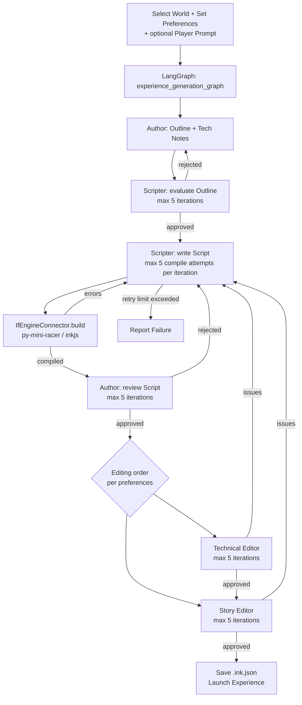

# Z-Forge Data and File Specifications

This document describes Z-Forge's data formats and file types. For workflow details, see the linked spec documents.

## File Types

| Extension | Format | Description |
|-----------|--------|-------------|
| `.zworld` | JSON | A ZWorld specification. See [ZWorld.md](ZWorld.md) for full schema. |
| `.ink.json` | JSON | A compiled ink experience, produced by `IfEngineConnector.build()`. |
| `.save` | bytes | Serialized playthrough state from `IfEngineConnector.save_state()`. Stored at `{experienceFolderPath}/{zworld.id}/{experience-name}.save`. |
| `zforge_config.json` | JSON | User configuration (preferences, storage paths). Stored in `platformdirs.user_config_dir("zforge")`. See `ZForgeConfig` below. |

Credentials (LLM API keys) are not stored as files — they are held in the platform keychain via `keyring`. See [LLM Abstraction Layer](LLM%20Abstraction%20Layer.md).

## ZForgeConfig Fields
Persisted as JSON via [`platformdirs`](https://pypi.org/project/platformdirs/):
- `zworld_folder`: str — path to ZWorld storage (`~/zforge/worlds/` by default on Mac/PC; application storage on mobile)
- `experience_folder`: str — path to experience storage (`~/zforge/experiences/` by default on Mac/PC; application storage on mobile)
- `default_if_engine`: str — active IF engine name (e.g. `"ink"`)
- `preferences`: dict — player preferences (see [Player Preferences](Player%20Preferences.md))

## ZForgeSecureConfig
Held in the platform keychain via `keyring` (service name `"zforge"`). Contains a dict of connector-name → credential key/value pairs. See [LLM Abstraction Layer](LLM%20Abstraction%20Layer.md).

## World Creation Workflow
- **Input:** Plain-text world description (direct entry or imported from Word/PDF)
- **Process:** LangGraph `world_creation_graph` — LLM validates input, then generates a ZWorld via `@tool` functions (max 5 validation attempts)
- **Output:** `.zworld` JSON file saved by `ZWorldManager`
- **Full spec:** [World Generation](World%20Generation.md)

## Player Preferences
Defined in [Player Preferences](Player%20Preferences.md). Stored as part of `ZForgeConfig`.

## Experience Generation & Game Flow

- **Step details:**
  1. User selects a ZWorld, reviews/adjusts preferences, and optionally enters a player prompt
  2. `ZForgeManager` constructs and runs `experience_generation_graph` via LangGraph
  3. A team of LLM agents collaborates: Author, Scripter, Technical Editor, Story Editor
  4. The Scripter's script is validated at each submission by `IfEngineConnector.build()` (ink compiled via `py-mini-racer`/inkjs)
  5. Each feedback loop has a maximum of 5 iterations; exhausting any limit sets `status = "failed"`
  6. On success, the compiled `.ink.json` is saved and the experience launches automatically
- **Full spec:** [Experience Generation](Experience%20Generation.md)

## Error Handling
- All retry loops are capped at **5 attempts**
- On exhausting retries, `status` is set to `"failed"` with a `failure_reason` explaining which step failed and why
- The UI displays the `failure_reason` and allows the user to edit their prompt/world and retry
- LLM call failures use exponential backoff (3 attempts) before setting `status = "failed"`

## Extensibility & Future Directions
- **World Format:** Custom fields (e.g. magic systems, technology levels)
- **Preferences:** More nuanced sliders (humor, darkness, pacing); Ultima-style onboarding quiz
- **Game Output:** Images, sound, and multimedia in ink
- **LLM Integration:** Additional pluggable `LlmConnector` implementations (Anthropic, Gemini, local models)
- **IF Engines:** Inform 7, TADS 3, Twine/Twee (see [IF Engine Abstraction Layer](IF%20Engine%20Abstraction%20Layer.md))

---

For more details, see the main [README.md](../README.md).
