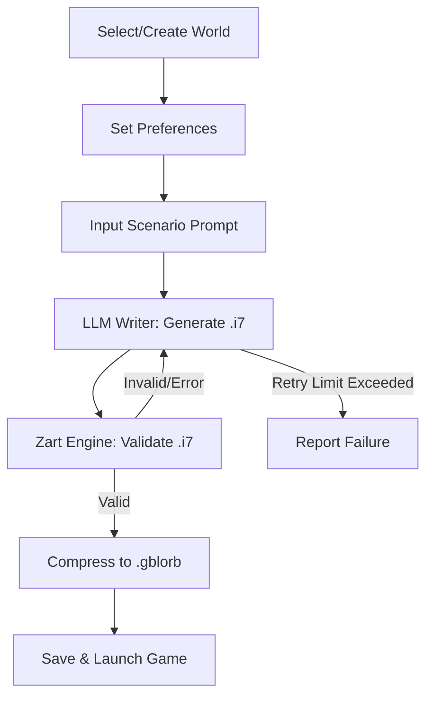

# Z-Forge Specification

## 1. Z-Forge World Format (.zworld)
A Z-Forge World specification, recorded in JSON format with the .zworld extension, includes the following details:
- Name, e.g. "Discworld"
- Locations, which can be indicated at nested levels of granularity
- Characters, who have a text id (to allow for unambiguous cross-reference), one or more Names, with each having a Context in the form of a brief free-text description in the case of multiple names, a History
- Relationships, which describe the personal history and current social/professional/emotional relationships between two characters, identified by their text ids
- Events, which are descriptions of significant occurrences within this World that greatly affected Characters and/or Locations; each has a "Date", though this can be a literal date according to an in-world numeric calendar or a description of approximate time relative to other events

### 1.1. Sample World JSON Schema
```json
{
  "name": "Discworld",
  "locations": [
    {
      "id": "ankh-morpork",
      "name": "Ankh-Morpork",
      "description": "A bustling, grimy city at the heart of Discworld.",
      "sublocations": [
        { "id": "bank", "name": "Royal Bank of Ankh-Morpork", "description": "The city bank." }
      ]
    }
  ],
  "characters": [
    {
      "id": "moist",
      "names": [
        { "name": "Moist von Lipwig", "context": "Birth name; used once again following his forced retirement from a life of crime." }, { "name": "Albert Spangler", "context": "Alias from a multi-year career as a conman." }
      ],
      "history": "A conman turned civil servant, Moist Von Lipwig is both the Postmaster General of Ankh-Morpork and chairman of its bank."
    }, 
    {
      "id": "vetinari",
      "names": [
        { "name": "Havelock Vetinari" }
      ],
      "history": "Patrician of the city of Ankh-Morpork, Havelock Vetinari is famed for his intelligence and his calculating manner. Vetinari's cold demeanor and occasionally brutal methods belie his powerful drive to uplift his society and ensure the safety of his city and its people."
    }
  ],
  "relationships": [
        { "character_a_id": "moist", "character_b_id": "vetinari", "description": "When Moist was scheduled to be hanged for his crimes, Vetinari arranged for his hanging to be faked and pressed him into service under his real name (unknown at the time in Ankh-Morpork) as Postmaster General. Moist's massive success in this endeavor led Vetinari to leverage him further as chairman of the bank. Moist reports directly to Vetinari in both roles. Due to Moist's criminal past, Vetinari leaves their relationship and Moist's safety intentionally tenuous despite his obvious admiration of Moist's unique skillset." }
      ],
  "events": [
    {
      "description": "The gold goes missing from the bank vault.",
      "date": "Year of the Prawn, 12th day" // or relative: "Shortly after Moist's appointment"
    }
  ]
}
```
- All fields are required unless otherwise specified.
- `locations` can be nested arbitrarily.

## 2. World Creation Workflow
- **Input:** Plain-text world description (user or external source)
- **Process:** LLM parses and generates .zworld JSON
- **Output:** Structured .zworld file
- **Use Case:** Bootstrapping from summaries, e.g. Wikipedia

## 3. User Preferences
- Set directly or via quiz (Ultima "Virtues" style)
- **Preference Fields:**
  - `focus`: "plot" | "character" | "balanced"
  - `challenge_level`: integer (1-5)
  - `genre`: string (optional)
  - `mood`: string (optional)
- **Quiz:**
  - Shown on first launch
  - Can be skipped for manual setup
  - Example question: "Do you prefer solving puzzles or exploring character motivations?"

## 4. Scenario Generation & Game Flow



- **Step Details:**
  1. User selects or creates a World (.zworld)
  2. User sets preferences (direct or quiz)
  3. User provides scenario prompt (situation, genre, mood)
  4. LLM Writer receives:
     - World file
     - ZWorld and Inform format descriptions
     - User preferences
  5. Writer generates .i7 file (5-15 rooms)
  6. Zart engine validates .i7
     - If invalid, error is sent to Writer for repair (up to 10 times)
  7. Valid .i7 is compressed to .gblorb and saved
  8. Game starts automatically (default)

## 6. Error Handling & Agentic Flow
- LLM Writer is prompted with error details if .i7 is invalid
- Retry up to 10 times, with error context each time
- On repeated failure, user is notified and can:
  - Edit prompt
  - Edit world
  - Retry

## 7. Extensibility & Future Directions
- **World Format:**
  - Allow for custom fields (e.g. magic systems, technology levels)
- **Preferences:**
  - Add more nuanced sliders (e.g. humor, darkness, pacing)
- **Game Output:**
  - Support for images, sound, and multimedia in Glulx
- **LLM Integration:**
  - Pluggable LLM backends
  - Fine-tuning for specific genres or worlds

---

For more details, see the main [README.md](../README.md).
