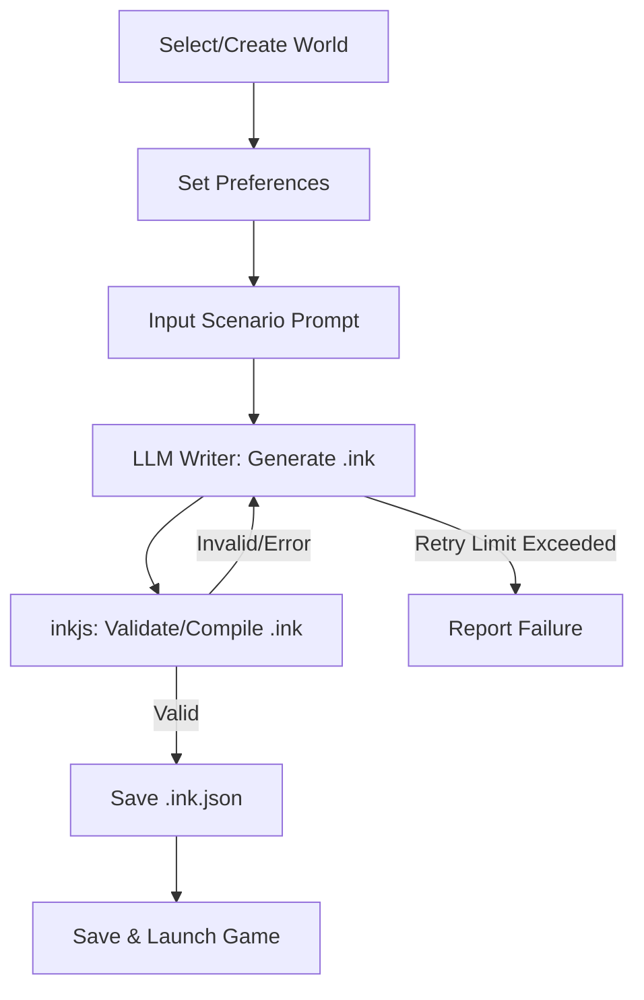

# Z-Forge Specification

## 2. World Creation Workflow
- **Input:** Plain-text world description (user or external source)
- **Process:** LLM parses and generates .zworld JSON
- **Output:** Structured .zworld file
- **Use Case:** Bootstrapping from summaries, e.g. Wikipedia

## 3. User Preferences
Player preferences are defined in [Player Preferences](Player%20Preferences.md).

## 4. Scenario Generation & Game Flow

- **Step Details:**
  1. User selects or creates a World (.zworld)
  2. User sets preferences (direct or quiz)
  3. User provides scenario prompt (situation, genre, mood)
  4. LLM Writer receives:
     - World file
     - ZWorld and ink format descriptions
     - User preferences
  5. Writer generates .ink script
  6. inkjs compiler validates .ink
     - If invalid, error is sent to Writer for repair (up to 10 times)
  7. Valid .ink is compiled to .ink.json and saved
  8. Game starts automatically (default)

## 6. Error Handling & Agentic Flow
- LLM Writer is prompted with error details if .ink is invalid
- Retry up to 10 times, with error context each time
- On repeated failure, user is notified and can:
  - Edit prompt
  - Edit world
  - Retry

## 7. Extensibility & Future Directions
- **World Format:**
  - Allow for custom fields (e.g. magic systems, technology levels)
- **Preferences:**
  - Add more nuanced sliders (e.g. humor, darkness, pacing)
- **Game Output:**
  - Support for images, sound, and multimedia in ink
- **LLM Integration:**
  - Pluggable LLM backends
  - Fine-tuning for specific genres or worlds

---

For more details, see the main [README.md](../README.md).
