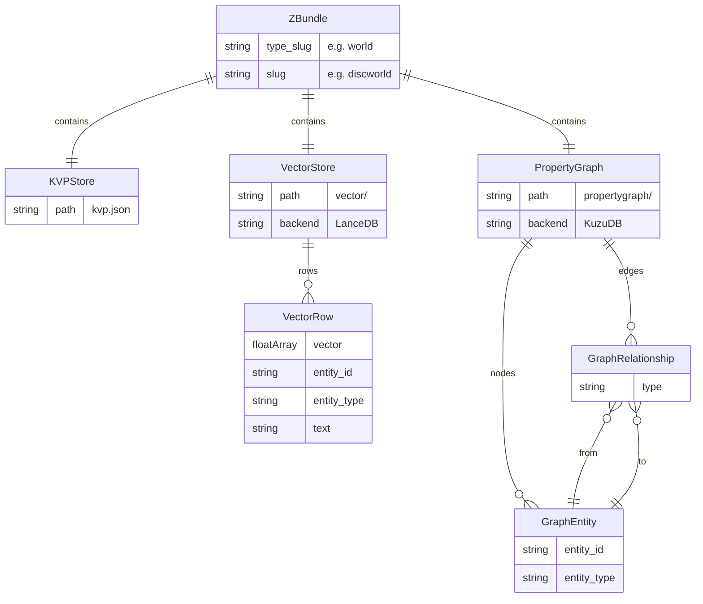
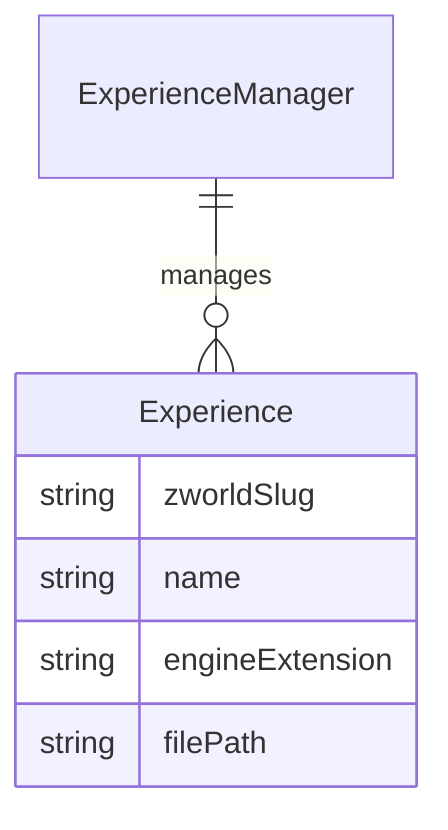
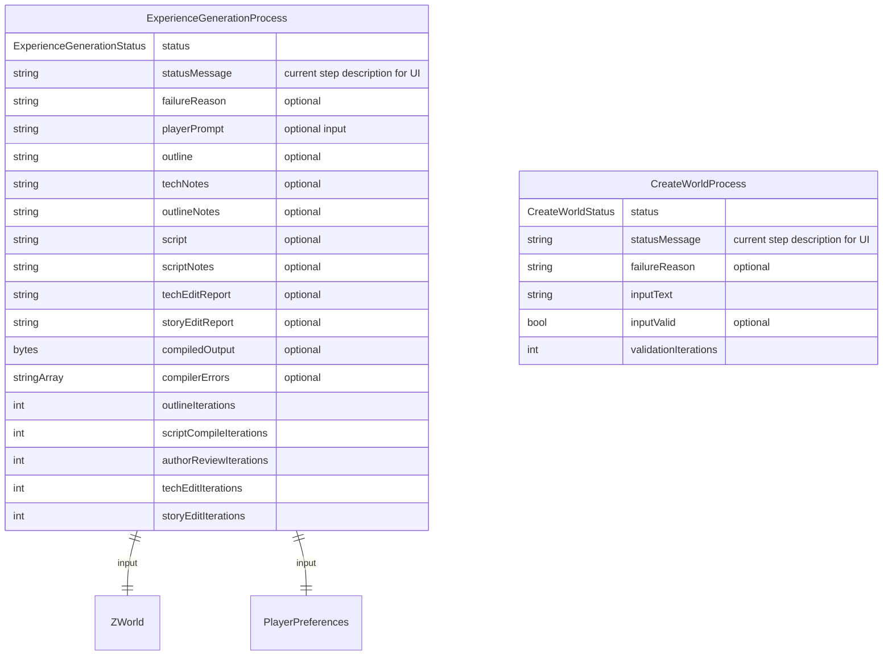

# Z-Forge Data Model ER Diagram

All persistent data models used by Z-Forge. Implemented across `src/zforge/models/`.

```mermaid
erDiagram
    ZWorld {
        string title
        string slug
        string uuid
        string summary
        string setting_era "optional"
        stringList source_canon "optional"
        stringList content_advisories "optional"
    }
    Character {
        string id
        string history
    }
    CharacterName {
        string name
        string context "optional"
    }
    Location {
        string id
        string name
        string description
    }
    Event {
        string description
        string time
    }
    Faction {
        string id
        string name
        string description
    }
    Artifact {
        string id
        string name
        string description
    }
    Era {
        string id
        string name
        string description
    }
    Culture {
        string id
        string name
        string description
    }
    Deity {
        string id
        string name
        string description
    }
    Prophecy {
        string id
        string name
        string text
    }
    Concept {
        string id
        string name
        string description
    }
    Mechanic {
        string text
    }
    Trope {
        string text
    }
    Species {
        string text
    }
    Occupation {
        string text
    }
    Relationship {
        string from_id
        string to_id
        string type
    }
    ZBundleKVP {
        string title
        string slug
        string uuid
        string summary
        string setting_era "optional"
        string embedding_model_name
        int embedding_model_size_bytes
    }
    ZForgeConfig {
        string bundlesRoot "optional; desktop only"
        string experienceFolderPath "optional; desktop only"
        string chatModelPath "relative to sandboxed storage"
        int chatContextSize "default 512"
        int chatGpuLayers "default 0"
        string embeddingModelPath "relative to sandboxed storage"
        int embeddingContextSize "default 512"
        int embeddingGpuLayers "default 0"
    }
    PlayerPreferences {
        int    characterToPlot      "1-10; 1=character, 10=plot; default 5"
        int    narrativeToDialog    "1-10; 1=narrative, 10=dialog; default 5"
        int    puzzleComplexity     "1-10; default 5"
        int    levity               "1-10; 1=somber, 10=comedic; default 5"
        string generalPreferences   "optional free text"
        int    logicalVsMood        "1-10; 1=mood priority, 10=logic priority; default 5"
    }
    ModelCatalogueEntry {
        string role "chat or embedding"
        string displayName
        string hfRepo "Hugging Face repo"
        string filename "GGUF filename"
        int sizeBytesApprox
        bool isDefault
    }
    LlmNodeConfig {
        string processSlug
        string nodeSlug
        string provider
        string model
    }

    ZForgeConfig ||--|| PlayerPreferences       : "contains"
    ZForgeConfig ||--o{ LlmNodeConfig           : "maps per-node settings"
    ZWorld       ||--o{ Character               : "has"
    ZWorld       ||--o{ Location                : "has"
    ZWorld       ||--o{ Event                   : "has"
    ZWorld       ||--o{ Faction                 : "has"
    ZWorld       ||--o{ Artifact                : "has"
    ZWorld       ||--o{ Era                     : "has"
    ZWorld       ||--o{ Culture                 : "has"
    ZWorld       ||--o{ Deity                   : "has"
    ZWorld       ||--o{ Prophecy                : "has"
    ZWorld       ||--o{ Concept                 : "has"
    ZWorld       ||--o{ Mechanic                : "has"
    ZWorld       ||--o{ Trope                   : "has"
    ZWorld       ||--o{ Species                 : "has"
    ZWorld       ||--o{ Occupation              : "has"
    ZWorld       ||--o{ Relationship            : "has"
    Location     ||--o{ Location                : "sublocations"
    Character    ||--o{ CharacterName           : "has"
    ZWorld       ||--|| ZBundleKVP              : "persisted as"
```

## Z-Bundle Storage

Z-Worlds are persisted as Z-Bundles at `bundles/world/{slug}/`:
- `kvp.json` — key-value metadata (title, slug, UUID, summary, embedding model identity)
- `vector/` — LanceDB vector store (entity embeddings with entity_id, entity_type, text columns)
- `propertygraph/` — KùzuDB property graph (Entity nodes + Relationship edges)

## Runtime / Service Models

These models are created and managed by services at runtime. See the corresponding source files for details.

## Transitory Process Models

Process objects are not persisted but track multi-step LLM workflows. See [Managers, Processes, and MCP Server](Managers,%20Processes,%20and%20MCP%20Server.md) for tool implementation guidelines.

## Notes
- Z-Worlds are stored as Z-Bundles under `bundles/world/{slug}/` by `ZWorldManager` (`src/zforge/managers/zworld_manager.py`).
- `Experience` objects are managed by `ExperienceManager` (`src/zforge/managers/experience_manager.py`), stored as compiled `.ink.json` files under the experience folder.
- `ZForgeConfig` is persisted via `ConfigService` (`src/zforge/services/config_service.py`) using `platformdirs` JSON file storage.
- `ModelCatalogueEntry` entries are defined in `src/zforge/models/model_catalogue.py` (static catalogue, not persisted).
- `ModelDownloadService` (`src/zforge/services/model_download_service.py`) streams GGUF files from Hugging Face CDN.
- `ExperienceGenerationState` (`src/zforge/graphs/state.py`) is the LangGraph TypedDict that drives the multi-agent LLM workflow for experience creation.
- `CreateWorldState` (`src/zforge/graphs/state.py`) is the LangGraph TypedDict that drives the LLM workflow for world creation.
- IF engine abstraction: `IfEngineConnector` (`src/zforge/services/if_engine/if_engine_connector.py`) with ink implementation (`src/zforge/services/if_engine/ink_engine_connector.py`).
- Embedding abstraction: `EmbeddingConnector` (`src/zforge/services/embedding/embedding_connector.py`) with llama.cpp implementation (`src/zforge/services/embedding/llama_cpp_embedding_connector.py`).
- LLM abstraction: `LlmConnector` (`src/zforge/services/llm/llm_connector.py`) with local llama.cpp implementation (`src/zforge/services/llm/llama_cpp_connector.py`). No cloud LLM providers are used.
