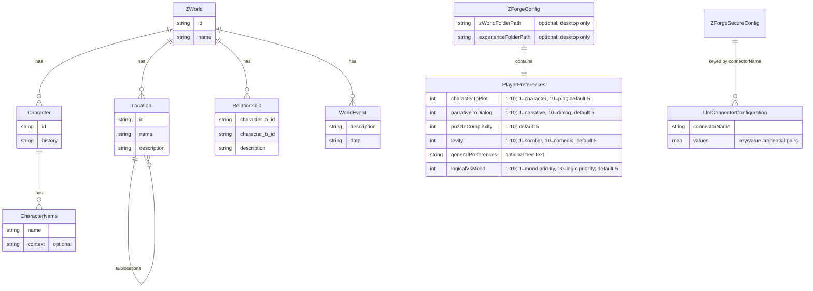
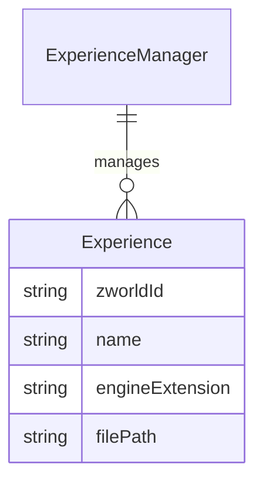
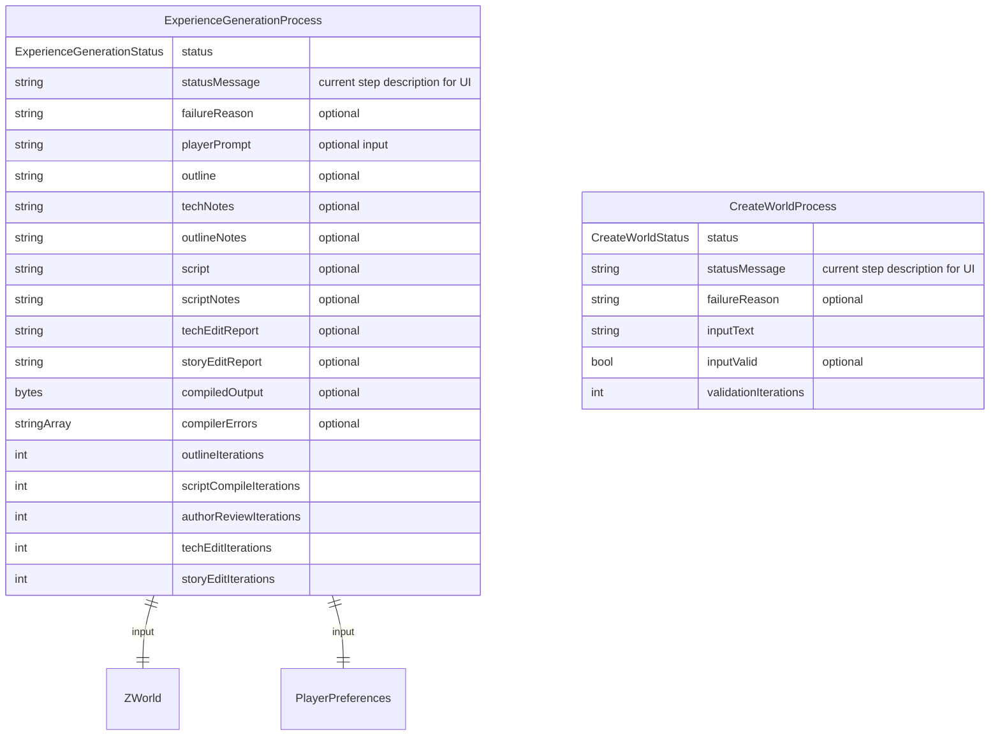

# Z-Forge Data Model ER Diagram

All persistent data models used by Z-Forge. Implemented across `lib/models/`.

## Runtime / Service Models

These models are created and managed by services at runtime. See the corresponding source files for details.

## Transitory Process Models

Process objects are not persisted but track multi-step LLM workflows. See [Managers, Processes, and MCP Server](Managers,%20Processes,%20and%20MCP%20Server.md) for tool implementation guidelines.

## Notes
- `.zworld` files are JSON representations of `ZWorld`, stored locally by `ZWorldManager` (`lib/services/managers/zworld_manager.dart`).
- `Experience` objects are managed by `ExperienceManager` (`lib/services/managers/experience_manager.dart`), stored as compiled `.ink.json` files under the experience folder.
- `ZForgeConfig` is persisted via `ConfigService` (`lib/services/config_service.dart`) using `shared_preferences`.
- `ZForgeSecureConfig` is persisted via `SecureConfigService` (`lib/services/secure_config_service.dart`) using `flutter_secure_storage`.
- `ExperienceGenerationProcess` (`lib/processes/experience_generation_process.dart`) drives the multi-agent LLM workflow for experience creation.
- `CreateWorldProcess` (`lib/processes/create_world_process.dart`) drives the LLM workflow for world creation.
- IF engine abstraction: `IfEngineConnector` (`lib/services/if_engine/if_engine_connector.dart`) with ink implementation (`lib/services/if_engine/ink_engine_connector.dart`).
