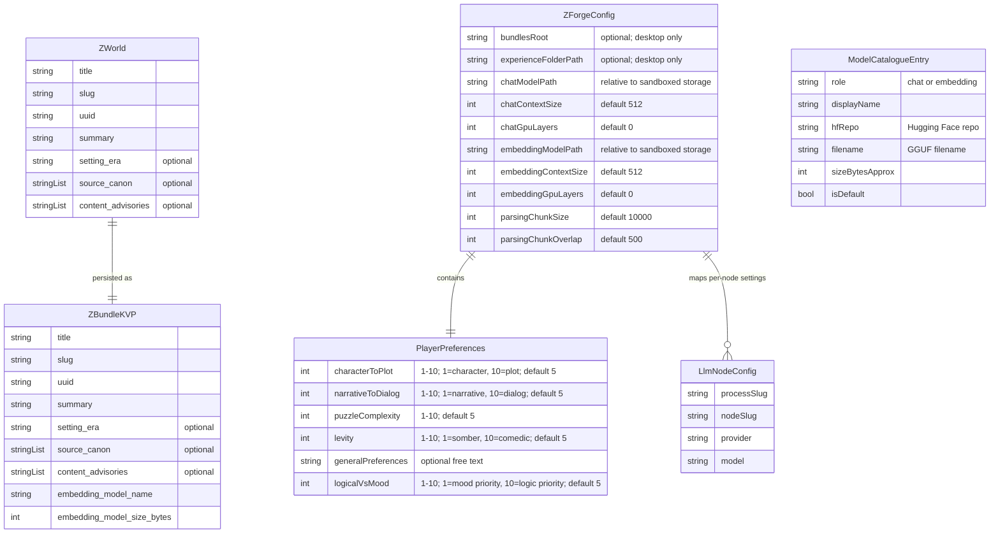
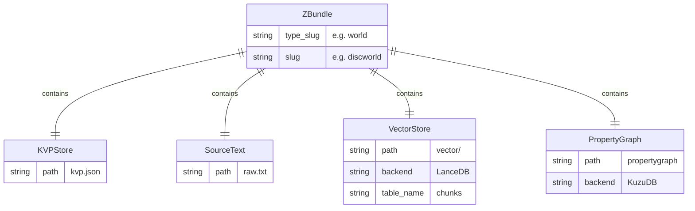
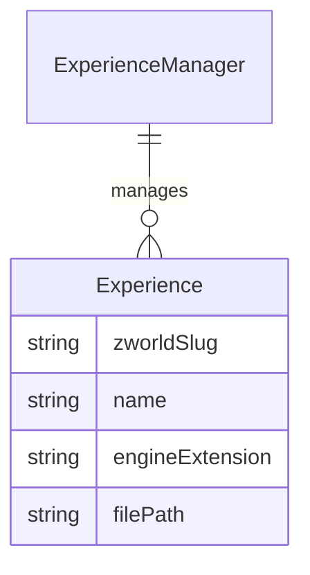
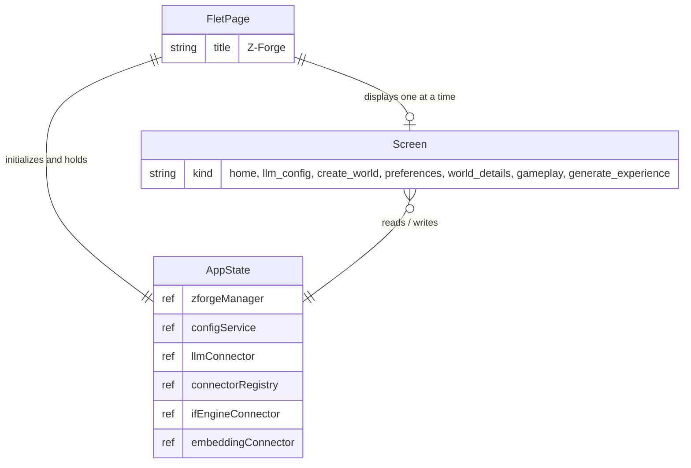
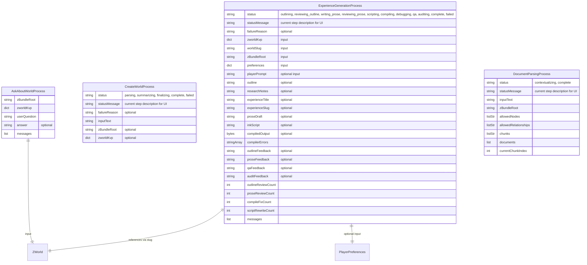

# Z-Forge Data Model ER Diagram

All persistent data models used by Z-Forge. Implemented across `src/zforge/models/`.

## Z-Bundle Storage

Z-Worlds are persisted as Z-Bundles at `bundles/world/{slug}/`:
- `kvp.json` — key-value metadata (title, slug, UUID, summary, setting_era, source_canon, content_advisories, embedding model identity)
- `raw.txt` — original raw input text
- `vector/` — LanceDB vector store (document chunk embeddings; table name `chunks`)
- `propertygraph` — KùzuDB property graph file (schema-less entity nodes and relationship edges, managed by `KuzuGraph.add_graph_documents`)

Entity types (Character, Location, Event, Faction, Artifact, Era, Culture, Deity, Prophecy, Concept, Mechanic, Trope, Species, Occupation) are no longer Python dataclasses — they exist as schema-less nodes in KuzuDB, created dynamically by `LLMGraphTransformer`.

## Runtime / Service Models

These models are created and managed by services at runtime. See the corresponding source files for details.

## UI Runtime

The Flet `Page` object is the root of the UI. It holds a reference to `AppState`
and navigates between screens by replacing `page.controls`.

## Transitory Process Models

Process objects are not persisted but track multi-step LLM workflows. See [Managers, Processes, and MCP Server](Managers,%20Processes,%20and%20MCP%20Server.md) for tool implementation guidelines.

## Notes
- Z-Worlds are stored as Z-Bundles under `bundles/world/{slug}/` by `ZWorldManager` (`src/zforge/managers/zworld_manager.py`).
- `Experience` objects are managed by `ExperienceManager` (`src/zforge/managers/experience_manager.py`), stored as compiled `.ink.json` files under the experience folder.
- `ZForgeConfig` is persisted via `ConfigService` (`src/zforge/services/config_service.py`) using `platformdirs` JSON file storage.
- `ModelCatalogueEntry` entries are defined in `src/zforge/models/model_catalogue.py` (static catalogue, not persisted).
- `ModelDownloadService` (`src/zforge/services/model_download_service.py`) streams GGUF files from Hugging Face CDN.
- `ExperienceGenerationState` (`src/zforge/graphs/state.py`) is the LangGraph TypedDict that drives the multi-agent LLM workflow for experience creation.
- `CreateWorldState` (`src/zforge/graphs/state.py`) is the LangGraph TypedDict that drives the world creation pipeline.
- `AskAboutWorldState` (`src/zforge/graphs/state.py`) is the LangGraph TypedDict for the Ask About World agentic RAG process.
- `DocumentParsingState` (`src/zforge/graphs/state.py`) is the LangGraph TypedDict for the document parsing sub-graph.
- IF engine abstraction: `IfEngineConnector` (`src/zforge/services/if_engine/if_engine_connector.py`) with ink implementation (`src/zforge/services/if_engine/ink_engine_connector.py`).
- Embedding abstraction: `EmbeddingConnector` (`src/zforge/services/embedding/embedding_connector.py`) with llama.cpp implementation (`src/zforge/services/embedding/llama_cpp_embedding_connector.py`).
- LLM abstraction: `LlmConnector` (`src/zforge/services/llm/llm_connector.py`) with local llama.cpp implementation (`src/zforge/services/llm/llama_cpp_connector.py`).
