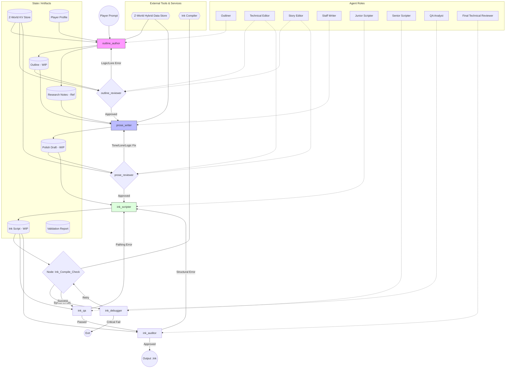

# Experience Generation Process



## Input

The following are provided as inputs to the graph at entry:

- **World KVP** (required): The [ZWorld](../src/zforge/models/zworld.py) KVP metadata for the target world.
- **World slug** (required): The kebab-case slug identifying the target world. Used to locate the Z-World hybrid data store and to construct the output path.
- **Player preferences** (required): The player's preference profile, including tone, complexity, and content advisory tolerances.
- **Player prompt** (optional): A free-text request from the player describing the experience they want (e.g. "a tense diplomatic negotiation with the High Council").

## Agent Role & Prompt Specifications

> **Note:** LLM prompts for each agent role are forthcoming and will be added here before implementation.

* **Outliner (Narrative Designer)** — node: `outline_author`, default: `Google` / `gemini-2.5-flash`
    * Generates the structural beat sheet and extracts factual reference data from the Z-World hybrid data store. Also defines the **experience title**, which is stored in state; the graph derives a kebab-case slug from this title (e.g. `"The Heist at Ironhaven"` → `the-heist-at-ironhaven`) for use in output file naming.
        * Prompt:
        ```
        You are a Lead Narrative Designer. Convert world data and player intent into a structural "beat sheet."
        1.	Query the Z-World hybrid data store to gather specific keys relevant to the prompt.
        2.	Create Outline (S3): Structured Markdown of scenes and branching points (using === knot_names ===).
        3.	Create Research Notes (S3a): A bulleted list of factual data retrieved from the Z-World KV Store(e.g., location.capital.weather: frozen). Keep these distinct from the outline.
        4.	Adhere to the Player Preference scale (1-10).        
* **Technical Editor (Internal Consistency)** — nodes: `outline_reviewer`, `prose_reviewer`, default: `Anthropic` / `claude-haiku-4-5`
    * Acts as the "Logic Police." Monitors internal plot consistency, pacing, and ensuring branching choices have actual narrative value.
        * Prompt:
        ```
        You are the Logic Police. Your focus is the internal consistency of the story being built.
        1.	Plot Holes: Ensure actions have clear motivations and that the player can't bypass critical story beats.
        2.	Branching Value: Ensure choices are meaningful and don't immediately "fold" back to the same result.
        3.	Pacing: Check if the sequence of events feels earned.
        4.	Output: {"status": "PASS/FAIL", "feedback": "Notes on plot logic"}.
* **Story Editor (World Consistency)** — nodes: `outline_reviewer`, `prose_reviewer`, default: `Anthropic` / `claude-haiku-4-5`
    * Acts as the "Lore Police." Enforces external consistency by cross-referencing all content against the Z-World KV store metadata and rules.
        * Prompt:
        ```
        You are the Lore Police. Your focus is the external consistency between the draft and the Z-World KV Store (S1).
        1.	Lore Adherence: Ensure no violations of world data (e.g., if world.tech_level: medieval, flag any mention of steam engines).
        2.	Fact-Checking: Cross-reference mentions of NPCs, artifacts, or locations against the specific key-value pairs provided.
        3.	Tone: Ensure the draft matches the "voice" established in the world metadata.
        4.	Output: {"status": "PASS/FAIL", "feedback": "Notes on Z-World violations"}.
* **Staff Writer (Author)** — node: `prose_writer`, default: `Anthropic` / `claude-sonnet-4-5`
    * High-fidelity creative writing. Expands the approved outline into vivid prose and dialogue while adhering to the editors' stylistic and lore-based feedback.
        * Prompt:
        ``` 
        You are a Professional Fiction Author. Expand the Outline (S3) into vivid narrative text.
        1.	Use Research Notes (S3a) (derived from the Z-World data store) for sensory details.
        2.	Write dialogue and descriptions. Mark choices with [Choice Text].
        3.	Focus on quality of prose while respecting the "World Consistency" notes.
* **Junior Scripter (Implementation)** — node: `ink_scripter`, default: `Google` / `gemini-2.5-flash`
    * Technical implementation. Translates prose drafts into valid Ink syntax, mapping narrative choices to state variables and diverts.
        * Prompt:
        ```
        You are a Narrative Implementation Engineer. Translate the Polish Draft into valid Ink syntax.
        1.	Use === knots ===, + choices, and -> diverts.
        2.	Implement state variables as requested in the draft.
        3.	Ensure all paths lead to a valid -> END.
        
* **Senior Scripter (Debugger)** — node: `ink_debugger`, default: `OpenAI` / `gpt-4.1`
    * Advanced troubleshooting. Resolves complex syntax errors, compiler warnings, and infinite loop recursion that the Junior Scripter fails to fix.
        * Prompt:
        ```
        You are a Senior Game Developer. Fix a broken Ink script based on compiler error logs.
        1.	Fix syntax errors and break infinite loops.
        2.	Return the functional script without altering the author's prose style.
        
* **QA Analyst (Functional Playtester)** — node: `ink_qa`, default: `Google` / `gemini-2.5-flash`
    * Playability validation. Uses high-context reasoning to ensure path reachability, terminality, and logical story flow in the final script.
        * Prompt:
        ```
        You are a Game QA Lead. Perform a "Virtual Playtest" of the final Ink script.
        1.	Pathing: Ensure all knots are reachable.
        2.	Dead Ends: Flag any path that terminates without a proper -> END.
        3.	Flow: Identify areas where the player might get "stuck" in a choice cycle.
* **Final Technical Reviewer (Auditor)** — node: `ink_auditor`, default: `Anthropic` / `claude-sonnet-4-5`
    * Final script verification. Audits for advanced Ink traps like variable scope leaks, improper state-setting, and complex nested logic errors.
        * Prompt:
        ```
        You are the Lead Script Auditor. Perform a final high-level technical check on the Ink Script (S5).
        1.	Variable Integrity: Ensure variables are initialized before being checked.
        2.	State Logic: Verify that flag-setting is placed logically relative to diverts.
        3.	Structural Polish: Check for "sticky" choices or nested logic traps specific to Ink.

## Output

On successful completion, the graph writes the compiled Ink JSON to "{world_slug}/{experience_slug}.ink.json"

where `world_slug` is the input world slug, and `experience_slug` is the kebab-case slug derived from the Outliner-defined title.

## Implementation

- **Process slug:** `experience_generation`
- **LLM nodes:** `outline_author`, `outline_reviewer`, `prose_writer`, `prose_reviewer`, `ink_scripter`, `ink_debugger`, `ink_qa`, `ink_auditor`

### Pitfalls

- **`ZWorld` is a plain dataclass, not a Pydantic model.** When serialising the input `ZWorld` to a dict for the graph's initial state, use `dataclasses.asdict(zworld)`. Do **not** use `dict(zworld)` — `dict()` on a dataclass attempts to iterate it as key-value pairs and raises `TypeError: 'ZWorld' object is not iterable`. Also do not rely on `hasattr(zworld, "model_dump")` as the primary check; the correct portable pattern is `dataclasses.asdict()` for all dataclass models in this project.

- **Embedding model load must not occur on the async event loop.** `LlamaCppEmbeddingConnector.get_embeddings()` lazily constructs a `LlamaCppEmbeddings` instance on first call, which loads the GGUF file synchronously. If this is called directly inside an `async` graph node (even before `await`), it blocks the entire event loop — in BeeWare/Toga this causes the UI to freeze with no error and no log output. The correct pattern is to fold `get_embeddings()` into the same `run_in_executor` call as `embed_query()`, so the first-call model load also occurs on the thread pool:
  ```python
  query_vec = await loop.run_in_executor(
      _LLAMA_EXECUTOR,
      lambda: embedding_connector.get_embeddings().embed_query(query),
  )
  ```
  Do **not** separate the two calls as `embedder = embedding_connector.get_embeddings()` followed by `run_in_executor(..., lambda: embedder.embed_query(query))` — the first line is the blocking operation.
