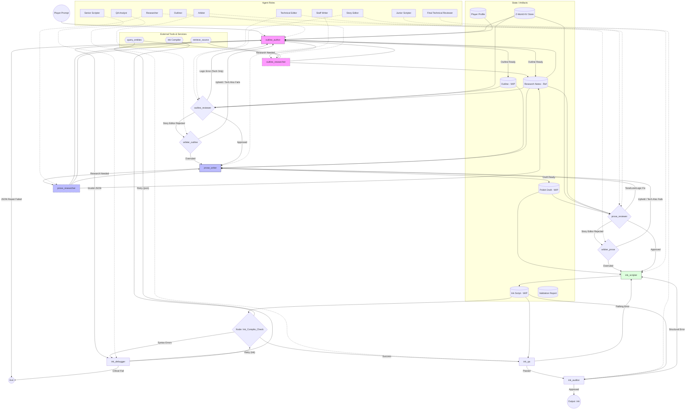

# Experience Generation Process



## Input

The following are provided as inputs to the graph at entry:

- **World KVP** (optional): The [ZWorld](../src/zforge/models/zworld.py) KVP metadata for a selected world. If not provided, the retrieval tools (`query_entities`, `retrieve_source`, etc.) are not available and the Outliner and downstream agents operate on the player prompt and player preferences alone.
- **World slug** (optional): The kebab-case slug identifying the selected world. Required if World KVP is provided; used to locate the Z-World hybrid data store and to construct the output path.
- **Player preferences** (required): The player's preference profile, including tone, complexity, content advisory tolerances, target length, and target knot count.
- **Player prompt** (required): A free-text description from the player of the experience they want (e.g. "a tense diplomatic negotiation with the High Council").

## Agent Role & Prompt Specifications

> **Note:** LLM prompts for each agent role are forthcoming and will be added here before implementation.

* **Outliner (Narrative Designer)** — node: `outline_author`, default: `Google` / `gemini-2.5-flash`
    * Generates the structural beat sheet. Does **not** have direct access to retrieval tools; instead, it may issue a **research request** (see Researcher below) to gather world data before finalising the outline. Also defines the **experience title**, which is stored in state; the graph derives a kebab-case slug from this title (e.g. `"The Heist at Ironhaven"` → `the-heist-at-ironhaven`) for use in output file naming.
        * Prompt:
        ```
        You are a Lead Narrative Designer. Convert world data and player intent into a structural "beat sheet."
        If you need additional world data before writing the outline, output ONLY a JSON object with key
        "research_request" containing your focused question(s) for the research assistant. You may do this
        as many times as needed; each time you will receive updated Research Notes.

        IMPORTANT: The research assistant can only answer factual questions about the world — who characters
        are, what abilities they have, how factions relate, where locations are, what events have occurred
        in canon. It cannot make creative decisions for you. You are responsible for inventing the specific
        events, threats, motivations, consequences, and timeline placement of the story. If the player
        prompt says "Alice secretly saves Bob's life," it is YOUR job to decide what the threat is, why
        Alice intervenes, and how — informed by the world data you gather about those characters.
        Good research requests: "Who is Alice?", "What abilities does Alice have?", "What factions
        threaten Bob's people?", "What relationship exists between Alice and Bob?"
        Bad research requests: "What should the threat to Bob be?", "Why would Alice want to save him?"

        Once you have sufficient context, produce the final output as ONLY a JSON object with these keys:
        - "experience_title": a short, evocative title for this experience
        - "outline": Structured Markdown of scenes and branching points (using === knot_names ===). The
          outline should total approximately 5-10% of the target prose word count from player preferences.
          The number of === knot === sections must equal the target complexity (knot count) from player
          preferences exactly.
        - "research_notes": an updated consolidated bulleted list of all factual world data gathered.
        Adhere to all player preference scales (1-10): character/plot, narrative/dialog, levity, logical
        vs. mood, and puzzle complexity.
        ```
* **Technical Editor (Internal Consistency)** — nodes: `outline_reviewer`, `prose_reviewer`, default: `Anthropic` / `claude-haiku-4-5`
    * Acts as the "Logic Police." Monitors internal plot consistency, pacing, and ensuring branching choices have actual narrative value. Does not use retrieval tools (structural review only). **The player prompt's premise is accepted as given — do not penalise relationships or scenarios that follow directly from it.**
        * Prompt:
        ```
        You are the Logic Police. Your focus is the internal consistency of the story being built.
        CRITICAL RULE: The player prompt establishes the founding premise of this experience. Do NOT penalise character relationships, motivations, or scenarios that follow directly from the player's stated premise, even if they seem unusual or contrary to established canon. Accept the premise as given and evaluate consistency within it.
        1.	Plot Holes: Ensure actions have clear motivations and that the player can't bypass critical story beats.
        2.	Branching Value: Ensure choices are meaningful and don't immediately "fold" back to the same result.
        3.	Pacing: Check if the sequence of events feels earned.
        4.	Output: {"status": "PASS/FAIL", "feedback": "Notes on plot logic"}.
* **Story Editor (World Consistency)** — nodes: `outline_reviewer`, `prose_reviewer`, default: `Anthropic` / `claude-haiku-4-5`
    * Acts as the "Lore Police." Enforces external consistency by cross-referencing all content against the Research Notes (S3a) and Z-World metadata provided in state. Does **not** have direct access to retrieval tools — fact-checking is performed against the research notes accumulated by the Researcher. **The player prompt's premise is accepted as given — an AU or crossover scenario that diverges from canon is not itself a violation.**
        * Prompt:
        ```
        You are the Lore Police. Your focus is the external consistency between the draft and the Z-World metadata.
        CRITICAL RULE: The player prompt establishes the creative premise of this experience and may intentionally diverge from established world canon (e.g., an alternate-universe scenario where normally hostile factions are friendly, or a playful crossover). Do NOT flag the player's stated premise itself as a lore violation. Treat it as an accepted given. Your job is to ensure that the Z-World details referenced within the draft (entity names, traits, locations, world mechanics) are accurately represented once the premise is in play.
        1.	Lore Adherence: Using the Research Notes provided, ensure world facts are used accurately.
        2.	Fact-Checking: Cross-reference mentions of NPCs, artifacts, or locations against the research notes and world metadata provided.
        3.	Tone: Ensure the draft matches the "voice" established in the world metadata.
        4.	Output: {"status": "PASS/FAIL", "feedback": "Notes on Z-World violations"}.
* **Staff Writer (Author)** — node: `prose_writer`, default: `Anthropic` / `claude-sonnet-4-5`
    * High-fidelity creative writing. Expands the approved outline into vivid prose and dialogue. Does **not** have direct access to retrieval tools; instead, it may issue a **research request** (see Researcher below) to fetch additional detail before writing or mid-draft.
        * Prompt:
        ```
        You are a Professional Fiction Author. Expand the Outline into vivid narrative text.
        If you need additional world data (sensory details, character traits, relationships), output ONLY a
        JSON object with key "research_request" containing your focused question(s) for the research
        assistant. You may do this as many times as needed; each time you will receive updated Research Notes.
        Once you have sufficient context, write the full prose draft as plain text (no JSON wrapper).
        - Target the word count specified in player preferences.
        - Write dialogue and descriptions. Mark choices with [Choice Text].
        - Respect all player preference scales (character/plot, narrative/dialog, levity, logical vs. mood,
          puzzle complexity) and any editor feedback provided.
        ```
* **Researcher** — nodes: `outline_researcher`, `prose_researcher`, default: `Google` / `gemini-2.5-flash-lite`
    * Data retrieval specialist. Activated when `outline_author` or `prose_writer` emits a `research_request`. Both researcher nodes share a single LLM configuration entry with slug `researcher` (configurable in the LLM config UI). Has full access to `query_entities`, `retrieve_source`, `find_relationship`, `find_relationship_by_name`, `list_entities`, `get_neighbors`, `find_path`, and `get_source_passages` tools (see [Retrieval Patterns](RAG%20and%20GRAG%20Implementation.md#retrieval-patterns)). After retrieving relevant data, combines results with any existing Research Notes and returns the consolidated notes to the calling node.
        * Prompt:
        ```
        You are a Research Assistant with access to the Z-World hybrid data store.
        You have received a research request from a creative agent. Your task is:

        1. Use the retrieval tools to gather all data relevant to the request. Understand
           what each tool is for:
           - query_entities: Look up specific entities (characters, locations, factions, etc.)
             by name or description. Returns a synthesized summary plus graph relationships.
             Best for: "Who is Alice?", "What is the Northern Kingdom?"
           - retrieve_source: Search the original source text for relevant passages. Returns
             verbatim chunks. Best for: topical questions, world mechanics, environmental
             details, specific quotes, or anything spread across the source rather than
             captured in a single entity summary.
           - find_relationship_by_name: Find how two named entities are connected in the
             world graph. Best for: "What is the relationship between Alice and Bob?"
           - list_entities: Get a catalog of all entities of a type. Best for building a
             roster: "Who are all the characters?", "What locations exist?"
           - get_neighbors: Get all graph connections from a known entity ID (returned by
             query_entities). More surgical follow-up after an initial entity lookup.
           - get_source_passages: Get raw source text mentioning a known entity ID. Cheaper
             than retrieve_source when the entity is already identified.
           - find_relationship / find_path: For known entity IDs — direct and indirect graph
             connections.
           If the request contains multiple questions, make a SEPARATE tool call for each one before
           synthesizing — do not try to answer all questions with a single broad tool call.
           Guidance on less-obvious types: use entity_type="time_period" (or
           list_entities(entity_type="time_period")) for questions about when events occur;
           use entity_type="concept" or entity_type="belief_system" for questions about magic
           systems, prophecy mechanics, or world rules; use retrieve_source with keyword-rich
           queries for thematic questions not tied to a single named entity.
           Break broad questions into specific lookups. For example, "What threats face
           Bob's people?" should become a query_entities call for Bob's faction plus a
           retrieve_source call for threats or enemies of that faction.
        2. Combine the retrieved data with the existing Research Notes provided, avoiding
           duplication.
        3. Return ONLY a JSON object with exactly this key:
           - "research_notes": the updated consolidated bulleted list of factual world data.
        ```
* **Junior Scripter (Implementation)** — node: `ink_scripter`, default: `Google` / `gemini-2.5-flash`
    * Technical implementation. Translates prose drafts into valid Ink syntax, mapping narrative choices to state variables and diverts.
        * Prompt:
        ```
        You are a Narrative Implementation Engineer. Translate the Polish Draft into valid Ink syntax.
        1.	Use === knots ===, + choices, and -> diverts.
        2.	Implement state variables as requested in the draft.
        3.	Ensure all paths lead to a valid -> END.
        4.	Every choice block must contain at least two options. A block with only one choice is not a real decision — either remove it and use a divert directly, or split the content into genuine alternatives.
        
* **Senior Scripter (Debugger)** — node: `ink_debugger`, default: `OpenAI` / `gpt-4.1`
    * Multi-mode repair node. Dispatches on `debugger_mode` in state:
        * **`"ink"` mode** — resolves complex Ink syntax errors and compiler warnings. Receives `ink_script` and `compiler_errors`; writes the fixed script back to `ink_script`; routes to `ink_compile_check`.
        * **`"json"` mode** — repairs a malformed LLM JSON response. Receives the raw broken output in `debugger_input`; writes the repaired JSON string back to `debugger_input` (clearing `debugger_mode`); routes to `debugger_return_node` (e.g. `outline_author`), which re-parses it directly.
        * The maximum total debug iterations (`compile_fix_count`) is shared across both modes and enforced by `MAX_COMPILE_FIX_ITERATIONS = 3`.
        * **Ink prompt:**
        ```
        You are a Senior Game Developer. Fix a broken Ink script based on compiler error logs.
        1.	Fix syntax errors and break infinite loops.
        2.	Return the functional script without altering the author's prose style.
        ```
        * **JSON prompt:**
        ```
        You are a JSON Repair Specialist. The text below is a malformed or improperly-formatted
        LLM response that was supposed to be a valid JSON object. Extract and return the intended
        JSON object, fixing any syntax errors, escaped characters, or extraneous markdown.
        Return ONLY the valid JSON object — no markdown fencing, no explanation.
        
* **QA Analyst (Functional Playtester)** — node: `ink_qa`, default: `Google` / `gemini-2.5-flash`
    * Playability validation. Uses high-context reasoning to ensure path reachability, terminality, and logical story flow in the final script.
        * Prompt:
        ```
        You are a Game QA Lead. Perform a "Virtual Playtest" of the final Ink script.
        1.	Pathing: Ensure all knots are reachable.
        2.	Dead Ends: Flag any path that terminates without a proper -> END.
        3.	Flow: Identify areas where the player might get "stuck" in a choice cycle.
        4.	False Choices: Flag any choice block that contains only a single option — this is not a real decision and must be revised.
* **Final Technical Reviewer (Auditor)** — node: `ink_auditor`, default: `Anthropic` / `claude-sonnet-4-5`
    * Final script verification. Audits for advanced Ink traps like variable scope leaks, improper state-setting, and complex nested logic errors.
        * Prompt:
        ```
        You are the Lead Script Auditor. Perform a final high-level technical check on the Ink Script (S5).
        1.	Variable Integrity: Ensure variables are initialized before being checked.
        2.	State Logic: Verify that flag-setting is placed logically relative to diverts.
        3.	Structural Polish: Check for "sticky" choices or nested logic traps specific to Ink.
* **Arbiter (Premise Defender)** — nodes: `arbiter_outline`, `arbiter_prose`, default: `Google` / `gemini-2.5-flash-lite`
    * Dispute resolution. Activated only when the Story Editor rejects a draft. Receives exclusively the **player's premise** and the **Story Editor's rejection reason** (no outline, no prose). Determines whether the rejection targets a lore divergence the player deliberately introduced (OVERRULE) or a genuine world-fact error in the draft (UPHOLD).
    * If OVERRULE and the Tech Editor had also failed, the revision loop continues with only the Tech Editor's feedback.
    * If OVERRULE and the Tech Editor had passed, generation proceeds to the next stage.
        * Prompt:
        ```
        You are a Senior Creative Director arbitrating a dispute between the Story Editor (Lore Police) and the player.
        The player has submitted a premise for their interactive experience. The Story Editor reviewed the draft and rejected it with a lore concern. Your task is to determine whether the Story Editor's rejection is primarily targeting the player's stated premise itself — i.e., the editor is penalising a creative divergence the player deliberately introduced — rather than a genuine error in the draft's execution of world facts.
        Rules:
        - If the Story Editor's rejection is caused by, or flows directly from, the player's premise (e.g., the editor flags a faction alignment, relationship, or scenario that the player explicitly set up), choose OVERRULE.
        - If the rejection is caused by the writer misrepresenting world facts that are not covered or implied by the player's premise, choose UPHOLD.
        Output: {"verdict": "OVERRULE/UPHOLD", "reason": "one-sentence explanation"}

## Output

On successful completion, the graph writes the compiled Ink JSON to "{world_slug}/{experience_slug}.ink.json"

where `world_slug` is the input world slug, and `experience_slug` is the kebab-case slug derived from the Outliner-defined title.

## Implementation

- **Process slug:** `experience_generation`
- **LLM nodes:** `outline_author`, `outline_researcher`, `outline_reviewer`, `arbiter_outline`, `prose_writer`, `prose_researcher`, `prose_reviewer`, `arbiter_prose`, `ink_scripter`, `ink_debugger`, `ink_qa`, `ink_auditor`

### Debugger State Fields

Three fields in `ExperienceGenerationState` support the multi-mode debugger node:

- **`debugger_mode: str | None`** — Set by any node that routes to `ink_debugger`. Value is `"ink"` (fix Ink script) or `"json"` (repair a malformed JSON response). Cleared to `None` by the debugger after completing its repair pass.

- **`debugger_return_node: str | None`** — Set alongside `debugger_mode` to identify which node should receive the corrected output. The routing function `_route_after_debugger` reads this field to determine the next node. Currently used values: `"ink_compile_check"` (Ink mode) and `"outline_author"` (JSON mode).

- **`debugger_input: str | None`** — Used in JSON mode only. Set to the raw malformed LLM response to be repaired. The debugger overwrites this field with the repaired JSON string; the receiving node (`debugger_return_node`) then parses it directly and clears all three debugger fields.

### Research State Fields

Two fields in `ExperienceGenerationState` support the researcher node pattern:

- **`research_request: str | None`** — Set by `outline_author` or `prose_writer` when they need additional world data. The presence of this field routes execution to the appropriate researcher node (`outline_researcher` or `prose_researcher`). Cleared to `None` by the researcher after fulfilling the request.

- **`research_caller: str | None`** — Set alongside `research_request` to identify which node issued the request (`"outline_author"` or `"prose_writer"`). Used by the researcher's routing logic to return control to the correct node. Cleared to `None` by the researcher.

### Observability State Fields

Two additional fields in `ExperienceGenerationState` drive live UI feedback during generation:

- **`last_step_rationale: str | None`** — Set by each review/QA/audit/arbiter node (`outline_reviewer`, `arbiter_outline`, `prose_reviewer`, `arbiter_prose`, `ink_qa`, `ink_auditor`) to a 1–2 sentence summary of the decision. Also set by `outline_author` and `prose_writer` to `"Research needed: {research_request}"` when they emit a research request, so the UI shows the specific question (e.g. "Research needed: Does Darkstalker already know Glory?"). Displayed in the UI below the status label and appended to the action log.

- **`action_log: list[dict[str, Any]]`** — Set by researcher nodes (`outline_researcher`, `prose_researcher`) to record each tool call made. Entries have `type: "tool_call"` and carry `node`, `role`, `tool`, and `args` keys. The `run_process` runner fires `on_rationale_update` for each entry immediately when the node completes. These appear in the UI action log as `> [role] tool_name(arg_preview)` lines so it is visible which world-store queries were made during research.

- **`story_editor_feedback: str | None`** — Set by `outline_reviewer`/`prose_reviewer` when the Story Editor fails; consumed by `arbiter_outline`/`arbiter_prose`. Cleared to `None` by the arbiter after use.

- **`tech_editor_feedback: str | None`** — Set by `outline_reviewer`/`prose_reviewer` when the Tech Editor also fails (alongside a Story Editor rejection). Used by the arbiter to reconstruct tech-only feedback if it overrules the Story Editor but the Tech Editor rejection stands.

  These fields are **not accumulated** across nodes — each node replaces them with its own output. Nodes that emit neither (e.g. `ink_scripter`, `ink_debugger`) simply omit both keys from their return dict.

### Debug Artifacts

When `ZForgeConfig.debug_experience_artifacts` is `True`, `ZForgeManager.start_experience_generation()` calls `_write_debug_artifacts()` immediately after `run_process()` completes (whether the run succeeded or not). The method writes the following state fields as individual `.txt` files under `experiences-generation/{experience_slug}/debug/` (a sibling of the configured `experience_folder`):

| File | State field |
|---|---|
| `research_notes.txt` | `research_notes` |
| `outline.txt` | `outline` |
| `prose_draft.txt` | `prose_draft` |
| `ink_script.txt` | `ink_script` |
| `compiler_errors.txt` | `compiler_errors` (joined with newlines; omitted if empty) |
| `outline_feedback.txt` | `outline_feedback` |
| `prose_feedback.txt` | `prose_feedback` |
| `qa_feedback.txt` | `qa_feedback` |
| `audit_feedback.txt` | `audit_feedback` |

Files whose corresponding state field is `None` or empty are not written. On every app startup, `_cleanup_debug_artifacts()` removes subdirectories in `experiences-generation/` older than `ZForgeConfig.debug_artifact_retention_days` (default 30). See [Application Configuration § Experience Generation Debugging](Application%20Configuration.md#experience-generation-debugging) and [File Storage](File%20Storage.md) for directory layout details.

### Pitfalls

- **`ZWorld` is a plain dataclass, not a Pydantic model.** When serialising the input `ZWorld` to a dict for the graph's initial state, use `dataclasses.asdict(zworld)`. Do **not** use `dict(zworld)` — `dict()` on a dataclass attempts to iterate it as key-value pairs and raises `TypeError: 'ZWorld' object is not iterable`. Also do not rely on `hasattr(zworld, "model_dump")` as the primary check; the correct portable pattern is `dataclasses.asdict()` for all dataclass models in this project.

- **Embedding model load must not occur on the async event loop.** `LlamaCppEmbeddingConnector.get_embeddings()` lazily constructs a `LlamaCppEmbeddings` instance on first call, which loads the GGUF file synchronously. If this is called directly inside an `async` graph node (even before `await`), it blocks the entire event loop — in BeeWare/Toga this causes the UI to freeze with no error and no log output. The correct pattern is to fold `get_embeddings()` into the same `run_in_executor` call as `embed_query()`, so the first-call model load also occurs on the thread pool:
  ```python
  query_vec = await loop.run_in_executor(
      _LLAMA_EXECUTOR,
      lambda: embedding_connector.get_embeddings().embed_query(query),
  )
  ```
  Do **not** separate the two calls as `embedder = embedding_connector.get_embeddings()` followed by `run_in_executor(..., lambda: embedder.embed_query(query))` — the first line is the blocking operation.
