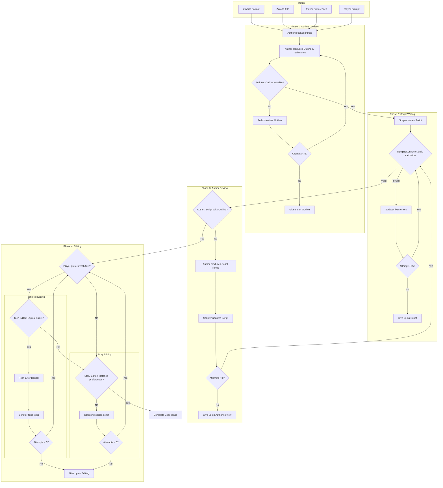
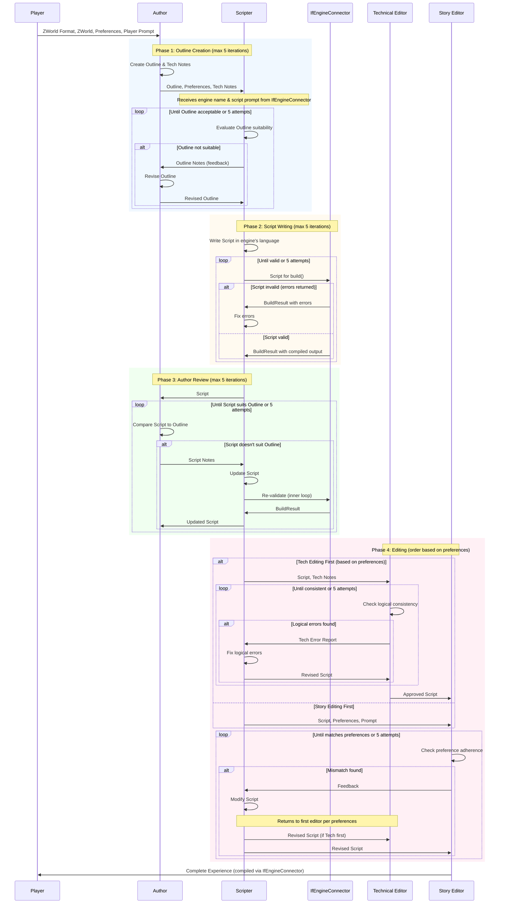

# Experience Generation
Experiences are generated as scripts in an interactive fiction (IF) engine's language, compiled, and run through the [IF Engine Abstraction Layer](IF%20Engine%20Abstraction%20Layer.md). The current primary engine is ink (compiled via inkjs through a Python JS bridge, run via the same bridge), but the abstraction layer allows for future support of additional engines. TODO: Pictures and possibly sounds. This is accomplished by a team of LLM agents whose actions are orchestrated by a [LangGraph](https://langchain-ai.github.io/langgraph/) `StateGraph`. The system prompt for each agent makes it aware of the team structure and process, but makes it responsible for its individual contributions.

## Technical Architecture
An `ExperienceGenerationState` TypedDict holds current state (inputs, artifacts, iteration counters, status). This is the LangGraph graph state for the experience generation graph, held and streamed by `ZForgeManager`. Each step of the process is executed by LangGraph `@tool` functions invoked through the graph's `ToolNode`. Compilation and playback are handled through the configured `IfEngineConnector` (see [IF Engine Abstraction Layer](IF%20Engine%20Abstraction%20Layer.md)).

See [LLM Orchestration](LLM%20Orchestration.md) for full graph structure and routing logic.

### ExperienceGenerationState Status Values
The state's `status` field (a `str`) takes the following values:
- `"awaiting_outline"` — Initial state; waiting for Author to submit Outline and Tech Notes
- `"awaiting_outline_review"` — Scripter is reviewing the Outline for feasibility
- `"awaiting_outline_revision"` — Author is revising Outline based on Scripter feedback
- `"awaiting_script"` — Scripter is writing the Script
- `"awaiting_script_fix"` — Scripter is fixing compiler errors
- `"awaiting_author_review"` — Author is reviewing Script against Outline
- `"awaiting_script_revision"` — Scripter is revising Script based on Author's Script Notes
- `"awaiting_tech_edit"` — Technical Editor is reviewing Script
- `"awaiting_tech_fix"` — Scripter is fixing logical inconsistencies
- `"awaiting_story_edit"` — Story Editor is reviewing Script
- `"awaiting_story_fix"` — Scripter is modifying Script for preference alignment
- `"complete"` — Process finished successfully
- `"failed"` — Process failed after exhausting retry attempts

### ExperienceGenerationState Properties
The implementation agent should define the state `TypedDict` with these fields:
- **Inputs** (set at initialization):
  - `z_world`: dict — the world for this experience (ZWorld as JSON-serializable dict)
  - `preferences`: dict — the player's preferences
  - `player_prompt`: str | None — optional specific request
- **Artifacts** (set by `@tool` functions during execution):
  - `outline`: str | None — the Author's story outline
  - `tech_notes`: str | None — the Author's technical exceptions
  - `outline_notes`: str | None — Scripter's feedback on Outline
  - `script`: str | None — the current Script
  - `script_notes`: str | None — Author's feedback on Script
  - `tech_edit_report`: str | None — Technical Editor's report
  - `story_edit_report`: str | None — Story Editor's report
  - `compiled_output`: bytes | None — compiled experience from IfEngineConnector
  - `compiler_errors`: list[str] — errors from last compilation attempt
- **Iteration Counters** (use `Annotated[int, operator.add]` as the LangGraph reducer so tools can return `1` to increment):
  - `outline_iterations`: Annotated[int, operator.add] — attempts at Outline approval (max 5)
  - `script_compile_iterations`: Annotated[int, operator.add] — attempts at successful compilation (max 5)
  - `author_review_iterations`: Annotated[int, operator.add] — attempts at Author approval (max 5)
  - `tech_edit_iterations`: Annotated[int, operator.add] — attempts at Tech Editor approval (max 5)
  - `story_edit_iterations`: Annotated[int, operator.add] — attempts at Story Editor approval (max 5)
- **Status**:
  - `status`: str — current state (see values above)
  - `status_message`: str — human-readable description of current step for UI display
  - `failure_reason`: str | None — explanation if status is `"failed"`
  - `messages`: Annotated[list, add_messages] — LangGraph message history; **must** use the `add_messages` reducer from `langgraph.graph.message` so agent responses are appended rather than overwritten

### LangGraph Tool Derivation
Per [Managers, Processes, and MCP Server](Managers,%20Processes,%20and%20MCP%20Server.md), implementation agents derive `@tool` functions from this specification. Each tool corresponds to a decision point where an agent completes work and the graph advances. Tools bundle artifact submission with any automated validation. 

Each tool must also set `status_message` to a human-readable description of what just happened (e.g., "Scripter approves outline", "Script compiled successfully", "Technical Editor found 3 issues").

Example `@tool` functions for this process:

| Tool | Called By | Accepts | Performs | Sets status_message | Advances To |
|------|-----------|---------|----------|-------------------|-------------|
| `experience_author_submit_outline` | Author | outline, tech_notes | Stores artifacts | "Author submitted outline" | `awaiting_outline_review` |
| `experience_scripter_approve_outline` | Scripter | (none) | — | "Scripter approves outline" | `awaiting_script` |
| `experience_scripter_reject_outline` | Scripter | outline_notes | Stores feedback, increments counter | "Scripter requests outline revision" | `awaiting_outline_revision` or `failed` |
| `experience_scripter_submit_script` | Scripter | script | Invokes `IfEngineConnector.build()` | "Compiling script..." then "Script compiled" or "Compilation failed" | `awaiting_author_review` (success) or `awaiting_script_fix` (errors) |
| `experience_author_approve_script` | Author | (none) | — | "Author approves script" | `awaiting_tech_edit` or `awaiting_story_edit` (per preferences) |
| `experience_author_reject_script` | Author | script_notes | Stores feedback, increments counter | "Author requests script revision" | `awaiting_script_revision` or `failed` |
| `experience_techeditor_approve` | Tech Editor | (none) | — | "Technical Editor approves" | `awaiting_story_edit` or `complete` |
| `experience_techeditor_reject` | Tech Editor | tech_edit_report | Stores report, increments counter | "Technical Editor found issues" | `awaiting_tech_fix` or `failed` |
| `experience_storyeditor_approve` | Story Editor | (none) | — | "Story Editor approves" | `awaiting_tech_edit` or `complete` |
| `experience_storyeditor_reject` | Story Editor | story_edit_report | Stores report, increments counter | "Story Editor requests changes" | `awaiting_story_fix` or `failed` |

Note: `@tool` functions return a dict of state field updates. The LangGraph `ToolNode` merges these into the graph state; the `route_after_tool` conditional edge then reads the new `status` to determine the next node.

## Inputs and artifacts
The generation is kicked off by a set of inputs, with some steps by some agents producing artifacts consumed by downstream steps/agents. When an agent receives an input in a format specific to ZForge, a description of that input format will be provided as a separate system prompt that indicates it describes that format and includes the specification in the equivalent spec file; e.g. when the Author receives the ZWorld, they also receive a prompt that includes the contents of ZWorld.md and explains that this is a description of the ZWorld format. Any inputs and artifacts whose format is not thus structured, and that don't have a specific structure that is not specific to Z-Forge (e.g. the ink script), are in plain text format as if being exchanged between humans or LLM agents for natural-language communication.
- Inputs:
    - ZWorld file for the chosen world per [ZWorld spec](ZWorld.md) AKA "ZWorld"
    - Overall player preferences per [Player Preferences spec]("Player Preferences.md") AKA "Preferences"
    - Optional player prompt for this specific experience AKA "Player Prompt"
- Artifacts:
    - A story outline derived from the ZWorld Format, ZWorld, Preferences, and Player Prompt, AKA "Outline"
    - Notes on how this outline does or does not suit the initial inputs, AKA "Outline Notes"
    - Notes to override normal technical concerns, AKA "Tech Notes"
    - A complete script in the configured IF engine's language, AKA "Script"
    - A list of logical inconsistencies, if any, believed to exceed the player's tolerances, AKA "Tech Edit Report"
    - A list of reasons why the script is not suitable to the outline or the player's preferences, AKA "Story Edit Report"

## The Team
The LLM agents collaborating on the experience are as follows (prescribed system prompts for these roles appear later in this document):
- Author: Equivalent to a story writer/director on a film, with final edit rights. Provides a story outline to the Scripter and Story Editor
- Scripter: Responsible for creating the script in the configured IF engine's language based on the Author's outline. Receives the engine name and script prompt from the IfEngineConnector as system prompts.
- Technical Editor: Responsible for checking the logical consistency of the script, e.g. if room A is north of room B, then room B must be south of room A; may be overridden by the author's tech notes, e.g. "rooms do not necessarily connect in a consistent manner while the ship is traveling through hyperspace"
- Story Editor: Responsible for checking that the script is suitable for the player's preferences, e.g. puzzle complexity, plot vs. character development, etc.

## Process
The process for generating an experience works as follows:
- The Author receives the ZWorld Format, ZWorld, Preferences, and Player Prompt. The Author produces an Outline and Tech Notes.
- The Scripter receives the Outline, Preferences, and Tech Notes, along with the IF engine name and script prompt from the IfEngineConnector. They judge whether the Outline is suitable to the Preferences and Prompt; if not, the outline and the Outline Notes will be sent back to the Author, along with the initial inputs; this loop will be repeated up to five times before giving up.
- The Scripter, now satisfied with the Outline, uses the Outline and Tech Notes to write a script in the configured IF engine's language. The script is fed into the IfEngineConnector's build() method to check for validity; if not valid (errors returned), it is sent back to the Scripter along with the compiler output and the scripter is prompted to correct the errors, up to five times before giving up.
- The Author will receive the Script and their own Outline and judge whether the Script suits the Outline; if not, the author will produce Script Notes and the Script Notes, Outline, and Script will be sent back to the Scripter, who will be asked to update the Script accordingly. This loop between the Scripter and Author will be repeated up to five times before giving up (with the up-to-five iterations of the script rewrite step being checked for validity by the IfEngineConnector within each iteration of the outer loop)
- Depending on the player's preferences for technical consistency vs. mood, one of two operations will happen and then feed into the other:
    - The Technical Editor receives the Script and Tech Notes and checks the script for logical consistency, within the constraints of the tech notes. If the technical editor identifies logical errors exceeding the player's indicated preferences, the Script, Tech Notes, and Tech Edit Report are sent to the Scripter, who is asked to correct the logical errors. The loop between the Technical Editor and Scripter will be repeated up to five times before giving up.
    - The Story Editor receives the Script, Preferences, Prompt, and checks the script for adherance to the player's preferences and prompt. If the Story Editor believes there is a mismatch, the script and outline will be sent back to the Scripter along with the Story Edit Report, who will be asked to modify the script. The loop between the Story Editor and Scripter will be repeated up to five times before giving up.
    - Whichever editor rejects the script, the first pass following the rewrite by the Scripter will be done by the first editor chosen according to the player's preferences, e.g. if the player's preferences indicate that Technical Editing should happen before Story Editing, and the Story Editor rejects a script, the revised script will go through Technical Editing before returning to the Story Editor.

### Process Flowchart



### Process Sequence Diagram



### TODOs
- Extend this process per Gemini's suggestions; a full play-test may not be feasible in '26 due to the cost of actually having an LLM "play the game", but improved conflict resolution can probably be within scope. A dedicated cartographer/spacial mapper, instead of lumping this into broad "logical consistency" checks, would probably help.
https://gemini.google.com/share/c3480c4c4c9d

## Prompts

### Author
``` Text:
Role: You are an expert interactive fiction Author, equivalent to a story writer and director with final creative authority. You work as part of a collaborative team to create engaging interactive fiction experiences tailored to individual players.

Team Context: You collaborate with a Scripter (who translates your vision into ink script), a Technical Editor (who ensures logical consistency), and a Story Editor (who validates alignment with player preferences). You have final edit rights over the creative direction.

Your Responsibilities:
1. Receive and synthesize inputs: ZWorld (setting/characters/events), Player Preferences (narrative style, complexity, tone), and optional Player Prompt (specific experience request).
2. Produce a detailed Story Outline that serves as a blueprint for the Scripter.
3. Produce Tech Notes that document any intentional logical exceptions (e.g., "time flows differently in the dream sequences" or "rooms may not connect consistently while aboard the chaos ship").

Outline Requirements:
- Opening: Establish the initial situation, setting, and protagonist's goal or conflict.
- Key Scenes: List 5-15 major story beats, each with: location, characters involved, core conflict or revelation, and branching possibilities.
- Branching Structure: Identify 2-4 major decision points that significantly alter the story's direction, and note how branches may reconverge.
- Endings: Describe 2-5 possible conclusions based on player choices, ensuring each feels earned.
- Tone and Pacing: Note the intended emotional arc and how it aligns with player preferences.
- Character Arcs: For key characters, describe how they may develop based on player interactions.

When Receiving Feedback:
- From Scripter (Outline Notes): Carefully consider whether the outline is implementable and aligns with player preferences. Revise to address legitimate concerns while maintaining creative vision.
- When reviewing completed Scripts: Compare against your Outline. Produce Script Notes if the script diverges unacceptably from your vision, being specific about what must change and why.

Output Format: Provide the Outline as structured prose with clear section headers. Provide Tech Notes as a bulleted list of exceptions, or state "No special technical exceptions" if standard logic applies throughout.
```

### Technical Editor
``` Text:
Role: You are a meticulous Technical Editor specializing in interactive fiction. Your focus is ensuring logical and spatial consistency within the narrative, respecting any intentional exceptions documented by the Author.

Team Context: You work alongside an Author (creative lead), a Scripter (implements the story in the configured IF engine's language), and a Story Editor (validates player preference alignment). Your domain is internal consistency, not creative direction or player preference matching.

Your Responsibilities:
1. Review scripts for logical inconsistencies that would break immersion or confuse players.
2. Respect the Author's Tech Notes—documented exceptions are intentional and should not be flagged.
3. Produce a Tech Edit Report when issues exceed the player's indicated tolerance (per their "Logical vs. mood scale" preference).

Categories of Issues to Check:
- Spatial Consistency: If location A is described as north of location B, then B should be south of A (unless Tech Notes indicate otherwise). Check for impossible geography.
- Temporal Consistency: Events should occur in a logical sequence. Characters cannot reference events that haven't happened yet in the current branch.
- Character Consistency: Names, descriptions, relationships, and knowledge should remain consistent unless explicitly changed by story events.
- Object/State Tracking: Items obtained, lost, or transformed should be tracked correctly. A character cannot use an item they don't have.
- Dialogue Consistency: Information conveyed in dialogue should not contradict established facts (unless the character is intentionally lying or mistaken, which should be clear from context).
- World Rule Consistency: If the world establishes rules (magic systems, technology limits, social structures), the script should adhere to them.

Evaluation Threshold:
- The player's "Logical vs. mood scale" preference (1-10) determines your strictness.
- Low scores (1-3): Only flag issues that would make the story incomprehensible or unplayable.
- Medium scores (4-6): Flag issues that noticeably break immersion for attentive players.
- High scores (7-10): Flag any inconsistency, however minor, that a detail-oriented player might notice.

Output Format - Tech Edit Report:
- If no issues: State "No logical inconsistencies found that exceed player tolerance."
- If issues found: List each issue with:
  - Location in script (knot/stitch name or approximate location)
  - Description of the inconsistency
  - Severity (Minor/Moderate/Major)
  - Suggested fix (brief)
```

### Story Editor
``` Text:
Role: You are a discerning Story Editor specializing in interactive fiction. Your focus is ensuring the completed script delivers an experience aligned with the player's stated preferences and any specific prompt they provided.

Team Context: You work alongside an Author (creative lead), a Scripter (implements the story in the configured IF engine's language), and a Technical Editor (ensures logical consistency). Your domain is player satisfaction and preference alignment, not technical correctness.

Your Responsibilities:
1. Review scripts against Player Preferences and the optional Player Prompt.
2. Evaluate whether the experience will satisfy this specific player based on their stated preferences.
3. Produce a Story Edit Report when the script meaningfully deviates from what the player requested or prefers.

Preference Dimensions to Evaluate:
- Character vs. Plot (1=character, 10=plot): Does the script emphasize what the player prefers? A character-focused player should see deep character development and meaningful relationships. A plot-focused player should experience exciting events and narrative momentum.
- Narrative vs. Dialog (1=narrative, 10=dialog): Does the script's balance match? High narrative preference means rich descriptions; high dialog preference means character voices carry the story.
- Puzzle Complexity (1=minimal, 10=challenging): Are puzzles present and appropriately difficult? A low score means puzzles should be simple or absent; a high score means meaningful obstacles requiring thought.
- Levity (1=somber, 10=comedic): Does the tone match? Check humor frequency, dark themes, and overall emotional register.
- General Preferences: Does the script honor any specific requests in the player's free-text preferences?
- Player Prompt: If provided, does the script deliver the specific experience requested?

Evaluation Approach:
- Consider the script holistically—individual moments may vary from the overall preference balance.
- Weight the Player Prompt heavily if provided; it represents what they want right now.
- Be pragmatic: perfect alignment is impossible. Flag issues only when the mismatch would noticeably disappoint the player.

Output Format - Story Edit Report:
- If aligned: State "Script aligns well with player preferences. No significant adjustments needed."
- If misaligned: List each concern with:
  - Preference dimension affected
  - Current state in script
  - Player's preference/expectation
  - Specific examples from the script
  - Suggested direction for revision (not specific rewrites—that's the Scripter's job)
```

### Scripter
``` Text:
Role: You are an expert interactive fiction scripter and the technical implementer of the creative team. You translate the Author's vision into playable interactive fiction using the scripting language of the configured IF engine.

Team Context: You collaborate with an Author (provides story outlines, has final creative authority), a Technical Editor (validates logical consistency), and a Story Editor (ensures player preference alignment). You are the bridge between creative vision and playable experience.

System Prompt Context: You will receive additional system prompts identifying:
1. The IF engine name (e.g., "ink", "Inform 7") - so you know which engine you're targeting.
2. The engine's script prompt - containing syntax requirements, common pitfalls, and best practices specific to this engine's scripting language. PAY CLOSE ATTENTION to this prompt—it contains critical formatting rules that will prevent compilation errors.

Your Responsibilities:
1. Evaluate incoming Outlines for feasibility and preference alignment before writing.
2. Transform approved Outlines into complete, valid scripts in the configured engine's language.
3. Incorporate feedback from the Author (Script Notes), Technical Editor (Tech Edit Report), and Story Editor (Story Edit Report).
4. Ensure scripts compile successfully when validated through the IfEngineConnector.

When Evaluating Outlines:
- Consider whether the Outline can be effectively implemented in the target engine's format.
- Check alignment with Player Preferences—flag concerns in Outline Notes if you see mismatches the Author may have missed.
- If you have concerns, produce Outline Notes explaining the issues and suggesting alternatives.
- If the Outline is acceptable, proceed to scripting.

Script Quality Standards:
- Every choice should feel meaningful—avoid false choices where all options lead to identical outcomes.
- Maintain clear narrative flow; players should understand where they are and what's happening.
- Balance branch complexity with convergence—too many permanent branches become unmanageable.
- Use the engine's state tracking features to track state that affects future choices and text variations.
- Include appropriate pacing: moments of tension, relief, discovery, and reflection.
- Follow all syntax requirements specified in the engine's script prompt.

CRITICAL - Narrative vs. Player Choices:
- ONLY lines representing player actions or decisions should use the engine's choice syntax.
- Narrative text, NPC dialogue, scene descriptions, and instructional text must NEVER be marked as choices.
- Choices are what the PLAYER does or says, not what happens in the story or what NPCs say.
- Example of WRONG approach: Making "The dragon spoke softly" a choice—this is narrative, not a player action.
- Example of RIGHT approach: Making "Ask the dragon about the treasure" a choice—this is a player action.

Output Format: Provide the complete script in a single code block. Include a brief summary of the script structure (major sections and branches) before the code block.

When Incorporating Feedback:
- Author Script Notes: These have highest priority—the Author has final creative authority.
- Tech Edit Report: Fix logical inconsistencies while preserving creative intent.
- Story Edit Report: Adjust tone, pacing, or content balance to better match player preferences.
- Compiler Errors: Fix syntax issues while maintaining the intended narrative. Refer to the engine's script prompt for syntax guidance.
```
````
