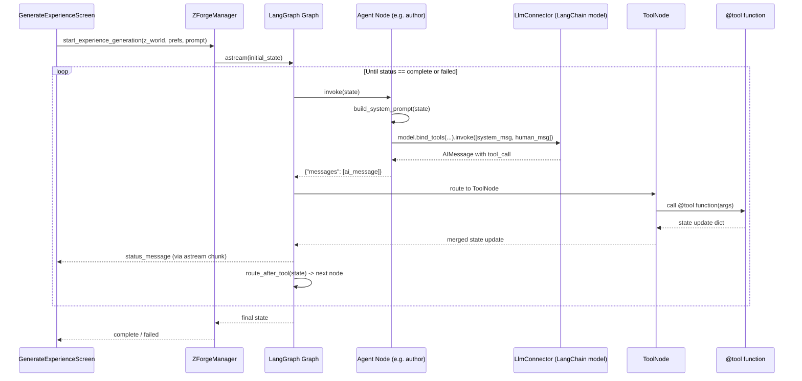

# LLM Orchestration

This document describes how [LangGraph](https://langchain-ai.github.io/langgraph/) drives the multi-step orchestration of World Generation and Experience Generation in Z-Forge.

## Overview

Each Z-Forge process (e.g., `create_world_graph`, `experience_generation_graph`) is implemented as a LangGraph `StateGraph`. The graph:

1. Holds all process state in a typed `TypedDict` (inputs, artifacts, counters, status)
2. Routes between named **nodes** (one per agent role or automated step)
3. Uses **conditional edges** to implement approve/reject/retry logic
4. Calls agent nodes by invoking the configured `LlmConnector.get_model()` bound to the relevant tools
5. Executes tool calls via LangGraph's `ToolNode`, which dispatches to Python `@tool` functions that update graph state
6. Terminates when the state's `status` field reaches `"complete"` or `"failed"`

This replaces the former hand-written orchestration loop. LangGraph handles retry routing, state persistence, and tool dispatch natively.

## Orchestration Components

### ZForgeManager
The `ZForgeManager` is the central coordinator. It:
- Holds singleton instances of `ZWorldManager` and `ExperienceManager`
- Constructs and invokes LangGraph graphs via `run_process(graph, state)`
- Exposes `asyncio`-based callbacks/events to the UI for progress updates

### LlmConnector
The configured `LlmConnector` (see [LLM Abstraction Layer](LLM%20Abstraction%20Layer.md)) provides a LangChain `BaseChatModel` via `get_model()`. This model is bound to the relevant tools for each graph node:

```python
model = llm_connector.get_model()
# Bind specific tools for this node
agent_runnable = model.bind_tools([submit_outline_tool])
```

### Tool Functions
Tools are plain Python functions decorated with `@tool` (from `langchain_core.tools`). Each tool:
- Accepts the artifacts produced by the agent at that step
- Performs any automated validation (e.g., ink compilation)
- Returns an updated partial state dict for LangGraph to merge into the graph state

See [Managers, Processes, and MCP Server](Managers,%20Processes,%20and%20MCP%20Server.md) for tool naming conventions and schema standards.

## LangGraph Graph Structure

Each process is a `StateGraph` with the following pattern:

```
[START] → agent_node → tool_node → conditional_edge → [next agent_node | END]
```

```python
from langgraph.graph import StateGraph, END
from langgraph.prebuilt import ToolNode

def build_experience_generation_graph(llm_connector, if_engine_connector):
    graph = StateGraph(ExperienceGenerationState)

    graph.add_node("author",       make_author_node(llm_connector))
    graph.add_node("scripter",     make_scripter_node(llm_connector, if_engine_connector))
    graph.add_node("tech_editor",  make_tech_editor_node(llm_connector))
    graph.add_node("story_editor", make_story_editor_node(llm_connector))
    graph.add_node("tools",        ToolNode(all_experience_tools))

    graph.set_entry_point("author")
    graph.add_edge("author", "tools")
    graph.add_conditional_edges("tools", route_after_tool, {
        "author":       "author",
        "scripter":     "scripter",
        "tech_editor":  "tech_editor",
        "story_editor": "story_editor",
        "end":          END,
    })

    return graph.compile()
```

### Agent Nodes
Each agent node builds a `SystemMessage` from graph state and a `HumanMessage` (action prompt), then calls `model.bind_tools(tools).invoke(messages)`. LangGraph automatically routes the resulting tool call to `ToolNode`.

```python
def make_author_node(llm_connector):
    model = llm_connector.get_model()

    def author_node(state: ExperienceGenerationState) -> dict:
        system_prompt = build_author_system_prompt(state)
        action_prompt = get_action_prompt_for_status(state["status"])
        response = model.bind_tools(
            [submit_outline_tool, approve_script_tool, reject_script_tool]
        ).invoke([
            SystemMessage(content=system_prompt),
            HumanMessage(content=action_prompt),
        ])
        return {"messages": [response]}

    return author_node
```

### ToolNode and Tool Functions

**Important**: Tools must return `Command(update={...})` (from `langgraph.types`), **not** a plain `dict`. LangGraph's `ToolNode` serializes plain dict returns into `ToolMessage.content` as JSON but does **not** merge them into graph state. Only `Command(update={...})` actually updates state, which is required for the conditional router to advance the graph.

```python
from langchain_core.tools import tool
from langgraph.types import Command

@tool
def submit_outline(outline: str, tech_notes: str, rationale: str) -> Command:
    """Author submits the story outline and tech notes."""
    return Command(update={
        "outline": outline,
        "tech_notes": tech_notes,
        "status": "awaiting_outline_review",
        "status_message": "Author submitted outline",
    })
```

### Conditional Edges (Routing)

```python
def route_after_tool(state: ExperienceGenerationState) -> str:
    routing = {
        "awaiting_outline_review":   "scripter",
        "awaiting_outline_revision": "author",
        "awaiting_script":           "scripter",
        "awaiting_script_fix":       "scripter",
        "awaiting_author_review":    "author",
        "awaiting_script_revision":  "scripter",
        "awaiting_tech_edit":        "tech_editor",
        "awaiting_tech_fix":         "scripter",
        "awaiting_story_edit":       "story_editor",
        "awaiting_story_fix":        "scripter",
        "complete":                  "end",
        "failed":                    "end",
    }
    return routing.get(state["status"], "end")
```

## Building System Prompts

System prompts are constructed dynamically from graph state. For each node, a `build_{role}_system_prompt(state)` function:
1. Adds the agent's role prompt (from [Experience Generation](Experience%20Generation.md) or [World Generation](World%20Generation.md))
2. Appends format specs for structured inputs (e.g., ZWorld format)
3. Appends relevant artifacts from the current state
4. Appends engine context for the Scripter (engine name and script prompt from `IfEngineConnector`)

### Experience Generation Orchestration Table

| Process Status | Next Node | Tools Offered |
|----------------|-----------|---------------|
| `awaiting_outline` | `author` | `submit_outline` |
| `awaiting_outline_review` | `scripter` | `approve_outline`, `reject_outline` |
| `awaiting_outline_revision` | `author` | `submit_outline` |
| `awaiting_script` | `scripter` | `submit_script` |
| `awaiting_script_fix` | `scripter` | `submit_script` |
| `awaiting_author_review` | `author` | `approve_script`, `reject_script` |
| `awaiting_script_revision` | `scripter` | `submit_script` |
| `awaiting_tech_edit` | `tech_editor` | `approve_tech`, `reject_tech` |
| `awaiting_tech_fix` | `scripter` | `submit_script` |
| `awaiting_story_edit` | `story_editor` | `approve_story`, `reject_story` |
| `awaiting_story_fix` | `scripter` | `submit_script` |

### World Generation Orchestration Table

| Process Status | Next Node | Tools Offered |
|----------------|-----------|---------------|
| `awaiting_validation` | `editor` | `validate_input` |
| `awaiting_generation` | `designer` | `create_zworld` |
| `awaiting_rejection_explanation` | `editor` | `explain_rejection` |


## Error Handling

### LLM Errors
If the LLM call fails (network error, rate limit, etc.), wrap the node with exponential backoff (3 attempts). On persistent failure, set `status = "failed"` with an appropriate `failure_reason`.

### Invalid Tool Calls
If the model returns an unexpected tool call or malformed arguments, log the error and retry the step (counting against the iteration limit). After repeated failures, transition to `"failed"`.

### Iteration Limits
Each feedback loop has a maximum (typically 5), tracked in the graph state (e.g., `outline_iterations`). When the limit is reached, the tool function sets `status = "failed"` and sets `failure_reason` to an explanatory message.

## UI Integration

The LangGraph graph runs asynchronously. `ZForgeManager.run_process()` streams updates to the Toga UI via an `asyncio` callback:

```python
async def run_process(self, graph, initial_state, on_status_update):
    async for chunk in graph.astream(initial_state):
        for node_output in chunk.values():
            if "status_message" in node_output:
                on_status_update(node_output["status_message"])
    return await graph.ainvoke(initial_state)
```

The UI observes `status_message` for progress display and checks `status` for completion or failure.

## Implementation Files

- `src/zforge/managers/zforge_manager.py` — `ZForgeManager` with `run_process()`
- `src/zforge/graphs/experience_generation_graph.py` — LangGraph experience generation graph
- `src/zforge/graphs/world_creation_graph.py` — LangGraph world creation graph
- `src/zforge/graphs/state.py` — `ExperienceGenerationState`, `CreateWorldState` TypedDicts
- `src/zforge/tools/experience_tools.py` — `@tool` functions for experience generation
- `src/zforge/tools/world_tools.py` — `@tool` functions for world creation
- `src/zforge/services/llm/llm_connector.py` — `LlmConnector` ABC
- `src/zforge/services/llm/openai_connector.py` — `OpenAiConnector`

## Sequence Diagram


