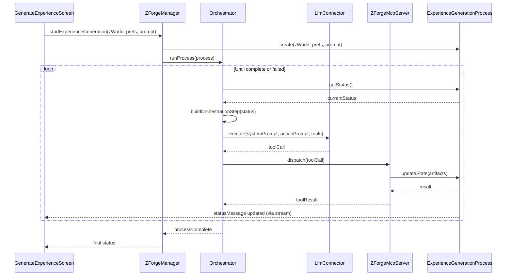

# LLM Orchestration

This document describes how the LLM, MCP Server, and ZForgeManager work together to drive multi-step processes like World Generation and Experience Generation.

## Overview

Z-Forge processes (e.g., `CreateWorldProcess`, `ExperienceGenerationProcess`) are orchestrated by a loop that:
1. Determines which agent should act based on the current process state
2. Constructs the appropriate system prompt and action prompt for that agent
3. Calls the LLM with a specific tool the agent should invoke
4. Receives the tool call and dispatches it to the MCP server
5. The MCP tool updates process state and returns results
6. The loop repeats until the process reaches `complete` or `failed`

## Orchestration Components

### ZForgeManager
The `ZForgeManager` is the central coordinator. It:
- Holds the current process instance (e.g., `currentExperienceProcess`)
- Provides the `runProcess()` method that executes the orchestration loop
- Exposes process state to the UI for progress display

### LlmConnector
The configured `LlmConnector` (e.g., `OpenAiConnector`) handles LLM communication:
- Receives system prompt, action prompt, and tool specification
- Returns tool calls from the LLM
- Does **not** maintain conversation history (stateless)

### ZForgeMcpServer
The `ZForgeMcpServer` dispatches tool calls to the appropriate handler:
- Maps tool names to handler functions
- Handlers update process state and return results
- Tool return values include everything needed for the next step

## Orchestration Loop

```dart
// Conceptual implementation in ZForgeManager
Future<void> runProcess(Process process) async {
  while (process.status != ProcessStatus.complete && 
         process.status != ProcessStatus.failed) {
    
    // 1. Determine next agent and build prompts
    final orchestrationStep = _buildOrchestrationStep(process);
    
    // 2. Call LLM with appropriate prompts and tool
    final toolCall = await _llmConnector.execute(
      systemPrompt: orchestrationStep.systemPrompt,
      actionPrompt: orchestrationStep.actionPrompt,
      tool: orchestrationStep.tool,
    );
    
    // 3. Dispatch tool call to MCP server
    final result = await _mcpServer.dispatch(toolCall);
    
    // 4. Process state is updated by the tool handler
    // Loop continues with new state
  }
}
```

## Building Orchestration Steps

For each process state, the orchestrator must determine:
- **Which agent** should act (Author, Scripter, Tech Editor, Story Editor, etc.)
- **What system prompt** to provide (role + context + artifacts)
- **What action prompt** to provide (specific instruction)
- **Which tool** to offer (the decision the agent will make)

### Example: Experience Generation Orchestration

| Process Status | Agent | System Prompt Includes | Action Prompt | Tool |
|----------------|-------|------------------------|---------------|------|
| `awaitingOutline` | Author | Role prompt + ZWorld + ZWorld Format + Preferences + Player Prompt | "Create an Outline and Tech Notes for this experience." | `experience_author_submit_outline` |
| `awaitingOutlineReview` | Scripter | Role prompt + Engine prompt + Outline + Tech Notes + Preferences | "Evaluate whether this Outline is suitable. Approve or provide feedback." | `experience_scripter_approve_outline` or `experience_scripter_reject_outline` |
| `awaitingOutlineRevision` | Author | Role prompt + ZWorld + Preferences + Previous Outline + Outline Notes | "Revise your Outline based on the Scripter's feedback." | `experience_author_submit_outline` |
| `awaitingScript` | Scripter | Role prompt + Engine prompt + Script prompt + Outline + Tech Notes | "Write a complete script implementing this Outline." | `experience_scripter_submit_script` |
| `awaitingScriptFix` | Scripter | Role prompt + Engine prompt + Script prompt + Previous Script + Compiler Errors | "Fix the compilation errors in this script." | `experience_scripter_submit_script` |
| `awaitingAuthorReview` | Author | Role prompt + Outline + Script | "Review whether this Script faithfully implements your Outline." | `experience_author_approve_script` or `experience_author_reject_script` |
| `awaitingScriptRevision` | Scripter | Role prompt + Engine prompt + Outline + Script + Script Notes | "Revise the Script based on the Author's feedback." | `experience_scripter_submit_script` |
| `awaitingTechEdit` | Tech Editor | Role prompt + Script + Tech Notes + Preferences (logical vs mood scale) | "Review this Script for logical consistency." | `experience_techeditor_approve` or `experience_techeditor_reject` |
| `awaitingTechFix` | Scripter | Role prompt + Engine prompt + Script + Tech Edit Report | "Fix the logical inconsistencies identified in the report." | `experience_scripter_submit_script` |
| `awaitingStoryEdit` | Story Editor | Role prompt + Script + Preferences + Player Prompt | "Review whether this Script aligns with player preferences." | `experience_storyeditor_approve` or `experience_storyeditor_reject` |
| `awaitingStoryFix` | Scripter | Role prompt + Engine prompt + Script + Story Edit Report + Preferences | "Modify the Script to better align with player preferences." | `experience_scripter_submit_script` |

### Example: World Generation Orchestration

| Process Status | Agent | System Prompt Includes | Action Prompt | Tool |
|----------------|-------|------------------------|---------------|------|
| `awaitingValidation` | Editor | Role prompt (literature editor) + Input text | "Determine if this is a valid world description." | `world_validate_input` |
| `awaitingGeneration` | Designer | Role prompt (IF designer) + ZWorld Format + Input text | "Create a ZWorld from this description." | `world_create_zworld` |

## System Prompt Construction

System prompts are constructed dynamically based on:
1. **Role prompt**: The agent's role (from Experience Generation.md or World Generation.md)
2. **Format specs**: When passing structured data (e.g., ZWorld), include the spec file contents
3. **Artifacts**: Current process artifacts relevant to this step
4. **Engine context**: For Scripter, include engine name and script prompt from `IfEngineConnector`

```dart
String buildSystemPrompt(Process process, AgentRole role) {
  final buffer = StringBuffer();
  
  // Add role prompt
  buffer.writeln(getPromptForRole(role));
  
  // Add format specs for structured inputs
  if (role == AgentRole.author && process.status == awaitingOutline) {
    buffer.writeln('\n--- ZWorld Format Specification ---');
    buffer.writeln(zworldFormatSpec);
  }
  
  // Add relevant artifacts
  buffer.writeln('\n--- Current Inputs ---');
  if (process.zWorld != null) {
    buffer.writeln('ZWorld: ${jsonEncode(process.zWorld)}');
  }
  if (process.outline != null) {
    buffer.writeln('Outline: ${process.outline}');
  }
  // ... etc
  
  // Add engine context for Scripter
  if (role == AgentRole.scripter) {
    buffer.writeln('\n--- IF Engine: ${ifEngineConnector.getEngineName()} ---');
    buffer.writeln(ifEngineConnector.getScriptPrompt());
  }
  
  return buffer.toString();
}
```

## Tool Selection Logic

When an agent can make multiple decisions (approve/reject), the orchestrator offers **both tools** and lets the LLM choose:

```dart
// For states where agent can approve or reject
final tools = [
  experience_scripter_approve_outline,
  experience_scripter_reject_outline,
];

final toolCall = await llmConnector.executeWithTools(
  systemPrompt: systemPrompt,
  actionPrompt: actionPrompt,
  tools: tools,
);
```

The LLM's tool choice determines the next state transition.

## Error Handling

### LLM Errors
If the LLM call fails (network error, rate limit, etc.):
- Retry with exponential backoff (3 attempts)
- On persistent failure, set `process.status = failed` with appropriate `failureReason`

### Invalid Tool Calls
If the LLM returns an unexpected tool or malformed arguments:
- Log the error for debugging
- Retry the same step (counts against iteration limit)
- After repeated failures, fail the process

### Iteration Limits
Each feedback loop has a maximum iteration count (typically 5):
- Tracked in process properties (e.g., `outlineIterations`)
- When limit reached, set `process.status = failed`
- Set `failureReason` to explain what couldn't be resolved

## UI Integration

The orchestration loop runs asynchronously. The UI observes process state:

```dart
// In GenerateExperienceScreen
StreamBuilder<ExperienceGenerationProcess>(
  stream: zforgeManager.processStream,
  builder: (context, snapshot) {
    final process = snapshot.data;
    return Column(
      children: [
        Text(process?.statusMessage ?? 'Starting...'),
        if (process?.status == ProcessStatus.failed)
          Text('Error: ${process.failureReason}'),
        if (process?.status == ProcessStatus.complete)
          ElevatedButton(
            onPressed: () => playExperience(process.compiledOutput),
            child: Text('Play Now'),
          ),
      ],
    );
  },
)
```

## Implementation Files

- `lib/services/managers/zforge_manager.dart` — `ZForgeManager` with `runProcess()` orchestration
- `lib/services/orchestration/orchestration_step.dart` — `OrchestrationStep` data class
- `lib/services/orchestration/experience_orchestrator.dart` — Experience-specific prompt building
- `lib/services/orchestration/world_orchestrator.dart` — World-specific prompt building
- `lib/services/llm/llm_connector.dart` — `LlmConnector.execute()` and `executeWithTools()`
- `lib/services/mcp/zforge_mcp_server.dart` — `ZForgeMcpServer.dispatch()`

## Sequence Diagram


