# Parsing Documents to Z-Bundles
Z-Forge has a standard [process](Processes.md) for extracting vector and graph data for a [Z-Bundle](RAG%20and%20GRAG%20Implementation.md) from free-text documents via [LLM](LLM%20Abstraction%20Layer.md). The pipeline uses a **two-pass split**: a coarse *context split* divides the document into large sections for graph extraction; each section is then re-split into smaller *retrieval chunks* for vector storage. Context chunks are processed in parallel (semaphore-bounded) — there is no sequential LLM breadcrumb loop. Entity canonicalization across chunks is handled by a post-extraction embedding-similarity deduplication pass.

Input is raw UTF-8 text. If the text appears to be a MediaWiki dump (XML export) or raw wikitext, a preprocessing step converts it to clean Markdown before splitting, removing template noise and XML markup that would otherwise pollute the vector and graph stores.

This is a general pipeline. [World Generation](World%20Generation.md) is one specific instance of it; once this general spec is stable, the World Generation spec will reference it explicitly.

```mermaid
flowchart LR
    subgraph phase1["Phase 1 · Preprocessing (optional)"]
        N_preproc["MediaWiki Preprocessor\n(detect + convert)"]
    end

    subgraph phase2["Phase 2 · Splitting (no LLM)"]
        N_struct["Structural Split\n(MarkdownTextSplitter + size cap)"]
        N_semantic["Retrieval Re-split per section\n(SemanticChunker)"]
    end

    subgraph phase3["Phase 3 · Per-chunk · parallel (semaphore-bounded)"]
        N_coref["Co-reference Resolver\n(fastcoref · local)"]
        N_gext["Graph Extractor\n(LLMGraphTransformer · gemini-2.5-flash-lite)"]
        N_vingest["Vector Ingestion\n(LanceDB · chunks table)"]
        N_gingest["Graph Ingestion\n(KuzuDB · property graph)"]
    end

    subgraph phase4["Phase 4 · Deduplication (no LLM)"]
        N_dedup["Entity Deduplicator\n(embedding cosine-similarity merge)"]
    end

    subgraph phase5["Phase 5 · Entity Summarization · parallel (semaphore-bounded)"]
        N_esum["Entity Summarizer\n(gemini-2.5-flash-lite)"]
        N_entv["LanceDB · entities table"]
        N_kuzut["KuzuDB node.text update"]
    end

    S(( )) --> N_preproc
    N_preproc --> N_struct
    N_struct --> N_semantic
    N_semantic -->|"context chunks +\nretrieval sub-chunks"| N_coref
    N_coref --> N_gext
    N_coref --> N_vingest
    N_gext --> N_gingest
    N_vingest --> N_dedup
    N_gingest --> N_dedup
    N_dedup --> N_esum
    N_esum --> N_entv
    N_esum --> N_kuzut
    N_entv --> E(( ))
    N_kuzut --> E
```



## Architectural Overview
A six-phase ETL process that transforms a text document into a dual-layered storage system:

- **Phase 1:** MediaWiki preprocessing (optional, detect + convert)
- **Phase 2:** Splitting — structural context split + SemanticChunker retrieval re-split (no LLM)
- **Phase 3:** Per-chunk parallel processing — co-reference resolution, graph extraction, vector + graph ingestion
- **Phase 4:** Post-extraction entity deduplication (embedding similarity merge, no LLM)
- **Phase 5:** Entity summarization (LLM, writes `entities` table)

Storage layers:
- **Vector Layer:** LanceDB (Semantic/Sensory Retrieval) — two tables: `chunks` (raw retrieval sub-chunks) and `entities` (LLM-synthesized per-entity summaries)
- **Graph Layer:** KuzuDB (Structural/Relational Retrieval)

Storage paths for both layers follow the Z-Bundle layout defined in [RAG and GRAG Implementation](RAG%20and%20GRAG%20Implementation.md#implementation).

## Chunking Strategy

The pipeline uses two distinct splitting passes for different purposes. The strategy chosen for each pass directly impacts LLM cost, retrieval precision, and the quality of extracted graph relationships.

### Context Pass (LLM Breadcrumb Loop)

The context pass produces large chunks for the sequential Contextualizer. Each chunk is sized to give the LLM enough narrative span to extract meaningful entity relationships. The key tradeoff: larger chunks cost more per LLM call but produce fewer calls and capture longer-range relationships.

**Approach: structure-aware split, then size-cap.**

1. If the source has structural markers (Markdown headers, chapter titles, scene breaks), split at those boundaries first using `MarkdownTextSplitter` or a custom header-separator list. Each section becomes one context chunk.
2. Any section exceeding `parsing_chunk_size` is sub-split with `RecursiveCharacterTextSplitter` to enforce the cap.
3. No structural markers present: fall back to `RecursiveCharacterTextSplitter` directly.

This ensures the LLM sees coherent sections (a chapter, a scene, a wiki article section) rather than arbitrary size-based cuts, improving entity and relationship extraction quality.

### Retrieval Pass (Vector Storage)

The retrieval pass re-splits each context chunk into the small sub-chunks stored in LanceDB and fetched at query time. Retrieval precision depends critically on chunk size: large chunks return coarse, noisy matches; chunks aligned to one or two sentences return precise matches.

**Approach: semantic chunking via `SemanticChunker`.**

`SemanticChunker` (from `langchain-experimental`) groups consecutive sentences until the embedding similarity to the next sentence drops below a threshold — a signal of a topic shift. This produces variable-length chunks naturally aligned to topic boundaries, typically 150–400 tokens, with no LLM calls (only embedding model calls).

Fall back to `RecursiveCharacterTextSplitter` with `parsing_retrieval_chunk_size` ≈ 500 characters when `SemanticChunker` is unavailable or too slow for the configured embedding model.

### Parent-Child Tagging

Each retrieval chunk stores a `parent_chunk_id` metadata field pointing back to the context chunk it was derived from. This enables two patterns:

- **Small-to-big retrieval:** find the precise retrieval chunk via similarity search, then fetch the full parent context chunk for LLM answer synthesis.
- **Graph anchoring:** the context chunk's `Document` is what `LLMGraphTransformer` processes; the cross-reference contract (`entity_id` = `Chunk.id`) links through the parent chain back to source text.

### Future: Propositional Chunking

Propositional chunking decomposes each passage into atomic subject-predicate-object propositions (15–30 tokens each, self-contained statements). These units map almost 1:1 to graph edges and deliver the highest retrieval precision of any known chunking strategy (Dense X Retrieval, Gao et al. 2023). The cost is one additional LLM pass per paragraph. This is tracked on the [roadmap](../roadmap.md).

## Phase 1: Preprocessing (MediaWiki Detection)

**Goal:** Detect whether `input_text` is a MediaWiki XML dump or dense raw wikitext, and if so, convert it to clean Markdown before the downstream splitter runs.  This strips template noise, XML tags, and wikilink syntax that would otherwise inflate chunk counts and pollute LLM context.

### Detection Heuristics

Two signals are checked, in order:

1. **XML dump** — the document's first 2,000 characters contain a `<mediawiki` element.  This is the unambiguous signal emitted by the MediaWiki XML export tool.
2. **Raw wikitext** — all three of the most distinctive wiki-markup tokens (`{{`, `[[`, `==`) appear at least 3 times each.  Documents with this density are almost certainly wikitext.

If neither signal fires, the node is a transparent pass-through and `input_text` is unchanged.

### Conversion Rules (mwparserfromhell)

The conversion iterates the `mwparserfromhell` node tree for each wikitext string:

| Node type | Output |
|---|---|
| `Heading` (`== … ==`) | ATX Markdown heading (`## …`) at the corresponding depth |
| `Wikilink` (`[[Page\|Display]]`) | Display text if present, otherwise page title |
| `ExternalLink` (`[URL Title]`) | Title text; bare URLs without a title are dropped |
| `Template` (`{{ … }}`) | Stripped entirely |
| `Tag` (HTML `<tag>…</tag>`) | Inner content only; surrounding tags dropped |
| `Comment` | Dropped |
| `Text` | Passed through unchanged |

For **XML dumps**, each `<page>/<revision>/<text>` element is extracted and processed individually, then joined with `---` separators so the downstream splitter sees one continuous text.  Page titles become top-level `#` headings.

### Implementation

- **Library:** `mwparserfromhell` (imported lazily inside the node, only on the hot path)
- **Node name:** `mediawiki_preprocessor` (synchronous; no LLM calls)
- **Helpers:** `_is_mediawiki_dump(text)`, `_wikitext_to_markdown(wikitext)`, `_mediawiki_to_markdown(text)` in `document_parsing_graph.py`
- **Detection threshold constant:** `_WIKITEXT_MIN_MARKER_COUNT = 3`
- The node returns `{}` (no state change) when the input is not identified as MediaWiki content.

## Co-reference Resolution (Phase 3 sub-step)

**Goal:** Resolve pronouns and nominal references to their canonical entity names within each context chunk before graph extraction, so that relationship edges are correctly attributed rather than left attached to generic pronouns.

### Why this matters

`LLMGraphTransformer` processes one context chunk at a time. When a passage reads *"He commanded the Watch for thirty years. His wife was Lady Sybil."*, the model sees an ambiguous pronoun with no prior context binding it to a specific character. Resolving *"He"* → *"Sam Vimes"* and *"His"* → *"Sam Vimes"* before chunking eliminates this ambiguity and produces correctly attributed edges (`Sam Vimes → commanded → Watch`, `Sam Vimes → married_to → Lady Sybil`) rather than orphaned or generic ones.

This is a pre-processing pass with no LLM cost — co-reference resolution runs entirely locally via spaCy.

### Process

For each context chunk produced by Phase 2 (run in the same parallel loop as graph extraction):

1. Pass the context chunk text to `fastcoref` to build a co-reference chain map: `{mention_span → canonical_name}`.
2. Replace each resolved mention with its canonical form, preserving surrounding punctuation and capitalisation.
3. Pass the resolved chunk text to the graph extractor and vector ingestion steps.

### Implementation

- **Library:** `fastcoref` (FCoref model)
- **Node name:** `coref_resolver` (synchronous; no LLM calls)
- **Configuration:** `coref_resolution_enabled` (`bool`, default `true`). Set to `false` to skip for languages other than English or when source text is already explicit (e.g. structured lore wikis where prose uses names throughout).
- **Apply per context chunk, not per document.** Co-reference resolution runs on each context chunk produced by the Phase 2 structural/size split, not on the full input text. This is correct by design: ~95% of pronoun-antecedent pairs are within 5–10 sentences of each other, so cross-chunk chains are rare and their loss is acceptable. It also sidesteps coreferee's O(n²) mention-pair scoring, which makes whole-document resolution impractically slow above ~50,000 characters and is the reason the node is placed after chunking, not before it.
- **Pitfall:** `fastcoref`'s `get_clusters()` returns high-level string clusters, but the underlying `res.clusters` list contains token-level spans that use `numpy.int64` and internal `coreferee`-style indexing. Attempting to slice `text` using these raw offsets, or attempting `int(span[0])` on a `CorefResult` object, can lead to `TypeError` or "invalid literal for int() with base 10: 'h'" (if the score field is misinterpreted). 
**Correct pattern:** Access the `char_map` attribute of the `CorefResult` to translate the token-based internal clusters into character-level spans:
```python
res = coref_model.predict(texts=[text])[0]
for cluster in res.clusters:
    for span in cluster:
        char_span = res.char_map.get(span)
        if char_span:
            start, end = char_span[1] # Actual character offsets
```
- **Max length:** `fastcoref` neural pass adds quadratic cost in the number of candidate mentions. Do not pass context chunks larger than `coref_max_chars` (default `60,000` characters — approximately 10,000–12,000 tokens) to the resolver. Chunks exceeding this cap are passed through unmodified; entity deduplication (Phase 4) handles the name-variant cleanup for any pronouns that remain unresolved.
- Lazy-import `fastcoref` inside the node to avoid loading the model on startup.

## Phase 2: Splitting

**Goal:** Divide `input_text` into context chunks for graph extraction and retrieval sub-chunks for vector storage. No LLM calls — this phase is entirely local.

### Context Split

Split the document at structural boundaries first (Markdown headers, scene breaks, `---` separators produced by Phase 1), then size-cap any oversized section with `RecursiveCharacterTextSplitter`. This ensures each context chunk corresponds to a coherent unit of narrative (a scene, chapter, wiki section) rather than an arbitrary character count, improving entity and relationship extraction quality in Phase 3.

- **Libraries:** `MarkdownTextSplitter` (structural boundaries) → `RecursiveCharacterTextSplitter` (size cap fallback)
- `chunk_size` (`parsing_chunk_size`) default: **10,000 characters**; `chunk_overlap` (`parsing_chunk_overlap`) default: **500 characters** (5%). Configurable in the LLM Configuration screen (see [Application Configuration](Application%20Configuration.md#parsing-pipeline)).
- Output: `state["context_chunks"]` — a list of plain strings.

### Retrieval Re-split

Each context chunk is immediately re-split into smaller sub-chunks for vector storage.

- **Library:** `SemanticChunker` (from `langchain-experimental`) — groups consecutive sentences until the embedding similarity to the next sentence drops below a threshold, producing variable-length chunks of 150–400 tokens naturally aligned to topic boundaries. No LLM calls — uses only the embedding model.
- Fallback to `RecursiveCharacterTextSplitter` at `parsing_retrieval_chunk_size` ≈ 500 characters if `SemanticChunker` is unavailable or too slow for the configured embedding model.
- Each sub-chunk stores `parent_chunk_id` metadata pointing back to its parent context chunk (enables small-to-big retrieval; see [Chunking Strategy](#chunking-strategy)).
- Output: `state["retrieval_documents"]` — a list of `Document` objects, one per sub-chunk.
- When `parsing_retrieval_chunk_size ≥ parsing_chunk_size`, no re-split occurs and vector ingestion uses `state["context_chunks"]` directly.

## Phase 3: Per-chunk Parallel Processing

**Goal:** For each context chunk, run co-reference resolution, graph extraction, and vector ingestion concurrently across chunks (semaphore-bounded). No sequential dependency between chunks — canonicalization is deferred to Phase 4.

### A. Vector Ingestion (LanceDB)

- **Class:** `langchain_community.vectorstores.LanceDB`
- **Method:** `from_documents`
- **Params:** `documents` (list), `embedding` (configured embedding model), `connection` (LanceDB connection), `table_name="chunks"` (canonical table name per [RAG and GRAG Implementation](RAG%20and%20GRAG%20Implementation.md#implementation))
- **`entity_type` casing contract:** The `entity_type` column in LanceDB must be the **snake_case** form of the PascalCase KuzuDB node table name — e.g. `Character` → `"character"`, `TimePeriod` → `"time_period"`, `BeliefSystem` → `"belief_system"`. This is the value passed in the `entity_type` filter of `query_world` and `retrieve_source`. The authoritative mapping is in the Z-Bundle type spec (e.g. [Z-World § Implementation](Z-World.md#implementation)).
- **Note:** The embedding model used here must be recorded in the Z-Bundle's KVP store (`embedding_model_name`, `embedding_model_size_bytes`) and must match the model used at query time.

### B. Graph Ingestion (KuzuDB)

#### Schema Creation (`_pre_create_schema`)

Before any data is written, `_MultiTypeKuzuGraph._pre_create_schema` runs DDL to declare all node and relationship tables. This step receives two inputs from the calling process:

- **`allowed_nodes`** — the concrete list of node type names (PascalCase, no macros). One `CREATE NODE TABLE IF NOT EXISTS` is issued per entry with at minimum `id STRING, type STRING` as columns, plus any Z-Bundle-type-specific columns declared in that type's spec (see [Z-World § Implementation](Z-World.md#implementation) for the authoritative column list). A `Chunk` table is also created with `id STRING, text STRING, type STRING`.
- **`allowed_relationships`** — the list of relationship type names. For each, a `CREATE REL TABLE GROUP IF NOT EXISTS` is issued spanning the full cross-product of FROM/TO node type pairs, with the relationship-property columns declared as typed columns (see Z-Bundle type spec for types). The five universal extractable properties (`from_time STRING`, `to_time STRING`, `role STRING`, `perspective STRING`, `canonical BOOL`) are included on every relationship table group.

**Macro expansion:** Z-Bundle type specs write relationship declarations using `AGENT` and `ENTITY` shorthand (see [Z-World](Z-World.md#implementation)). These are **not** passed to `_pre_create_schema` — the calling process must expand them to concrete node type lists before calling the pipeline. The expanded FROM/TO pairs are used when creating REL TABLE GROUPs, ensuring every valid combination is pre-declared and avoiding the per-document schema-creation pitfalls described in the Implementation section below.

The result after schema creation: every node type has a table; every relationship type has a group table covering all agent/entity combinations; the `MENTIONS` group covers all `Chunk → <node type>` pairs. No data has been written yet.

#### LLM Node: Graph Extractor

The **Graph Extractor** node drives `LLMGraphTransformer`. Default: `gemini-2.5-flash-lite` (Google).

- **Extraction Class:** `langchain_experimental.graph_transformers.LLMGraphTransformer`
  - **Method:** `convert_to_graph_documents`
  - **Params:** the list of `Document` objects from Phase 2
  - **Config:** `allowed_nodes`, `allowed_relationships`, `node_properties`, and `relationship_properties` are specified by the calling process; they are not defined in this general pipeline spec.
  - **`node_properties`:** A list of node property names the LLM should attempt to extract alongside each entity. Populated where the text provides evidence; absent values are left null. See the Z-Bundle type spec for the authoritative list (e.g. [Z-World § Implementation](Z-World.md#implementation)).
  - **`relationship_properties`:** A list of edge property names that the LLM should attempt to extract from the source text alongside each relationship. The LLM populates these where the text provides evidence; absent values are left null. Priority fields are those most likely to be explicitly stated in prose — see the Z-Bundle type spec for the authoritative list (e.g. [Z-World § Implementation](Z-World.md#implementation)).
- **Storage Class:** `langchain_community.graphs.KuzuGraph`
  - **Method:** `add_graph_documents`
  - **Params:** `graph_documents` (output from transformer), `include_source=True`
  - `include_source=True` causes a `Chunk` node to be created in KuzuDB for each source text chunk, with `MENTIONS` edges from every extracted entity node back to its source chunk. The `Chunk.id` matches the `entity_id` in the corresponding LanceDB row — this is the cross-reference contract defined in [RAG and GRAG Implementation § Cross-Reference Contract](RAG%20and%20GRAG%20Implementation.md#cross-reference-contract).

## Parallelization Strategy

To manage concurrency and rate limits:

- Wrap the LanceDB write and KuzuDB extraction/write in `asyncio.gather` for concurrent execution.
- Gate concurrency with a `Semaphore(value=N)`, where N is configurable (e.g. 5–10 for Gemini Flash Lite), to avoid HTTP 429 rate-limit errors.

## Phase 4: Entity Deduplication

**Goal:** Merge duplicate entity nodes produced by `LLMGraphTransformer` before Phase 5 (entity summarization) runs, so summaries are written against clean canonical nodes rather than fragments.

### Why this matters

`LLMGraphTransformer` generates node `id` values from the text it sees. Across different chunks, the same entity frequently appears under multiple surface forms: `"Ankh-Morpork"`, `"Ankh Morpork"`, `"the city"`, `"the city of Ankh-Morpork"`. Each becomes a separate KuzuDB node with a disjoint set of relationship edges. Queries for `"Ankh-Morpork"` miss the edges attached to the variants; entity summaries synthesize from an incomplete passage set.

### Process

1. For each node table in `allowed_nodes`, retrieve all `(id, type)` pairs from KuzuDB.
2. Embed each `id` string (using the configured embedding model).
3. Cluster by cosine similarity within the same `type`: pairs above `entity_dedup_threshold` (default `0.93`) are candidate duplicates.
4. Within each cluster, select the canonical form (longest string, or the most-connected node by edge count if lengths are equal).
5. For each non-canonical duplicate:
   a. Repoint all incoming and outgoing edges to the canonical node id via Cypher `MERGE`.
   b. Delete the duplicate node.
6. Update `n.id` references in the LanceDB `chunks` table (`entity_id` column) to the canonical id.

### Implementation

- No LLM calls — uses only the embedding model already loaded for vector ingestion.
- **Configuration:** `entity_dedup_enabled` (`bool`, default `true`); `entity_dedup_threshold` (`float`, default `0.93`).
- Runs synchronously after Phase 3 completes and before Phase 5 begins (depends on graph write; must precede summary generation).
- Step 5 (edge repointing via Cypher) requires parameterised KuzuDB queries. KuzuDB supports `$param` substitution in `MERGE` and `SET` clauses — use `graph.query(cypher, params={...})`.
- **Pitfall:** KuzuDB does not support renaming a node's primary key (`id`) in-place via `SET`. The correct pattern for a merge is: create the canonical node (if not already present via `MERGE`), copy all edges, then `DELETE` the duplicate. Do not attempt `SET n.id = $new_id`.

## Phase 5: Entity Summarization

**Goal:** For each entity node written to KuzuDB in Phase 3, synthesize a 1–5 paragraph natural-language summary from its source passages and embed it into a second LanceDB table (`entities`). This enables single-call entity-centric retrieval at query time without a follow-up graph or chunk lookup.

This is the entity summarization pattern from Microsoft's GraphRAG (2024). See the [GraphRAG assessment](#graphrag-assessment) below for why ZForge implements this pattern independently rather than using the GraphRAG library directly.

### Process

1. Query KuzuDB: `MATCH (c:Chunk)-[:MENTIONS]->(n:{label}) WHERE n.id = $id RETURN c.text` to collect all source passages mentioning the entity.
2. If no passages are found, skip this entity.
3. **Rank and trim passages to fit the character budget:** embed the entity's `id` string as a query vector and rank candidate passages by cosine similarity. Take the top-`entity_summarization_max_passages` passages, then concatenate in ranked order until the total character count reaches `entity_summarization_max_chars`. Truncate at that boundary. If an entity already has a non-empty `text` in KuzuDB (set during extraction), prepend it as the highest-priority passage before ranking.
4. Prompt the **Entity Summarizer** LLM with the trimmed passages and entity name/type. Prompt template:
   > You are summarizing an entity from a fictional world. Based only on the following source passages, write a 1–5 paragraph factual summary of {entity_type} "{entity_id}". Do not invent facts not present in the passages.
5. Write the summary text back to `n.text` in KuzuDB (updating the node property).
6. Embed the summary and write a row to the LanceDB `entities` table: `{vector, entity_id, entity_type, text}`.

### LLM Node: Entity Summarizer

Default: a fast, cheap model is appropriate here (e.g. `gemini-2.5-flash-lite`). The summaries are factual syntheses, not creative writing.

### Configuration

- **`entity_summarization_enabled`** (`bool`, default `true`) — set to `false` to skip Phase 5 entirely for quick/draft ingestion. When disabled, `query_world` falls back to the `chunks` table only.
- **`entity_summarization_max_passages`** (`int`, default `20`) — maximum number of passages (by relevance rank) to consider before applying the character budget.
- **`entity_summarization_max_chars`** (`int`, default `40000`) — hard character budget for the total passage text passed to the LLM. Passages are added in relevance order until this limit is reached. Prevents context overflow on frequently-mentioned entities in large source documents.

### Implementation

- Phase 5 runs after Phase 4 completes (not concurrent with it — it depends on the graph being written).
- Entities are processed with bounded concurrency (same semaphore pattern as Phase 3).
- The `entities` LanceDB table schema is identical to `chunks`: `{vector float32[], entity_id STRING, entity_type STRING, text STRING}`. The `entity_id` value matches the entity's KuzuDB node `id` directly (not a chunk id).
- **Passage ranking:** embed the entity `id` string using the same `_LLAMA_EXECUTOR` pattern as the embedding nodes in Phase 3. Use cosine similarity against each candidate passage's vector (already stored in the `chunks` table — no re-embedding needed). Sort descending; take up to `entity_summarization_max_passages`, then apply the `entity_summarization_max_chars` budget. The seed text from KuzuDB `n.text`, if non-empty, is prepended unconditionally and is not counted against the passage count cap.

### GraphRAG Assessment

Microsoft's [GraphRAG](https://github.com/microsoft/graphrag) library implements community detection (Leiden algorithm over the graph), multi-level community summarization (local, global, and drift search), and Parquet-based storage. These capabilities are well-suited for **large document corpora** (thousands of documents, deep thematic analysis) and **global/thematic queries** ("what are the major factions?", "what themes recur?").

ZForge does **not** use the GraphRAG library directly for the following reasons:

1. **Storage coupling** — GraphRAG requires Parquet files and its own indexer pipeline. ZForge's stores (LanceDB + KuzuDB) are already defined, embedded on-device, and used across multiple process types. Introducing a second, separate storage stack for one library would fragment the architecture.
2. **Community detection is not the right primitive** — GraphRAG's core value is community-level summarization for thematic/global queries. The ZForge use case is predominantly entity-centric fact retrieval ("where does Vimes live?", "who leads the Watch?"). Leiden clustering adds overhead that does not improve this.
3. **Graph ownership** — GraphRAG builds and manages its own graph internally. ZForge owns its KuzuDB graph (it is used by multiple processes: world generation, ask-about-world, experience generation). A library that wraps graph creation cannot be composed with an existing externally-managed graph without significant adapter work.
4. **On-device constraint** — GraphRAG's indexer is designed for server-side batch processing. The ZForge parsing pipeline runs on desktop hardware, is invoked interactively, and must fit within the same resource envelope as the rest of the application.

**The patterns borrowed from GraphRAG** — entity summarization and graph-seeded vector lookup — are implemented directly and are sufficient for the ZForge query profile. No GraphRAG library dependency is introduced.

## Summary of Key LangChain Components

| Component | Class | Primary Method |
|---|---|---|
| Context splitter | `MarkdownTextSplitter` / `RecursiveCharacterTextSplitter` | `split_text` |
| Retrieval splitter | `SemanticChunker` | `create_documents` |
| Co-reference resolver | `fastcoref` | `model.predict(texts=[text])[0]` |
| Data container | `Document` | `__init__(page_content, metadata)` |
| Graph transformer | `LLMGraphTransformer` | `convert_to_graph_documents` |
| Graph store | `KuzuGraph` | `add_graph_documents` |
| Vector store | `LanceDB` | `from_documents` |

## Implementation

- **Process slug:** `document_parsing`
- **Implementation file:** `src/zforge/graphs/document_parsing_graph.py` (new file)
- **LLM nodes** (defined in `process_config.py`):
  - `graph_extractor` — Phase 3 graph extraction via `LLMGraphTransformer`; default `Google` / `gemini-2.5-flash-lite`
  - `entity_summarizer` — Phase 5 per-entity summary generation; default `Google` / `gemini-2.5-flash-lite`
- **Local NLP / embedding nodes** (no LLM; run inside the Phase 3 parallel loop):
  - `coref_resolver` — Phase 3 co-reference resolution sub-step via `fastcoref`, per context chunk. Enabled by `coref_resolution_enabled` config flag.
  - `entity_deduplicator` — Phase 4 embedding-similarity node merge, runs after all Phase 3 writes complete. Enabled by `entity_dedup_enabled` config flag.
- **Context-pass chunk defaults:** `parsing_chunk_size = 10000`, `parsing_chunk_overlap = 500` (5%); stored in `ZForgeConfig`. These govern the LLM breadcrumb loop.
- **Retrieval-pass chunk defaults:** `parsing_retrieval_chunk_size = 500`, `parsing_retrieval_chunk_overlap = 50` (10%); stored in `ZForgeConfig`. These govern the fine-grained vector-store split. When `parsing_retrieval_chunk_size ≥ parsing_chunk_size`, the pipeline runs single-pass (no re-split). Both sets of parameters are user-configurable via the **Parsing Pipeline** section of the LLM Configuration screen (chunk sizes in characters; overlaps expressed as percentages of the respective chunk size).
- `allowed_nodes` and `allowed_relationships` for `LLMGraphTransformer` are not defined here; they are specified by the caller (e.g., World Generation).
- **`DocumentParsingState`** (in `src/zforge/graphs/state.py`) — Add a new TypedDict for this process:
  ```python
  class DocumentParsingState(TypedDict):
      input_text: str                   # Raw source text
      z_bundle_root: str                # Z-Bundle root path (target for LanceDB + KuzuDB)
      allowed_nodes: list[str]          # Passed from caller (e.g. World Generation)
      allowed_relationships: list[str]  # Passed from caller
      chunks: list[str]                 # Context-pass text chunks (set by Text Splitter node)
      documents: list                   # Context-pass Document objects with breadcrumbs (graph ingestion)
      retrieval_documents: list         # Retrieval-pass Document objects (vector ingestion)
      current_chunk_index: Annotated[int, operator.add]  # Phase 3 loop counter
      status: str
      status_message: str
  ```

### Async nodes required — AFC deadlock pitfall

**Pitfall:** All LLM-calling nodes (`contextualizer`, `graph_ingestion`, `fan_out`) **must** be `async def` and use the async model API (`model.ainvoke()`, `transformer.aconvert_to_graph_documents()`). Do **not** call the synchronous equivalents from inside the graph.

**Why it occurs:** The parent graph is consumed via `graph.astream()` (see `ZForgeManager.run_process`). LangGraph runs synchronous nodes in a thread-pool executor to avoid blocking the event loop. The `google-genai` SDK (v1+, underpinning `ChatGoogleGenerativeAI` for Gemini 2.5 models) enables AFC (Automatic Function Calling) and manages async HTTP internally. When `model.invoke()` is called from inside a thread-pool thread, the SDK attempts to schedule async coroutines on an event loop. If the SDK tries to call `asyncio.get_running_loop()` or `asyncio.run()` from within a thread whose loop state is entangled with the parent asyncio event loop, the call hangs indefinitely with no error — the only visible symptom is the log line `AFC is enabled with max remote calls: 10` from `google_genai.models` followed by silence.

**Correct pattern:** Declare nodes as `async def` and use `await model.ainvoke(...)` / `await transformer.aconvert_to_graph_documents(...)`. LangGraph's async runner then awaits them directly on the event loop rather than offloading to a thread, eliminating the deadlock. For nodes that call sync I/O, keep the calls inline inside the async function body — do **not** use `asyncio.to_thread` for any node that loads or runs a local llama.cpp model (see the Metal pitfall below).

### macOS Metal + local embedding models — single-thread executor required

**Pitfall:** Local embedding nodes (those using llama.cpp via `LlamaCppEmbeddingConnector`) cannot safely run either (a) synchronously on the event loop thread, or (b) via `asyncio.to_thread` / a general thread pool:

- **On the event loop thread (async def, no offloading):** llama.cpp model loading and inference are CPU-intensive and block the event loop entirely, freezing the Toga UI for minutes with no feedback.
- **Via `asyncio.to_thread` or a general `ThreadPoolExecutor`:** `ggml_metal` (the GPU backend for llama.cpp on macOS) binds its Metal command queue to the OS thread on which the model is *first loaded*. A general thread pool may dispatch subsequent calls to a different thread, causing Metal to silently hang with no error or timeout.

**Correct pattern:** Use a **module-level `ThreadPoolExecutor(max_workers=1)`** (named `_LLAMA_EXECUTOR`). All embedding computation is dispatched to this executor via `await loop.run_in_executor(_LLAMA_EXECUTOR, fn)`. Because the executor has exactly one worker thread, every call is guaranteed to land on the same OS thread, satisfying Metal's thread-affinity requirement while releasing the event loop so the UI stays responsive. `_LLAMA_EXECUTOR` is defined in `document_parsing_graph.py` and imported by `world_creation_graph.py` for use in `query_world`.

### `lancedb.connect()` deadlocks in any asyncio context

**Pitfall:** `lancedb.connect()` (the synchronous wrapper) bridges async work onto LanceDB's own internal background event loop via `asyncio.run_coroutine_threadsafe` + `future.result()`. The Rust/PyO3 internals that power the actual connection attempt to attach their futures to `asyncio.get_event_loop()` of the calling thread. When called from *any* thread that has an asyncio event loop reference — either the event loop thread itself, or a thread-pool thread spawned from an asyncio context — the internal future gets attached to a *different* loop than the one running `do_connect`. This raises: `RuntimeError: Task got Future attached to a different loop`.

This affects both the write path (`LanceDBVectorStore.from_documents`) and the read path (`lancedb.connect()` in retriever tools).

**Correct pattern:** Always use `await lancedb.connect_async(path)` from within async functions. Then use the native `AsyncTable` API for reads and writes. Only the embedding computation (the llama.cpp call) goes to `_LLAMA_EXECUTOR`; the LanceDB connection and table operations are awaited directly on the event loop.

### KuzuDB database path must not be pre-created as a directory

**Pitfall:** Calling `os.makedirs(graph_path, exist_ok=True)` before `kuzu.Database(graph_path)` creates `graph_path` as a directory. KuzuDB's `Database()` constructor then raises `Database path cannot be a directory: …/propertygraph`.

**Correct pattern:** Do not `makedirs` the graph path. KuzuDB creates its own database file at the given path. The path string should be a plain file path (e.g. `{z_bundle_root}/propertygraph`) with no trailing slash.

### KuzuGraph requires `allow_dangerous_requests=True`

**Pitfall:** Constructing `KuzuGraph(db)` without `allow_dangerous_requests=True` raises an error at runtime.

**Correct pattern:** Always construct as `KuzuGraph(db, allow_dangerous_requests=True)`. This applies wherever `KuzuGraph` is instantiated — both in `graph_ingestion_node` (write path) and `query_world` (read path in the summarizer and librarian tools).

### `KuzuGraph.add_graph_documents` requires `allowed_relationships` as triplets

**Pitfall:** `KuzuGraph.add_graph_documents` has the signature `(graph_documents, allowed_relationships, include_source=False)` — `allowed_relationships` is a **required positional parameter** of type `List[Tuple[str, str, str]]` (source node type, relationship type, target node type). Calling it without this argument, or passing keyword-only, raises a `TypeError`.

**Note:** In the current version of `langchain-community`, this parameter is accepted but not actually executed against — the schema is created dynamically per relationship via `_create_entity_relationship_table`. A full Cartesian product of `allowed_nodes × allowed_relationships × allowed_nodes` satisfies the signature and is future-proof if the implementation starts using it.

### KùzuDB `REL TABLE` single-pair schema violation

Two related pitfalls arise from `KuzuGraph`'s lazy, per-document schema creation when `add_graph_documents` is called across multiple documents:

**Pitfall 1 — Entity relationship tables:** `_create_entity_relationship_table` issues `CREATE REL TABLE IF NOT EXISTS {name} (FROM {src} TO {tgt})` — a **single** FROM-TO pair. When the same relationship type is extracted between different node type pairs across documents, `IF NOT EXISTS` silently skips later DDL. The `MERGE` then raises a Binder exception: *"Query node eN violates schema. Expected labels are X."*

**Pitfall 2 — MENTIONS table:** The `MENTIONS` REL TABLE GROUP is seeded with only the node labels found in the *first* document. For subsequent documents, `CREATE REL TABLE GROUP IF NOT EXISTS MENTIONS (...)` skips re-creation, so new entity types introduced in later chunks are never added. The same Binder exception occurs when merging MENTIONS edges for those new types.

**Correct pattern:** Subclass `KuzuGraph` and (a) add a `_pre_create_schema` method that creates all node tables and the full `MENTIONS` group from the complete `allowed_nodes` list *before* calling `add_graph_documents`, and (b) override `_create_entity_relationship_table` to use `CREATE REL TABLE GROUP` and `ALTER TABLE ADD FROM ... TO ...`:

```python
class _MultiTypeKuzuGraph(KuzuGraph):
    def _pre_create_schema(self, allowed_node_labels: list[str]) -> None:
        for label in allowed_node_labels:
            self.conn.execute(
                f"CREATE NODE TABLE IF NOT EXISTS {label} "
                f"(id STRING, type STRING, PRIMARY KEY (id))"
            )
        self.conn.execute(
            "CREATE NODE TABLE IF NOT EXISTS Chunk "
            "(id STRING, text STRING, type STRING, PRIMARY KEY (id))"
        )
        from_to_pairs = ", ".join(f"FROM Chunk TO {lbl}" for lbl in allowed_node_labels)
        try:
            self.conn.execute(
                f"CREATE REL TABLE GROUP MENTIONS "
                f"({from_to_pairs}, label STRING, triplet_source_id STRING)"
            )
        except Exception:
            for label in allowed_node_labels:
                try:
                    self.conn.execute(f"ALTER TABLE MENTIONS ADD FROM Chunk TO {label}")
                except Exception:
                    pass  # Pair already registered.

    def _create_entity_relationship_table(self, rel) -> None:
        src, rel_type, tgt = rel.source.type, rel.type, rel.target.type
        try:
            self.conn.execute(f"CREATE REL TABLE GROUP {rel_type} (FROM {src} TO {tgt})")
        except Exception:
            try:
                self.conn.execute(f"ALTER TABLE {rel_type} ADD FROM {src} TO {tgt}")
            except Exception:
                pass  # Pair already registered.
```

Call `graph._pre_create_schema(allowed_nodes)` immediately after constructing the instance, before `add_graph_documents`.

### `SemanticChunker` batch overflow — `llama_decode returned -1`

**Pitfall:** `SemanticChunker` (from `langchain-experimental`) internally calls `embedder.embed_documents(sentences)` where `sentences` is a list of every sentence in the input text. For long context chunks, this can involve hundreds of sentences. As documented in [`embed_documents` batch overflow](#embed_documents-batch-overflow--llama_decode-returned--1), this single-batch call is prone to overflowing llama.cpp's decode capacity even if each sentence is small, causing `RuntimeError: llama_decode returned -1`. 

**Correct pattern:** ZForge uses a custom `_stable_semantic_split` implementation (in `document_parsing_graph.py`) that processes sentences using `embedder.embed_query(s)` one-by-one. While logically similar to `SemanticChunker`, this avoids the batch overflow pitfall by ensuring each sentence occupies its own decode pass. This is wrapped in `LLAMA_EXECUTOR` to ensure single-threaded stability on macOS Metal.

### `embed_documents` batch overflow — `llama_decode returned -1`

**Pitfall:** `LlamaCppEmbeddings.embed_documents(texts)` forwards the entire list of texts to `llama_cpp.create_embedding(texts)`, which feeds all texts into a single `decode_batch()` call. llama.cpp accumulates all input token sequences into one `llama_batch` and calls `llama_decode` on it. Even if each individual chunk is well within `n_ctx`, the combined batch of all chunks together overflows the decode capacity, causing `llama_decode` to return -1, surfaced as `RuntimeError: llama_decode returned -1`. This happens regardless of chunk size — even 500-char chunks hit this when there are many of them.

**Correct pattern:** In `vector_ingestion_node`, call `embedder.embed_query(text)` for each text in a loop instead of `embedder.embed_documents(texts)`. `embed_query` processes one text per `llama_decode` call and always stays within `n_ctx`.

```python
def _embed_one_by_one(embed_texts):
    return [embedder.embed_query(t) for t in embed_texts]

vectors = await loop.run_in_executor(_LLAMA_EXECUTOR, lambda: _embed_one_by_one(texts_for_embed))
```

### Embedding context overflow — per-text truncation

Even with per-text `embed_query()` calls, individual texts must not exceed `n_ctx` tokens. `EmbeddingConnector` exposes `get_context_size()`. In `vector_ingestion_node`, texts are truncated to `get_context_size() * 3` characters before embedding. Using `3` chars/token (rather than the English-prose average of ~4) provides a ~25% safety margin for BOS tokens and tokeniser variation. The full chunk text is stored verbatim in the LanceDB `text` field so retrieval quality is unaffected.

```python
embed_max_chars = embedding_connector.get_context_size() * 3
texts_for_embed = [t[:embed_max_chars] for t in texts]
```

### Embedding repeated model construction — `llama_decode returned -1`

**Pitfall:** If `get_embeddings()` creates a new `LlamaCppEmbeddings` instance on every call, repeated model construction and destruction cycles exhaust llama.cpp's Metal command queue on macOS. With many chunks (even short ones), each `embed_documents` call triggers a fresh model load, which destabilises the internal Metal state and causes `llama_decode returned -1` on a later iteration. This occurs regardless of chunk size.

**Correct pattern:** Cache the `LlamaCppEmbeddings` instance inside `LlamaCppEmbeddingConnector` and return it on subsequent calls — the same pattern used by `LlamaCppConnector` for `ChatLlamaCpp`:

```python
def get_embeddings(self) -> Embeddings:
    if self._embeddings is not None:
        return self._embeddings
    from langchain_community.embeddings import LlamaCppEmbeddings
    self._embeddings = LlamaCppEmbeddings(...)
    return self._embeddings
```

### LLM provider `400 Bad Request` during graph extraction

**Pitfall:** `LLMGraphTransformer.aconvert_to_graph_documents(documents)` dispatches one LLM request per document concurrently. If any single chunk's content combined with the transformer's system prompt exceeds the provider's context limit (or is otherwise malformed), the provider returns `400 Bad Request`, which the transformer surfaces as an unhandled exception that aborts the entire batch.

**Correct pattern:** Wrap the call in try/except. On failure, log a warning and set `graph_documents = []`. Use `except BaseException` (not just `except Exception`) because on Python 3.11+, `asyncio.TaskGroup` wraps failures in `ExceptionGroup(BaseException)` which can bypass `except Exception` in some contexts. Unwrap `exc.exceptions` (if present) to extract the individual provider error body for logging. The vector store written in the concurrent `vector_ingestion_node` is preserved; the world is still usable for RAG retrieval via the vector layer.

**Note on Groq + `LLMGraphTransformer`:** Several Groq-hosted models (including `qwen/qwen3-32b`) do not reliably produce valid structured tool calls for the `DynamicGraph` schema used by `LLMGraphTransformer`. The error manifests as `400 Bad Request` with `code: tool_use_failed` and `failed_generation: ''`. The recommended graph extractor is `gemini-2.5-flash-lite` (Google), which has robust structured-output support. If Groq must be used, prefer models with proven function-calling support (e.g. `llama-3.3-70b-versatile`).

### Graph extraction rate-limit exhaustion with large document sets

**Pitfall:** `LLMGraphTransformer.aconvert_to_graph_documents(documents)` dispatches one LLM call **per document concurrently**. With thousands of chunks (e.g. a 5 MB world-bible at 500 chars/chunk ≈ 10,000 documents), this issues 10,000 simultaneous requests to the provider, immediately exhausting API rate limits.

**Correct pattern:** Split the documents list into sequential batches (default `_GRAPH_EXTRACTION_BATCH_SIZE = 10`) and await each batch before starting the next. Each batch still fans out internally for its ≤10 documents; the sequential outer loop prevents rate-limit exhaustion. Failed batches are skipped (logged as warnings) so partial graph extraction succeeds rather than aborting the whole run.

```python
try:
    graph_documents = await transformer.aconvert_to_graph_documents(documents)
except BaseException as exc:
    _causes = getattr(exc, "exceptions", [exc])  # unwrap ExceptionGroup
    for _cause in _causes:
        _response = getattr(_cause, "response", None)
        if _response is not None:
            log.warning("graph_ingestion_node: ... %s", _response.json())
            break
    graph_documents = []
```

### Groq 400 Bad Request in the contextualizer

**Pitfall:** The contextualizer node (`model.ainvoke(...)`) has no error handling. If Groq returns a 400 for a specific chunk (e.g. due to malformed content or validation failure), the unhandled exception propagates through the LangGraph state machine and aborts the entire parse.

**Correct pattern:** Wrap `model.ainvoke(...)` in try/except. On failure, log the actual Groq error body (available as `exc.response.json()` from `httpx.HTTPStatusError`) and continue with `summary = ""`. The affected chunk is still stored in the vector store; it simply has no breadcrumb forwarded to the next chunk, which is an acceptable degradation.

```python
try:
    response = await model.ainvoke([SystemMessage(...), HumanMessage(...)])
    summary = str(getattr(response, "content", ""))
except Exception as exc:
    _response = getattr(exc, "response", None)
    _detail = _response.json() if _response is not None else ""
    log.warning("contextualizer_node: chunk %d LLM call failed (%s %s)", idx+1, exc, _detail)
    summary = ""
```