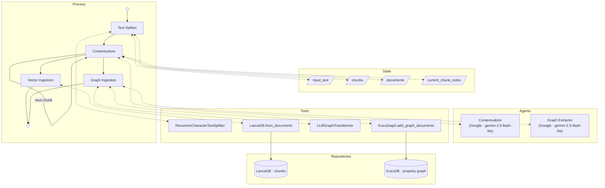

# Parsing Documents to Z-Bundles
Z-Forge has a standard [process](Processes.md) for extracting vector and graph data for a [Z-Bundle](RAG%20and%20GRAG%20Implementation.md) from free-text documents via [LLM](LLM%20Abstraction%20Layer.md). The basic process is to break the document into overlapping chunks and use an LLM to prepend the second through final chunks with "breadcrumbs" based on the prior chunk.

Input is always raw UTF-8 plain text.

This is a general pipeline. [World Generation](World%20Generation.md) is one specific instance of it; once this general spec is stable, the World Generation spec will reference it explicitly.



## Architectural Overview
A two-phase ETL process that transforms a plain-text document into a dual-layered storage system:

- **Vector Layer:** LanceDB (Semantic/Sensory Retrieval)
- **Graph Layer:** KuzuDB (Structural/Relational Retrieval)

Storage paths for both layers follow the Z-Bundle layout defined in [RAG and GRAG Implementation](RAG%20and%20GRAG%20Implementation.md#implementation).

## Phase 1: Sequential Contextualization

**Goal:** Process raw text into `Document` objects containing a "Rolling Context" breadcrumb to preserve narrative continuity across chunks.

### LLM Node: Contextualizer

Each LLM step in this pipeline is a configurable process node (see [Processes](Processes.md) and [LLM Abstraction Layer](LLM%20Abstraction%20Layer.md)). The **Contextualizer** node summarizes each chunk to generate a breadcrumb for the next chunk. Default: `gemini-2.5-flash-lite` (Google).

**Prompt template:**

> You are summarizing a passage from a source document. List the key named entities {allowed nodes, comma-delimited} and any significant facts, events, or status changes introduced in this passage. Be concise — your output will be prepended as context when processing the next passage.

### Implementation Details

- **Text Splitting:** `langchain_text_splitters.RecursiveCharacterTextSplitter`
  - Method: `split_text()` (returns a list of strings)
  - `chunk_size` and `chunk_overlap` are read from application configuration (see [Application Configuration](Application%20Configuration.md#parsing-pipeline)); defaults are **10,000 characters** and **500 characters** respectively.
- **Stateful Loop:** Iterate through chunks sequentially.
- **Object Creation:** Instantiate `langchain_core.documents.Document`
  - `page_content`: the current chunk text
  - `metadata`: dictionary containing the Contextualizer's summary from the *previous* iteration (the "Breadcrumb"); empty for the first chunk.

## Phase 2: Parallel Ingestion (The "Fan-out")

**Goal:** Concurrently populate both databases using the enriched `Document` list from Phase 1.

### A. Vector Ingestion (LanceDB)

- **Class:** `langchain_community.vectorstores.LanceDB`
- **Method:** `from_documents`
- **Params:** `documents` (list), `embedding` (configured embedding model), `connection` (LanceDB connection), `table_name="chunks"` (canonical table name per [RAG and GRAG Implementation](RAG%20and%20GRAG%20Implementation.md#implementation))
- **Note:** The embedding model used here must be recorded in the Z-Bundle's KVP store (`embedding_model_name`, `embedding_model_size_bytes`) and must match the model used at query time.

### B. Graph Ingestion (KuzuDB)

#### LLM Node: Graph Extractor

The **Graph Extractor** node drives `LLMGraphTransformer`. Default: `gemini-2.5-flash-lite` (Google).

- **Extraction Class:** `langchain_experimental.graph_transformers.LLMGraphTransformer`
  - **Method:** `convert_to_graph_documents`
  - **Params:** the list of `Document` objects from Phase 1
  - **Config:** `allowed_nodes` and `allowed_relationships` are specified by the calling process (e.g., World Generation's world-building schema); they are not defined in this general pipeline spec.
- **Storage Class:** `langchain_community.graphs.KuzuGraph`
  - **Method:** `add_graph_documents`
  - **Params:** `graph_documents` (output from transformer), `include_source=True`
  - `include_source=True` causes a `Document` node to be created in Kuzu for each source text chunk, with edges from every extracted graph node back to its source chunk. This enables hybrid lookups: given any graph node you can always retrieve the original passage it was extracted from.

## Parallelization Strategy

To manage concurrency and rate limits:

- Wrap the LanceDB write and KuzuDB extraction/write in `asyncio.gather` for concurrent execution.
- Gate concurrency with a `Semaphore(value=N)`, where N is configurable (e.g. 5–10 for Gemini Flash Lite), to avoid HTTP 429 rate-limit errors.

## Summary of Key LangChain Components

| Component | Class | Primary Method |
|---|---|---|
| Splitter | `RecursiveCharacterTextSplitter` | `split_text` |
| Data Container | `Document` | `__init__(page_content, metadata)` |
| Graph Transformer | `LLMGraphTransformer` | `convert_to_graph_documents` |
| Graph Store | `KuzuGraph` | `add_graph_documents` |
| Vector Store | `LanceDB` | `from_documents` |

## Implementation

- **Process slug:** `document_parsing`
- **Implementation file:** `src/zforge/graphs/document_parsing_graph.py` (new file)
- **LLM nodes** (defined in `process_config.py`):
  - `contextualizer` — Phase 1 breadcrumb generation; default `Google` / `gemini-2.5-flash-lite`
  - `graph_extractor` — Phase 2 graph extraction via `LLMGraphTransformer`; default `Google` / `gemini-2.5-flash-lite`
- **Chunk size defaults:** `parsing_chunk_size = 10000`, `parsing_chunk_overlap = 500`; stored in `ZForgeConfig` and read by the pipeline at runtime. (These are the defaults used at the code level; the chunk size is not yet user-configurable — see [User Experience](User%20Experience.md) for the planned TODO.)
- `allowed_nodes` and `allowed_relationships` for `LLMGraphTransformer` are not defined here; they are specified by the caller (e.g., World Generation).
- **`DocumentParsingState`** (in `src/zforge/graphs/state.py`) — Add a new TypedDict for this process:
  ```python
  class DocumentParsingState(TypedDict):
      input_text: str                   # Raw source text
      z_bundle_root: str                # Z-Bundle root path (target for LanceDB + KuzuDB)
      allowed_nodes: list[str]          # Passed from caller (e.g. World Generation)
      allowed_relationships: list[str]  # Passed from caller
      chunks: list[str]                 # Split text chunks (set by Text Splitter node)
      documents: list                   # LangChain Document objects with breadcrumbs (set by Contextualizer)
      current_chunk_index: Annotated[int, operator.add]  # Phase 1 loop counter
      status: str
      status_message: str
  ```