# Parsing Documents to Z-Bundles
Z-Forge has a standard [process](Processes.md) for extracting vector and graph data for a [Z-Bundle](RAG%20and%20GRAG%20Implementation.md) from free-text documents via [LLM](LLM%20Abstraction%20Layer.md). The pipeline uses a **two-pass split**: a coarse *context split* divides the document into large chunks for the sequential LLM breadcrumb loop; each contextualized large chunk is then re-split into smaller *retrieval chunks* for vector storage. This keeps the LLM call count proportional to the number of context chunks (not retrieval chunks), allowing precise vector retrieval without a prohibitively long contextualization phase.

Input is always raw UTF-8 plain text.

This is a general pipeline. [World Generation](World%20Generation.md) is one specific instance of it; once this general spec is stable, the World Generation spec will reference it explicitly.

```mermaid
flowchart TD
    subgraph Agents
        A_ctx["Contextualizer\n(Groq · llama-3.3-70b-versatile)"]
        A_gext["Graph Extractor\n(Google · gemini-2.5-flash-lite)"]
    end

    subgraph State
        S_input_text[/"input_text"/]
        S_chunks[/"chunks\n(context pass)"/]
        S_documents[/"documents\n(context chunks + breadcrumbs)"/]
        S_retrieval_docs[/"retrieval_documents\n(small chunks + breadcrumbs)"/]
        S_chunk_idx[/"current_chunk_index"/]
    end

    subgraph Repositories
        R_vector[(LanceDB · chunks)]
        R_graph[(KuzuDB · property graph)]
    end

    subgraph Tools
        T_ctx_splitter["RecursiveCharacterTextSplitter\n(context pass)"]
        T_ret_splitter["RecursiveCharacterTextSplitter\n(retrieval pass)"]
        T_lancedb[LanceDB.from_documents] --> R_vector
        T_llmgt[LLMGraphTransformer]
        T_kuzu[KuzuGraph.add_graph_documents] --> R_graph
    end

    subgraph Process
        P_start(( )) --> P_splitter["Text Splitter\ncontext pass"]
        P_splitter --> P_contextualizer["Contextualizer\n+ retrieval re-split"]
        P_contextualizer -->|next chunk| P_contextualizer
        P_contextualizer --> P_vector_ingest[Vector Ingestion]
        P_contextualizer --> P_graph_ingest[Graph Ingestion]
        P_vector_ingest --> P_stop(( ))
        P_graph_ingest --> P_stop
    end

    P_splitter <-.-> S_input_text
    P_splitter <-.-> S_chunks
    P_splitter <-.-> T_ctx_splitter
    P_contextualizer <-.-> A_ctx
    P_contextualizer <-.-> S_chunk_idx
    P_contextualizer <-.-> S_documents
    P_contextualizer <-.-> T_ret_splitter
    P_contextualizer <-.-> S_retrieval_docs
    P_vector_ingest <-.-> T_lancedb
    P_vector_ingest <-.-> S_retrieval_docs
    P_graph_ingest <-.-> A_gext
    P_graph_ingest <-.-> T_llmgt
    P_graph_ingest <-.-> T_kuzu
    P_graph_ingest <-.-> S_documents
```



## Architectural Overview
A two-phase ETL process that transforms a plain-text document into a dual-layered storage system:

- **Vector Layer:** LanceDB (Semantic/Sensory Retrieval)
- **Graph Layer:** KuzuDB (Structural/Relational Retrieval)

Storage paths for both layers follow the Z-Bundle layout defined in [RAG and GRAG Implementation](RAG%20and%20GRAG%20Implementation.md#implementation).

## Phase 1: Sequential Contextualization

**Goal:** Process raw text into `Document` objects containing a "Rolling Context" breadcrumb to preserve narrative continuity across chunks.

### LLM Node: Contextualizer

Each LLM step in this pipeline is a configurable process node (see [Processes](Processes.md) and [LLM Abstraction Layer](LLM%20Abstraction%20Layer.md)). The **Contextualizer** node summarizes each chunk to generate a breadcrumb for the next chunk. Default: `llama-3.3-70b-versatile` (Groq).

**Prompt template:**

> You are summarizing a passage from a source document. List the key named entities {allowed nodes, comma-delimited} and any significant facts, events, or status changes introduced in this passage. Be concise — your output will be prepended as context when processing the next passage.

### Implementation Details

- **Context Split:** `langchain_text_splitters.RecursiveCharacterTextSplitter` (context pass)
  - Method: `split_text()` (returns a list of strings)
  - `chunk_size` (`parsing_chunk_size`) and `chunk_overlap` (`parsing_chunk_overlap`) control the **LLM breadcrumb pass**. Defaults: **10,000 characters** and **500 characters** (5%) respectively. Configurable in the LLM Configuration screen (see [Application Configuration](Application%20Configuration.md#parsing-pipeline)).
- **Stateful Loop:** Iterate through context chunks sequentially.
- **Breadcrumb Document:** After the LLM summarizes a context chunk, a `langchain_core.documents.Document` is created:
  - `page_content`: the context chunk text
  - `metadata`: `{"breadcrumb": <summary from previous iteration>}` (empty for the first chunk)
  These are accumulated in `state["documents"]` and consumed by **graph ingestion**.
- **Retrieval Split (two-pass):** Each context chunk is immediately re-split by a second `RecursiveCharacterTextSplitter` (retrieval pass) into smaller sub-chunks. Defaults: **500 characters** and **50 characters** (10%) respectively, controlled by `parsing_retrieval_chunk_size` and `parsing_retrieval_chunk_overlap`. Each sub-chunk inherits the same breadcrumb as its parent context chunk.
  These are accumulated in `state["retrieval_documents"]` and consumed by **vector ingestion**.
  - When `parsing_retrieval_chunk_size ≥ parsing_chunk_size`, no re-split occurs and vector ingestion falls back to `state["documents"]` (single-pass behaviour).

## Phase 2: Parallel Ingestion (The "Fan-out")

**Goal:** Concurrently populate both databases using the enriched `Document` list from Phase 1.

### A. Vector Ingestion (LanceDB)

- **Class:** `langchain_community.vectorstores.LanceDB`
- **Method:** `from_documents`
- **Params:** `documents` (list), `embedding` (configured embedding model), `connection` (LanceDB connection), `table_name="chunks"` (canonical table name per [RAG and GRAG Implementation](RAG%20and%20GRAG%20Implementation.md#implementation))
- **Note:** The embedding model used here must be recorded in the Z-Bundle's KVP store (`embedding_model_name`, `embedding_model_size_bytes`) and must match the model used at query time.

### B. Graph Ingestion (KuzuDB)

#### LLM Node: Graph Extractor

The **Graph Extractor** node drives `LLMGraphTransformer`. Default: `gemini-2.5-flash-lite` (Google).

- **Extraction Class:** `langchain_experimental.graph_transformers.LLMGraphTransformer`
  - **Method:** `convert_to_graph_documents`
  - **Params:** the list of `Document` objects from Phase 1
  - **Config:** `allowed_nodes` and `allowed_relationships` are specified by the calling process (e.g., World Generation's world-building schema); they are not defined in this general pipeline spec.
- **Storage Class:** `langchain_community.graphs.KuzuGraph`
  - **Method:** `add_graph_documents`
  - **Params:** `graph_documents` (output from transformer), `include_source=True`
  - `include_source=True` causes a `Document` node to be created in Kuzu for each source text chunk, with edges from every extracted graph node back to its source chunk. This enables hybrid lookups: given any graph node you can always retrieve the original passage it was extracted from.

## Parallelization Strategy

To manage concurrency and rate limits:

- Wrap the LanceDB write and KuzuDB extraction/write in `asyncio.gather` for concurrent execution.
- Gate concurrency with a `Semaphore(value=N)`, where N is configurable (e.g. 5–10 for Gemini Flash Lite), to avoid HTTP 429 rate-limit errors.

## Summary of Key LangChain Components

| Component | Class | Primary Method |
|---|---|---|
| Splitter | `RecursiveCharacterTextSplitter` | `split_text` |
| Data Container | `Document` | `__init__(page_content, metadata)` |
| Graph Transformer | `LLMGraphTransformer` | `convert_to_graph_documents` |
| Graph Store | `KuzuGraph` | `add_graph_documents` |
| Vector Store | `LanceDB` | `from_documents` |

## Implementation

- **Process slug:** `document_parsing`
- **Implementation file:** `src/zforge/graphs/document_parsing_graph.py` (new file)
- **LLM nodes** (defined in `process_config.py`):
  - `contextualizer` — Phase 1 breadcrumb generation; default `Groq` / `llama-3.3-70b-versatile`
  - `graph_extractor` — Phase 2 graph extraction via `LLMGraphTransformer`; default `Google` / `gemini-2.5-flash-lite`
- **Context-pass chunk defaults:** `parsing_chunk_size = 10000`, `parsing_chunk_overlap = 500` (5%); stored in `ZForgeConfig`. These govern the LLM breadcrumb loop.
- **Retrieval-pass chunk defaults:** `parsing_retrieval_chunk_size = 500`, `parsing_retrieval_chunk_overlap = 50` (10%); stored in `ZForgeConfig`. These govern the fine-grained vector-store split. When `parsing_retrieval_chunk_size ≥ parsing_chunk_size`, the pipeline runs single-pass (no re-split). Both sets of parameters are user-configurable via the **Parsing Pipeline** section of the LLM Configuration screen (chunk sizes in characters; overlaps expressed as percentages of the respective chunk size).
- `allowed_nodes` and `allowed_relationships` for `LLMGraphTransformer` are not defined here; they are specified by the caller (e.g., World Generation).
- **`DocumentParsingState`** (in `src/zforge/graphs/state.py`) — Add a new TypedDict for this process:
  ```python
  class DocumentParsingState(TypedDict):
      input_text: str                   # Raw source text
      z_bundle_root: str                # Z-Bundle root path (target for LanceDB + KuzuDB)
      allowed_nodes: list[str]          # Passed from caller (e.g. World Generation)
      allowed_relationships: list[str]  # Passed from caller
      chunks: list[str]                 # Context-pass text chunks (set by Text Splitter node)
      documents: list                   # Context-pass Document objects with breadcrumbs (graph ingestion)
      retrieval_documents: list         # Retrieval-pass Document objects (vector ingestion)
      current_chunk_index: Annotated[int, operator.add]  # Phase 1 loop counter
      status: str
      status_message: str
  ```

### Async nodes required — AFC deadlock pitfall

**Pitfall:** All LLM-calling nodes (`contextualizer`, `graph_ingestion`, `fan_out`) **must** be `async def` and use the async model API (`model.ainvoke()`, `transformer.aconvert_to_graph_documents()`). Do **not** call the synchronous equivalents from inside the graph.

**Why it occurs:** The parent graph is consumed via `graph.astream()` (see `ZForgeManager.run_process`). LangGraph runs synchronous nodes in a thread-pool executor to avoid blocking the event loop. The `google-genai` SDK (v1+, underpinning `ChatGoogleGenerativeAI` for Gemini 2.5 models) enables AFC (Automatic Function Calling) and manages async HTTP internally. When `model.invoke()` is called from inside a thread-pool thread, the SDK attempts to schedule async coroutines on an event loop. If the SDK tries to call `asyncio.get_running_loop()` or `asyncio.run()` from within a thread whose loop state is entangled with the parent asyncio event loop, the call hangs indefinitely with no error — the only visible symptom is the log line `AFC is enabled with max remote calls: 10` from `google_genai.models` followed by silence.

**Correct pattern:** Declare nodes as `async def` and use `await model.ainvoke(...)` / `await transformer.aconvert_to_graph_documents(...)`. LangGraph's async runner then awaits them directly on the event loop rather than offloading to a thread, eliminating the deadlock. For nodes that call sync I/O, keep the calls inline inside the async function body — do **not** use `asyncio.to_thread` for any node that loads or runs a local llama.cpp model (see the Metal pitfall below).

### macOS Metal + local embedding models — single-thread executor required

**Pitfall:** Local embedding nodes (those using llama.cpp via `LlamaCppEmbeddingConnector`) cannot safely run either (a) synchronously on the event loop thread, or (b) via `asyncio.to_thread` / a general thread pool:

- **On the event loop thread (async def, no offloading):** llama.cpp model loading and inference are CPU-intensive and block the event loop entirely, freezing the Toga UI for minutes with no feedback.
- **Via `asyncio.to_thread` or a general `ThreadPoolExecutor`:** `ggml_metal` (the GPU backend for llama.cpp on macOS) binds its Metal command queue to the OS thread on which the model is *first loaded*. A general thread pool may dispatch subsequent calls to a different thread, causing Metal to silently hang with no error or timeout.

**Correct pattern:** Use a **module-level `ThreadPoolExecutor(max_workers=1)`** (named `_LLAMA_EXECUTOR`). All embedding computation is dispatched to this executor via `await loop.run_in_executor(_LLAMA_EXECUTOR, fn)`. Because the executor has exactly one worker thread, every call is guaranteed to land on the same OS thread, satisfying Metal's thread-affinity requirement while releasing the event loop so the UI stays responsive. `_LLAMA_EXECUTOR` is defined in `document_parsing_graph.py` and imported by `world_creation_graph.py` for use in `retrieve_vector`.

### `lancedb.connect()` deadlocks in any asyncio context

**Pitfall:** `lancedb.connect()` (the synchronous wrapper) bridges async work onto LanceDB's own internal background event loop via `asyncio.run_coroutine_threadsafe` + `future.result()`. The Rust/PyO3 internals that power the actual connection attempt to attach their futures to `asyncio.get_event_loop()` of the calling thread. When called from *any* thread that has an asyncio event loop reference — either the event loop thread itself, or a thread-pool thread spawned from an asyncio context — the internal future gets attached to a *different* loop than the one running `do_connect`. This raises: `RuntimeError: Task got Future attached to a different loop`.

This affects both the write path (`LanceDBVectorStore.from_documents`) and the read path (`lancedb.connect()` in retriever tools).

**Correct pattern:** Always use `await lancedb.connect_async(path)` from within async functions. Then use the native `AsyncTable` API for reads and writes. Only the embedding computation (the llama.cpp call) goes to `_LLAMA_EXECUTOR`; the LanceDB connection and table operations are awaited directly on the event loop.

### KuzuDB database path must not be pre-created as a directory

**Pitfall:** Calling `os.makedirs(graph_path, exist_ok=True)` before `kuzu.Database(graph_path)` creates `graph_path` as a directory. KuzuDB's `Database()` constructor then raises `Database path cannot be a directory: …/propertygraph`.

**Correct pattern:** Do not `makedirs` the graph path. KuzuDB creates its own database file at the given path. The path string should be a plain file path (e.g. `{z_bundle_root}/propertygraph`) with no trailing slash.

### KuzuGraph requires `allow_dangerous_requests=True`

**Pitfall:** Constructing `KuzuGraph(db)` without `allow_dangerous_requests=True` raises an error at runtime.

**Correct pattern:** Always construct as `KuzuGraph(db, allow_dangerous_requests=True)`. This applies wherever `KuzuGraph` is instantiated — both in `graph_ingestion_node` (write path) and `retrieve_graph` (read path in the summarizer tool).

### `KuzuGraph.add_graph_documents` requires `allowed_relationships` as triplets

**Pitfall:** `KuzuGraph.add_graph_documents` has the signature `(graph_documents, allowed_relationships, include_source=False)` — `allowed_relationships` is a **required positional parameter** of type `List[Tuple[str, str, str]]` (source node type, relationship type, target node type). Calling it without this argument, or passing keyword-only, raises a `TypeError`.

**Note:** In the current version of `langchain-community`, this parameter is accepted but not actually executed against — the schema is created dynamically per relationship via `_create_entity_relationship_table`. A full Cartesian product of `allowed_nodes × allowed_relationships × allowed_nodes` satisfies the signature and is future-proof if the implementation starts using it.

### KùzuDB `REL TABLE` single-pair schema violation

Two related pitfalls arise from `KuzuGraph`'s lazy, per-document schema creation when `add_graph_documents` is called across multiple documents:

**Pitfall 1 — Entity relationship tables:** `_create_entity_relationship_table` issues `CREATE REL TABLE IF NOT EXISTS {name} (FROM {src} TO {tgt})` — a **single** FROM-TO pair. When the same relationship type is extracted between different node type pairs across documents, `IF NOT EXISTS` silently skips later DDL. The `MERGE` then raises a Binder exception: *"Query node eN violates schema. Expected labels are X."*

**Pitfall 2 — MENTIONS table:** The `MENTIONS` REL TABLE GROUP is seeded with only the node labels found in the *first* document. For subsequent documents, `CREATE REL TABLE GROUP IF NOT EXISTS MENTIONS (...)` skips re-creation, so new entity types introduced in later chunks are never added. The same Binder exception occurs when merging MENTIONS edges for those new types.

**Correct pattern:** Subclass `KuzuGraph` and (a) add a `_pre_create_schema` method that creates all node tables and the full `MENTIONS` group from the complete `allowed_nodes` list *before* calling `add_graph_documents`, and (b) override `_create_entity_relationship_table` to use `CREATE REL TABLE GROUP` and `ALTER TABLE ADD FROM ... TO ...`:

```python
class _MultiTypeKuzuGraph(KuzuGraph):
    def _pre_create_schema(self, allowed_node_labels: list[str]) -> None:
        for label in allowed_node_labels:
            self.conn.execute(
                f"CREATE NODE TABLE IF NOT EXISTS {label} "
                f"(id STRING, type STRING, PRIMARY KEY (id))"
            )
        self.conn.execute(
            "CREATE NODE TABLE IF NOT EXISTS Chunk "
            "(id STRING, text STRING, type STRING, PRIMARY KEY (id))"
        )
        from_to_pairs = ", ".join(f"FROM Chunk TO {lbl}" for lbl in allowed_node_labels)
        try:
            self.conn.execute(
                f"CREATE REL TABLE GROUP MENTIONS "
                f"({from_to_pairs}, label STRING, triplet_source_id STRING)"
            )
        except Exception:
            for label in allowed_node_labels:
                try:
                    self.conn.execute(f"ALTER TABLE MENTIONS ADD FROM Chunk TO {label}")
                except Exception:
                    pass  # Pair already registered.

    def _create_entity_relationship_table(self, rel) -> None:
        src, rel_type, tgt = rel.source.type, rel.type, rel.target.type
        try:
            self.conn.execute(f"CREATE REL TABLE GROUP {rel_type} (FROM {src} TO {tgt})")
        except Exception:
            try:
                self.conn.execute(f"ALTER TABLE {rel_type} ADD FROM {src} TO {tgt}")
            except Exception:
                pass  # Pair already registered.
```

Call `graph._pre_create_schema(allowed_nodes)` immediately after constructing the instance, before `add_graph_documents`.

### `embed_documents` batch overflow — `llama_decode returned -1`

**Pitfall:** `LlamaCppEmbeddings.embed_documents(texts)` forwards the entire list of texts to `llama_cpp.create_embedding(texts)`, which feeds all texts into a single `decode_batch()` call. llama.cpp accumulates all input token sequences into one `llama_batch` and calls `llama_decode` on it. Even if each individual chunk is well within `n_ctx`, the combined batch of all chunks together overflows the decode capacity, causing `llama_decode` to return -1, surfaced as `RuntimeError: llama_decode returned -1`. This happens regardless of chunk size — even 500-char chunks hit this when there are many of them.

**Correct pattern:** In `vector_ingestion_node`, call `embedder.embed_query(text)` for each text in a loop instead of `embedder.embed_documents(texts)`. `embed_query` processes one text per `llama_decode` call and always stays within `n_ctx`.

```python
def _embed_one_by_one(embed_texts):
    return [embedder.embed_query(t) for t in embed_texts]

vectors = await loop.run_in_executor(_LLAMA_EXECUTOR, lambda: _embed_one_by_one(texts_for_embed))
```

### Embedding context overflow — per-text truncation

Even with per-text `embed_query()` calls, individual texts must not exceed `n_ctx` tokens. `EmbeddingConnector` exposes `get_context_size()`. In `vector_ingestion_node`, texts are truncated to `get_context_size() * 3` characters before embedding. Using `3` chars/token (rather than the English-prose average of ~4) provides a ~25% safety margin for BOS tokens and tokeniser variation. The full chunk text is stored verbatim in the LanceDB `text` field so retrieval quality is unaffected.

```python
embed_max_chars = embedding_connector.get_context_size() * 3
texts_for_embed = [t[:embed_max_chars] for t in texts]
```

### Embedding repeated model construction — `llama_decode returned -1`

**Pitfall:** If `get_embeddings()` creates a new `LlamaCppEmbeddings` instance on every call, repeated model construction and destruction cycles exhaust llama.cpp's Metal command queue on macOS. With many chunks (even short ones), each `embed_documents` call triggers a fresh model load, which destabilises the internal Metal state and causes `llama_decode returned -1` on a later iteration. This occurs regardless of chunk size.

**Correct pattern:** Cache the `LlamaCppEmbeddings` instance inside `LlamaCppEmbeddingConnector` and return it on subsequent calls — the same pattern used by `LlamaCppConnector` for `ChatLlamaCpp`:

```python
def get_embeddings(self) -> Embeddings:
    if self._embeddings is not None:
        return self._embeddings
    from langchain_community.embeddings import LlamaCppEmbeddings
    self._embeddings = LlamaCppEmbeddings(...)
    return self._embeddings
```

### LLM provider `400 Bad Request` during graph extraction

**Pitfall:** `LLMGraphTransformer.aconvert_to_graph_documents(documents)` dispatches one LLM request per document concurrently. If any single chunk's content combined with the transformer's system prompt exceeds the provider's context limit (or is otherwise malformed), the provider returns `400 Bad Request`, which the transformer surfaces as an unhandled exception that aborts the entire batch.

**Correct pattern:** Wrap the call in try/except. On failure, log a warning and set `graph_documents = []`. Use `except BaseException` (not just `except Exception`) because on Python 3.11+, `asyncio.TaskGroup` wraps failures in `ExceptionGroup(BaseException)` which can bypass `except Exception` in some contexts. Unwrap `exc.exceptions` (if present) to extract the individual provider error body for logging. The vector store written in the concurrent `vector_ingestion_node` is preserved; the world is still usable for RAG retrieval via the vector layer.

**Note on Groq + `LLMGraphTransformer`:** Several Groq-hosted models (including `qwen/qwen3-32b`) do not reliably produce valid structured tool calls for the `DynamicGraph` schema used by `LLMGraphTransformer`. The error manifests as `400 Bad Request` with `code: tool_use_failed` and `failed_generation: ''`. The recommended graph extractor is `gemini-2.5-flash-lite` (Google), which has robust structured-output support. If Groq must be used, prefer models with proven function-calling support (e.g. `llama-3.3-70b-versatile`).

### Graph extraction rate-limit exhaustion with large document sets

**Pitfall:** `LLMGraphTransformer.aconvert_to_graph_documents(documents)` dispatches one LLM call **per document concurrently**. With thousands of chunks (e.g. a 5 MB world-bible at 500 chars/chunk ≈ 10,000 documents), this issues 10,000 simultaneous requests to the provider, immediately exhausting API rate limits.

**Correct pattern:** Split the documents list into sequential batches (default `_GRAPH_EXTRACTION_BATCH_SIZE = 10`) and await each batch before starting the next. Each batch still fans out internally for its ≤10 documents; the sequential outer loop prevents rate-limit exhaustion. Failed batches are skipped (logged as warnings) so partial graph extraction succeeds rather than aborting the whole run.

```python
try:
    graph_documents = await transformer.aconvert_to_graph_documents(documents)
except BaseException as exc:
    _causes = getattr(exc, "exceptions", [exc])  # unwrap ExceptionGroup
    for _cause in _causes:
        _response = getattr(_cause, "response", None)
        if _response is not None:
            log.warning("graph_ingestion_node: ... %s", _response.json())
            break
    graph_documents = []
```

### Groq 400 Bad Request in the contextualizer

**Pitfall:** The contextualizer node (`model.ainvoke(...)`) has no error handling. If Groq returns a 400 for a specific chunk (e.g. due to malformed content or validation failure), the unhandled exception propagates through the LangGraph state machine and aborts the entire parse.

**Correct pattern:** Wrap `model.ainvoke(...)` in try/except. On failure, log the actual Groq error body (available as `exc.response.json()` from `httpx.HTTPStatusError`) and continue with `summary = ""`. The affected chunk is still stored in the vector store; it simply has no breadcrumb forwarded to the next chunk, which is an acceptable degradation.

```python
try:
    response = await model.ainvoke([SystemMessage(...), HumanMessage(...)])
    summary = str(getattr(response, "content", ""))
except Exception as exc:
    _response = getattr(exc, "response", None)
    _detail = _response.json() if _response is not None else ""
    log.warning("contextualizer_node: chunk %d LLM call failed (%s %s)", idx+1, exc, _detail)
    summary = ""
```