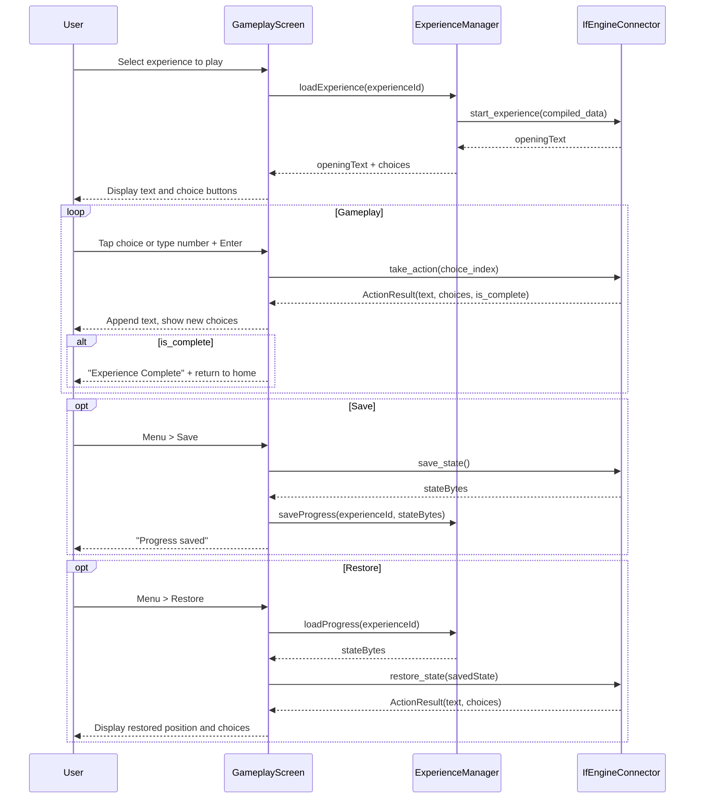
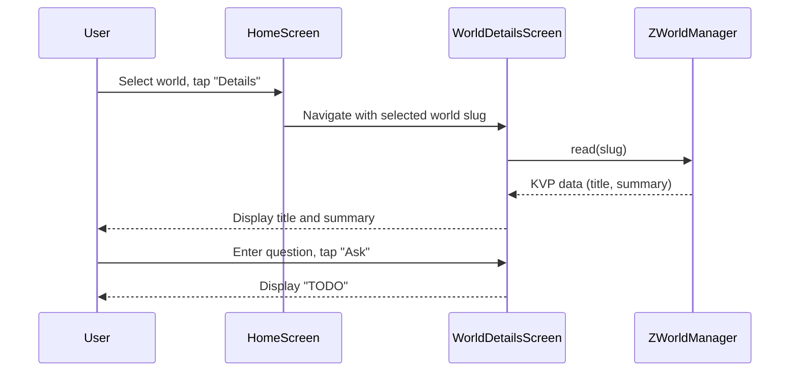

# User Experience

## Main UI
The user interface for ZForge is built with [Flet](https://flet.dev/) (Flutter-backed Python UI framework). On PC and Mac, a main application menu takes the user to basic functions like opening an experience or creating a world. On mobile/web, the same menu is accessible by a "hamburger" menu icon to the left of the main text input at the bottom of the main window.

### Implementation
Always use Python type hints for all Flet event handlers.

Prefer Flet 1.0 declarative components and hooks over imperative page mutations.

Use page.run_task() for bridging synchronous events to asynchronous backend logic.

Enforce strict typing; do not use Any for Flet controls.

Flet is declared as a dependency in `pyproject.toml` as `flet>=0.24`. The application is launched via `ft.app(target=main)` where `main` is an async function taking `page: ft.Page`. There is no separate `App` class; `page` is threaded through all screens. Navigation between screens is accomplished by clearing `page.controls` and calling `page.update()`. All event handlers may be `async`; background tasks use `page.run_task()` instead of `asyncio.ensure_future()`. The`toga.MainWindow` pattern is replaced by properties of `ft.Page` (e.g., `page.title`). See `src/zforge/app.py` and `src/zforge/__main__.py` for the entry point.

## Gameplay Interface
When an ink experience has been started, the UI looks as follows:
- **Input:** One-line at bottom
- **Output:** Scrolling text above
- **Display:**
  - Game output: left-justified
  - Player input: right-justified (like chat, no bubbles)
  - Font: Veteran Typewriter or similar (monospace, typewriter aesthetic)
- **Main menu:** A main menu appears in the header on Mac/PC and is triggered by a "hamburger" menu icon to the left of the input area while an experience is on progress on mobile/Web. Options include:
  - Create
    - World
    - Experience (only available if at least one World has been created)
  - Save/Restore
    - Save (only available while an experience is in progress)
    - Restore (only available if at least one progress has been saved)
- **Input Submission:**
  - "Return" key submits
  - Button with return/line feed icon also submits (right of input)
- **Accessibility:**
  - All controls keyboard-accessible
  - High-contrast and large-text modes recommended

### Gameplay Flow and IF Engine Integration

The gameplay interface interacts with the [IF Engine Abstraction Layer](IF%20Engine%20Abstraction%20Layer.md) as follows:

#### Starting an Experience
When the user selects an experience to play:
1. The `ExperienceManager` loads the compiled experience file (e.g., `.ink.json`)
2. Calls `IfEngineConnector.start_experience(compiled_data)`
3. The returned opening text is displayed in the output area
4. Available choices (if any) are displayed as numbered options or tappable buttons below the output

#### Player Input (Choice-Based)
For choice-based engines like ink:
1. Choices are displayed as a numbered list (e.g., "1. Go north", "2. Examine the door")
2. Player can either:
   - Tap/click a choice directly (on touch/mouse devices)
   - Type the choice number and press Enter/Return or tap the submit button
3. The selected choice index is passed to `IfEngineConnector.take_action(choice_index)`
4. The returned `ActionResult` contains:
   - `text`: New narrative text, appended to the output
   - `choices`: Next set of choices (or `None` if story ended)
   - `is_complete`: Whether the experience has ended
5. If `is_complete` is true, display an "Experience Complete" message and offer to return to home

#### Choice Display
Choices are rendered below the main output area:
- Each choice is a tappable button with the choice text
- Choices are also numbered (1, 2, 3...) so players can type the number
- When a choice is selected, it appears in the output as player input (right-justified)
- The input field shows a placeholder like "Enter choice number or tap above"

#### Saving Progress
When the user selects "Save" from the menu:
1. Calls `IfEngineConnector.save_state()` to get the current state as bytes
2. Saves the state bytes to `{experienceFolderPath}/{zworld.id}/{experience-name}.save`
3. Shows confirmation: "Progress saved"

#### Restoring Progress
When the user selects "Restore" or "Resume Experience":
1. Loads the saved state bytes from the `.save` file
2. Calls `IfEngineConnector.restore_state(saved_state)`
3. The returned `ActionResult` contains both the current narrative text and available choices
4. Displays the restored text and choices

#### Gameplay Sequence Diagram

## Pre-Gameplay interface
If no experience is in progress:
 If progress within an experience has been saved, but that experience was not successfully completed before the last time Z-Forge was closed, the user will be asked if they want to continue {name of experience} at application start.
 In addition to their usual places in the main menu, buttons will appear offering the options to "Create World" and, if there is at least one ZWorld available, "Create Experience", and, if there is at least one experience available, "Start Experience" and, if there is at least one saved progress available within an experience, "Resume Experience".

That same action row now keeps an "LLM Configuration" button in view so the user can reopen the model download/configuration workflow at any time; see [src/zforge/ui/screens/home_screen.py](src/zforge/ui/screens/home_screen.py).

## LLM Configuration
LLM configuration is a crucial element of the [app config](Application%20Configuration.md). The user is able to specify the provider and model for each LLM node in each [Process](Processes.md). When viewing the LLM configuration screen, the user will see a display of Processes with their LLM Nodes; for each node, they can select a Provider (from among all available LLM Connectors) and a model (from among the models available for the chosen Connector). If no value, or an invalid value, already exists in the application config for a given node, it will be defaulted to the provider and model listed in the specification for that node of that Process. After the user updates the LLM configuration, the app will check that all required configuration values have been provided for all the selected providers across all nodes; if not, they will be prompted for these configuration values as defined in the LLM Connector Configuration section.

Below the node configuration section, the screen also shows the **Provider Configuration** section (API keys for each remote connector) and the **Local Model** section (GGUF download). A **"Use Defaults"** button proceeds without saving; **"Save"** writes node config to `zforge_config.json` and API keys to the platform keyring before returning to the home screen ([src/zforge/ui/screens/llm_config_screen.py](src/zforge/ui/screens/llm_config_screen.py)).

Process / node metadata (slugs, display names, and per-node defaults) is maintained as a single source of truth in [src/zforge/models/process_config.py](src/zforge/models/process_config.py) and consumed by both `ConfigService._apply_defaults` and `LlmConfigScreen`.

## LLM Connector Configuration
When viewing the LLM Connector configuration screen, the user will see a collabsible display of all available Connectors that have been selected for at least one node, with their required configuration elements, including configured values. The user can update these values. When the user attempts to save the updated values, the connectors will check their validity. If any are not valid, the page will remain open with the problematic connector and, if possible, the specific configuration value(s) identified with an error message and color-coding in red.

Below the API connectors, there will be an additional section for local LLMs. This will display a list of models that have been downloaded, with the option of deleting them. If the user attempts to delete a model, the LLM configuration will be checked to see if it is selected on any nodes. If it is, the node(s) will be reverted to their default. If the default connector on any of these nodes was not in use at the time the page was loaded, it will be added to the page and the user will have to ensure it is configured correctly as described above. To ensure the success of this process, the model file will not actually be deleted until the user saves this page and the LLM connections are successfully validated. The user will also be able to download models as desired from the [model catalogue](Local%20LLM%20Execution.md#model-catalogue).

## Embedding Model Configuration
On the Embedding Model configuration screen, the user is able to select the preferred embedding model from among those already downloaded. They can also download a new embedding model from the [model catalogue](Local%20LLM%20Execution.md#model-catalogue).

## Application Start
At application start, the configuration will be checked for completeness and validity. If there is no configuration file, or it has no LLM configuration section (`llm_nodes` absent or empty in the JSON), the LLM Configuration screen is shown immediately with an explanatory message. The screen's **"Use Defaults"** button lets the user skip directly to the home screen while accepting the default provider/model values. **"Save"** saves configuration changes first.

If a valid config file with an `llm_nodes` section already exists, the app validates the local connectors. If either local model file is missing, the LLM Configuration screen is shown without the "no config found" message. Otherwise, the home screen is shown and the local LLM is pre-warmed in the background.

Implementation: `ConfigService.has_llm_config()` reads the raw JSON to check for a non-empty `llm_nodes` key ([src/zforge/services/config_service.py](src/zforge/services/config_service.py)); startup routing lives in the `main(page)` function in [src/zforge/app.py](src/zforge/app.py).

## World Details Screen
When the user selects a world from the home screen, a **Details** button becomes enabled alongside the existing action buttons. Tapping it navigates to `WorldDetailsScreen`.

### Layout
- **Title**: the world's title (from KVP), displayed prominently at the top
- **Summary**: the world's summary text (from KVP), displayed as a scrollable read-only block below the title
- **Question input**: a single-line text input with placeholder text "Ask a question about this world…" and a **Ask** button to its right
- **Answer area**: a read-only text area below the question input where the response is displayed
- **Back button**: returns to the home screen

### Behaviour (current)
On load, `ZWorldManager.read(slug)` fetches the Z-Bundle's KVP data and populates Title and Summary.

When the user submits a question, the answer area displays `"TODO"`. This is an intentional stub — the question-answering process (Agentic RAG over the Z-Bundle) is not yet implemented.

### Behaviour (future)
The stub will be replaced by a new Process that uses the full Z-Bundle (vector store + property graph) to answer the user's question via an Agentic RAG operation. The spec for that process will be added when the implementation is ready.

### Sequence Diagram

## Future Configuration

- **TODO:** Expose `parsing_chunk_size` and `parsing_chunk_overlap` as user-configurable settings in the LLM / Advanced Configuration screen. Currently these are application-level defaults (see [Parsing Documents to Z-Bundles](Parsing%20Documents%20to%20Z-Bundles.md#implementation)) with no UI affordance.
