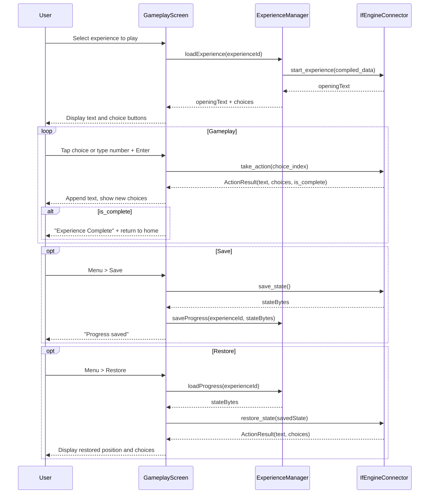
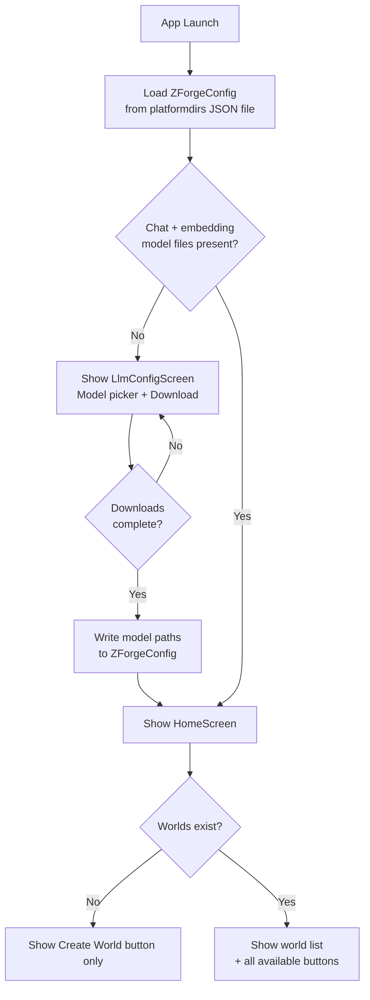
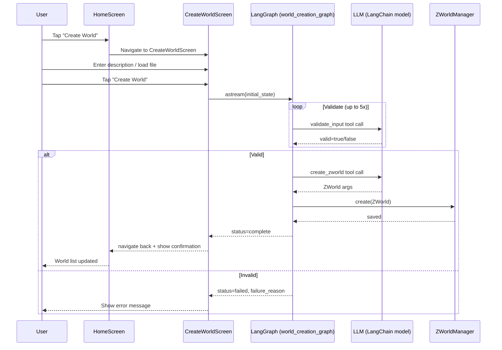
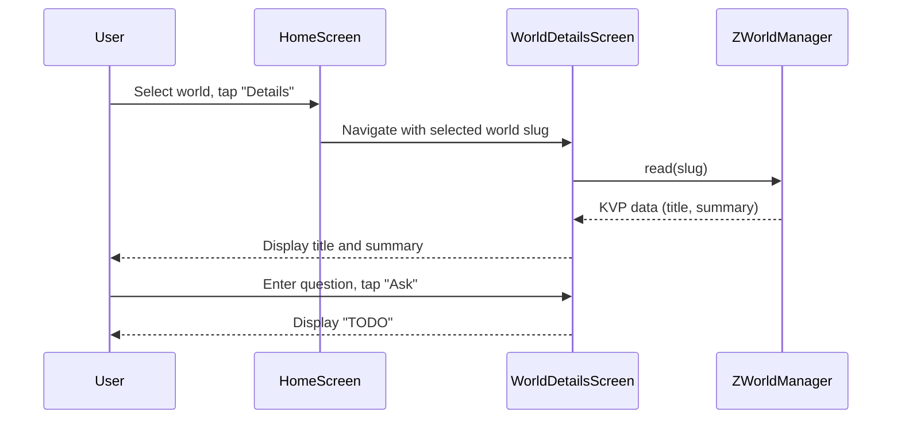
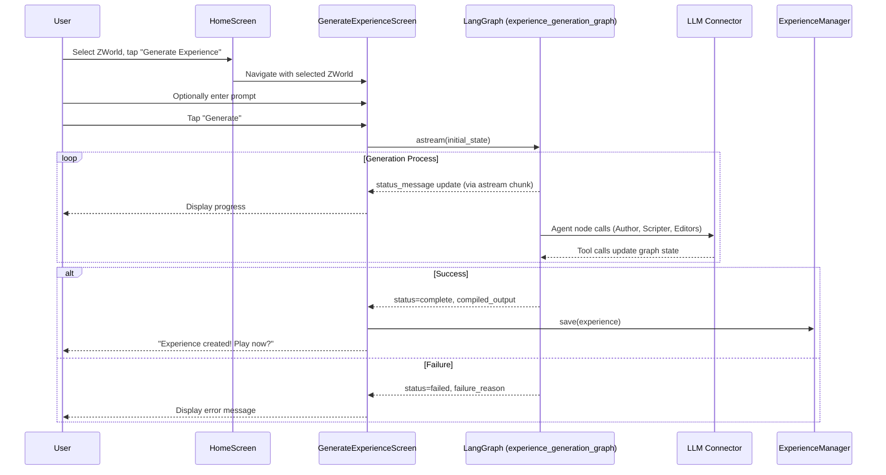

# User Experience

## Main UI
The user interface for ZForge is built with [BeeWare](https://beeware.org/) (Toga widget toolkit). On PC and Mac, a main application menu takes the user to basic functions like opening an experience or creating a world. On mobile/web, the same menu is accessible by a "hamburger" menu icon to the left of the main text input at the bottom of the main window.

## Gameplay Interface
When an ink experience has been started, the UI looks as follows:
- **Input:** One-line at bottom
- **Output:** Scrolling text above
- **Display:**
  - Game output: left-justified
  - Player input: right-justified (like chat, no bubbles)
  - Font: Veteran Typewriter or similar (monospace, typewriter aesthetic)
- **Main menu:** A main menu appears in the header on Mac/PC and is triggered by a "hamburger" menu icon to the left of the input area while an experience is on progress on mobile/Web. Options include:
  - Create
    - World
    - Experience (only available if at least one World has been created)
  - Save/Restore
    - Save (only available while an experience is in progress)
    - Restore (only available if at least one progress has been saved)
- **Input Submission:**
  - "Return" key submits
  - Button with return/line feed icon also submits (right of input)
- **Accessibility:**
  - All controls keyboard-accessible
  - High-contrast and large-text modes recommended

### Gameplay Flow and IF Engine Integration

The gameplay interface interacts with the [IF Engine Abstraction Layer](IF%20Engine%20Abstraction%20Layer.md) as follows:

#### Starting an Experience
When the user selects an experience to play:
1. The `ExperienceManager` loads the compiled experience file (e.g., `.ink.json`)
2. Calls `IfEngineConnector.start_experience(compiled_data)`
3. The returned opening text is displayed in the output area
4. Available choices (if any) are displayed as numbered options or tappable buttons below the output

#### Player Input (Choice-Based)
For choice-based engines like ink:
1. Choices are displayed as a numbered list (e.g., "1. Go north", "2. Examine the door")
2. Player can either:
   - Tap/click a choice directly (on touch/mouse devices)
   - Type the choice number and press Enter/Return or tap the submit button
3. The selected choice index is passed to `IfEngineConnector.take_action(choice_index)`
4. The returned `ActionResult` contains:
   - `text`: New narrative text, appended to the output
   - `choices`: Next set of choices (or `None` if story ended)
   - `is_complete`: Whether the experience has ended
5. If `is_complete` is true, display an "Experience Complete" message and offer to return to home

#### Choice Display
Choices are rendered below the main output area:
- Each choice is a tappable button with the choice text
- Choices are also numbered (1, 2, 3...) so players can type the number
- When a choice is selected, it appears in the output as player input (right-justified)
- The input field shows a placeholder like "Enter choice number or tap above"

#### Saving Progress
When the user selects "Save" from the menu:
1. Calls `IfEngineConnector.save_state()` to get the current state as bytes
2. Saves the state bytes to `{experienceFolderPath}/{zworld.id}/{experience-name}.save`
3. Shows confirmation: "Progress saved"

#### Restoring Progress
When the user selects "Restore" or "Resume Experience":
1. Loads the saved state bytes from the `.save` file
2. Calls `IfEngineConnector.restore_state(saved_state)`
3. The returned `ActionResult` contains both the current narrative text and available choices
4. Displays the restored text and choices

#### Gameplay Sequence Diagram

## Pre-Gameplay interface
If no experience is in progress:
 If progress within an experience has been saved, but that experience was not successfully completed before the last time Z-Forge was closed, the user will be asked if they want to continue {name of experience} at application start.
 In addition to their usual places in the main menu, buttons will appear offering the options to "Create World" and, if there is at least one ZWorld available, "Create Experience", and, if there is at least one experience available, "Start Experience" and, if there is at least one saved progress available within an experience, "Resume Experience".

## Application Start
### LLM Configuration
When the user opens the application, Z-Forge checks whether the configured chat and embedding GGUF model files exist on disk. If either is missing, the user is shown the **LLM Configuration screen** before reaching the home screen.

The screen presents:
- A **model selector** listing the curated chat models from the [model catalogue](Local%20LLM%20Execution.md#model-catalogue), with the smallest model (DeepSeek R1 Distill 1.5B) pre-selected by default
- A brief description of the selected model (name and approximate size)
- A **Download** button that initiates download of the selected chat model and the embedding model simultaneously
- A **progress indicator** (one bar per file) showing bytes received vs. total; file names are shown alongside each bar
- A status message that updates as downloads complete; once all files are present, Z-Forge automatically proceeds to the home screen

The downloaded files are saved to `models/` in sandboxed storage (see [File Storage](File%20Storage.md)) and their paths are written to `ZForgeConfig`. No credentials or API keys are required. The screen is also accessible from the main menu to switch to a different model.

### Player Preferences
Player preferences, if not already specified, default to 5/10 complexity and 5/10 plot-to-character-development ratio. TODO: In a future version of Z-Forge, the user will be prompted with a series of Ultima-like questions to gauge their preferences.

## Back-End and Front-End Elements
### ZForgeConfig
A single `ZForgeConfig` is either loaded from insecure storage at application start or created with defaults if unavailable. This includes player preferences as defined in the [spec file](Data%20and%20File%20Specifications.md), paths to chat and embedding GGUF model files (under `models/`), and model context/GPU settings. On Mac and PC it also includes the path to the user's ZWorld and ink experience storage folders, both of which default to `~/zforge/`. On mobile these are stored in application data; on web, TODO.

`ZForgeConfig` is persisted as a JSON file in the user's config directory, accessed via the Python [`platformdirs`](https://pypi.org/project/platformdirs/) library (e.g., `user_config_dir("zforge")`).

> **No secrets stored.** Z-Forge uses only local models and requires no API keys or credentials. `ZForgeSecureConfig` and `keyring` are no longer used.

### ZWorldManager
A singleton ZWorldManager object handles CRUD operations on ZWorlds. Create can be invoked with an optional flag (default false) to suppress an event that is normally used to prompt the user to create an experience in the new ZWorld. ZWorld are written in JSON format to the user's ZWorld storage, which is local application storage on mobile or a configured folder on Mac or PC. (On web, TODO.)

### ExperienceManager
A singleton ExperienceManager object handles CRUD operations on experiences. Create can be invoked with an optional flag (default false) to suppress an event that is normally used to begin playing the experience.

#### Experience Storage
Experiences are organized by the ZWorld they were generated from:
- **Storage location**: `{experienceFolderPath}/{zworld.id}/` on Mac/PC; application storage on mobile
- **File naming**: `{experience-name}.{engine-extension}`, e.g., `bank-heist.ink.json`
- **File extension**: Determined by the IF engine (see [IF Engine Abstraction Layer](IF%20Engine%20Abstraction%20Layer.md)); identifies which engine can play the experience
- **Saved progress**: Stored alongside experiences as `{experience-name}.save`

Experiences are enumerated by reading the contents of world subfolders. Given the expected small number of experiences (hundreds at most for personal use), no database or index is maintained.

## Application Startup Flow

## World Creation Sequence

## Implementation Files
- `src/zforge/__main__.py` — entry point
- `src/zforge/app.py` — `ZForgeApp` (Toga `App` subclass)
- `src/zforge/app_state.py` — `AppState`
- `src/zforge/ui/screens/home_screen.py` — `HomeScreen`
- `src/zforge/ui/screens/llm_config_screen.py` — `LlmConfigScreen`
- `src/zforge/ui/screens/create_world_screen.py` — `CreateWorldScreen`
- `src/zforge/ui/screens/world_details_screen.py` — `WorldDetailsScreen`
- `src/zforge/ui/screens/preferences_screen.py` — `PreferencesScreen`
- `src/zforge/ui/screens/generate_experience_screen.py` — `GenerateExperienceScreen`

## World Details Screen

When the user selects a world from the home screen, a **Details** button becomes enabled alongside the existing action buttons. Tapping it navigates to `WorldDetailsScreen`.

### Layout
- **Title**: the world's title (from KVP), displayed prominently at the top
- **Summary**: the world's summary text (from KVP), displayed as a scrollable read-only block below the title
- **Question input**: a single-line text input with placeholder text "Ask a question about this world…" and a **Ask** button to its right
- **Answer area**: a read-only text area below the question input where the response is displayed
- **Back button**: returns to the home screen

### Behaviour (current)
On load, `ZWorldManager.read(slug)` fetches the Z-Bundle's KVP data and populates Title and Summary.

When the user submits a question, the answer area displays `"TODO"`. This is an intentional stub — the question-answering process (Agentic RAG over the Z-Bundle) is not yet implemented.

### Behaviour (future)
The stub will be replaced by a new Process that uses the full Z-Bundle (vector store + property graph) to answer the user's question via an Agentic RAG operation. The spec for that process will be added when the implementation is ready.

### Sequence Diagram

Implements: `src/zforge/ui/screens/world_details_screen.py`

## Experience Generation UI

### Flow
1. User selects a ZWorld from the home screen and taps "Generate Experience"
2. User is presented with `GenerateExperienceScreen`, which shows:
   - The selected world's name
   - An optional text input for a player prompt (specific experience request)
   - A "Generate" button
3. Upon tapping "Generate", the `experience_generation_graph` LangGraph run begins
4. During generation, progress is displayed (see below)
5. On success, the user is prompted to play the new experience
6. On failure, the `failure_reason` is displayed (e.g., "Failed to generate a compileable script after five tries. Giving up.")

### Progress Display
During generation, the UI displays the `status_message` field streamed from the running LangGraph graph (e.g., "Author submitted outline", "Scripter approves outline", "Compiling script...").

On failure, the `failure_reason` is displayed instead.

**TODO**: Visual flowchart showing process steps with color-coded status (requires Peanut Gallery workflow model).

**TODO**: Allow user cancellation of in-progress generation.

### Experience Generation Sequence

