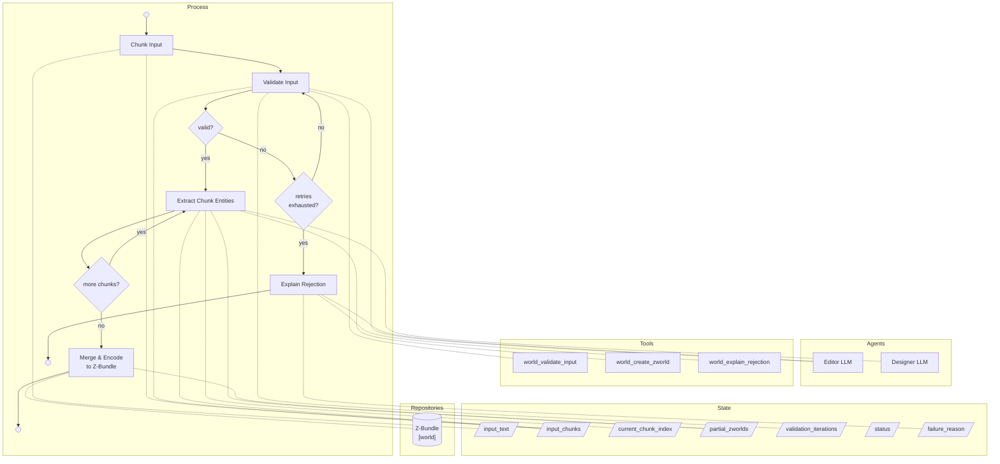

# World Generation Process

The following [Process](Processes.md) generates a [Z-World](Z-World.md) from an unstructured description of a fictional world, storing it as a [Z-Bundle](RAG%20and%20GRAG%20Implementation.md).

## Input

The user provides a large, unstructured text — typically a "world bible" or similar document describing a fictional world's characters, locations, events, and narrative conventions.

## Process Overview

1. A **Chunker** splits the input text into context-fitting segments before any LLM work begins.
2. An **Editor LLM** validates whether the input is a coherent fictional world description by examining the first chunk. If not, it retries up to a configured maximum, then fails with an explanation.
3. A **Designer LLM** extracts structured world data (characters, locations, events, mechanics, tropes, species, occupations, relationships, and a summary) from each chunk in turn, accumulating partial extractions in state.
4. After all chunks have been processed, a deterministic **Finalizer** merges the partial extractions (deduplicating by entity ID) and encodes the result into a **Z-Bundle** for later use in experience generation.

## Input Chunking

Because source documents (world bibles, lore documents) are often far larger than a local LLM's context window, the input is pre-processed by a **Chunker** node before any LLM interaction.

The Chunker splits the raw input into overlapping segments, each sized to fit within the LLM's available context. Split boundaries are chosen in priority order:

1. Paragraph boundary (`\n\n`) — preferred, preserves narrative coherence
2. Sentence boundary (`. `) — fallback when no paragraph boundary fits
3. Hard character cut — last resort when no natural boundary exists

An overlap of trailing context is carried into the next chunk so that sentences that span a boundary are not silently truncated.

The **Editor** validates only the first chunk — a representative sample sufficient to determine whether the document describes a fictional world. The **Designer** then processes each chunk in sequence, always annotating multi-chunk runs with the chunk index and total count so the LLM can use stable IDs for entities it has already seen.

### Implementation

Chunking is implemented in `chunk_text()` in [graph_utils.py](../src/zforge/graphs/graph_utils.py). The maximum characters per chunk is computed as:

```
max_chars = context_size_tokens × 0.55 × 4 chars/token
```

This reserves 45% of the context window for system and human prompt overhead. The overlap is fixed at 200 characters. At the default context size of 8 192 tokens this yields approximately 18 000 characters (~3 000 words) per chunk.

## LLM Prompts

### Editor
The Editor is a literature editor asked to determine whether the input is a clear description of a fictional world — one that meaningfully describes characters, their relationships, locations, and events. It calls `world_validate_input` with `valid=true` or `valid=false`.

### Designer
The Designer is given one chunk of the validated input per invocation and asked to produce a partial ZWorld. When processing a multi-chunk document it is instructed to use the same stable IDs for any entities already seen in earlier parts. The prompt instructs it to extract:

- **name**: display name of the world
- **summary**: 1–3 paragraphs describing the world in diegetic terms, suitable for helping a player understand the world at a glance
- **characters**: list, each with a stable ID, one or more names (each optionally qualified with context, e.g. `"formal name"`), and a narrative history
- **locations**: list at any granularity with narrative significance (broad regions AND specific buildings/landmarks); each with stable ID, name, description, and optional sublocations
- **events**: list of significant occurrences, each with a description and a time (literal date or relative, e.g. `"three years before the story begins"`)
- **mechanics**: rules or systems that distinguish how the world operates (e.g. `"magic exists and is divided between academic wizards and rural witches"`)
- **tropes**: recurring story elements and narrative style conventions (e.g. `"found family themes"`, `"long footnotes detailing world lore"`)
- **species**: non-default or notable species; omit if the world maps to Earth species
- **occupations**: real-world or world-specific occupations of narrative significance
- **relationships**: typed links between entity IDs (e.g., `character friends_with character`, `character present_at event`, `character is_a species`, `location inside_of location`)

## Merging and Finalizing

After the Designer has processed all chunks, the **Finalizer** node deterministically merges the accumulated partial extractions — no further LLM prompting is required. Merge rules:

- **Name and summary**: taken from the first (primary) partial.
- **Characters and locations**: deduplicated by stable entity ID; first occurrence wins.
- **Events**: deduplicated by the first 80 characters of the description.
- **Mechanics, tropes, species, occupations**: deduplicated by exact string value.
- **Relationships**: deduplicated by `(from_id, to_id, type)` triple.

The merged ZWorld is then encoded into a Z-Bundle as described below.

## Encoding to Z-Bundle

The encoding step is **deterministic** — no further LLM prompting is required once the Designer has produced structured output. Storage format and file locations are defined in [RAG and GRAG Implementation](RAG%20and%20GRAG%20Implementation.md).

### KVP Store
The title, slug (derived from the world name), UUID (generated), and summary (generated by the Designer) are written to the Z-Bundle's key-value store.

### Vector Store
Each entity in the Designer's output is treated as a single, self-contained **chunk** — i.e., chunking is entity-based rather than positional. There is no sliding-window or overlap splitting of the raw input. Each chunk is a short serialized natural-language description, for example:

- Character: `"Character: Granny Weatherwax. An elderly but formidable witch from Lancre, known for strong moral conviction and expertise in 'headology'."`
- Location: `"Location: Ankh-Morpork. A large, sprawling city-state on the Discworld, the largest city on the Sto Plains and home to the Unseen University."`

Each chunk is embedded using a **local embedding model** (see [Local LLM Execution](Local%20LLM%20Execution.md)) and stored in the vector store, along with metadata identifying the entity type and a stable entity ID.

> **Note:** A general "Encoding to Z-Bundle" spec should be extracted from this document if and when other processes require the same encoding pipeline.

### Property Graph
Relationships extracted by the Designer (e.g., `{character} friends_with {character}`, `{character} present_at {event}`) are written to the property graph. Each graph node references the corresponding vector store entry by its entity ID.

## Mermaid Diagram

Implements: [world_creation_graph.py](../src/zforge/graphs/world_creation_graph.py), [world_tools.py](../src/zforge/tools/world_tools.py)



## Implementation
The Editor and Designer use the configured local LLM (see [Local LLM Execution](Local%20LLM%20Execution.md)). Chunking parameters and context size defaults are defined in [graph_utils.py](../src/zforge/graphs/graph_utils.py) and [zforge_config.py](../src/zforge/models/zforge_config.py) respectively. The default context window is 8 192 tokens.
