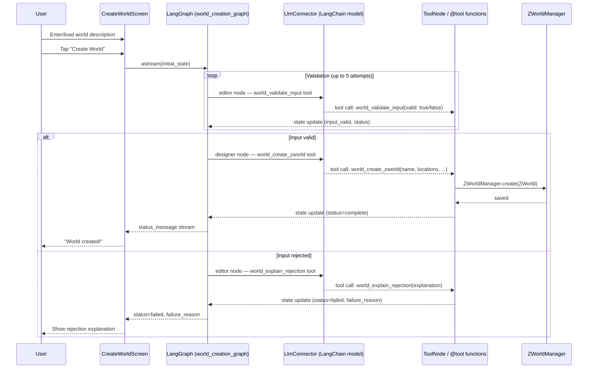

# World Creation Workflow
A ZWorld is generated from a plain-text description by the following process:

- A plain-text world description is provided, either by direct entry or by providing a Word or PDF file.
- A new CreateWorldProcess object is inserted into the ZForgeManager, thus exposing it to the MCP Server; this CreateWorldProcess is responsible for the following steps
- The configured LLM is given a system prompt of "You are a literature editor. You are to determine whether the following is a clear description of a fictional world, listing characters and their relationships with one another, locations, and events: {given description}", an action prompt to "evaluate the given world description", and a tool to answer yes or no by calling a function that sets InputValid = true or false on the CreateWorldProcess
- The above is repeated up to five times until the given answer is yes; InputValid will be set to null between attempts so that the true/false will be recognized as a change
- If the above has failed after five attempts, the user LLM will be asked to describe why the given text is inadequate or inappropriate; the user will then be shown a message indicating the failure and including the LLM's explanation; the world creation attempt then ends.
- If the above succeeds, the LLM will be given a system prompt of "You are a designer for an interactive fiction system. ZWorlds, used as the basis of your interactive fiction experiences, consist of the following: {zworld spec from ZWorld.md} Create a ZWorld from the following description of a fictional world: {given description}", an action prompt of "build the specified ZWorld", and a tool that calls the "create zworld" method on the ZForgeManager, which delegates it to the ZWorldManager
- The ZWorld is created in memory and saved to storage (configured folder on Mac/PC; application storage on mobile)
- The user is asked if they would like to [generate an experience]("Experience Generation.md") from this new world

## CreateWorldState
The state `TypedDict` for the world creation LangGraph graph has the following fields:
- **Inputs**: `input_text`: str — the plain-text world description
- **State**: `input_valid`: bool | None — result of last validation (None between attempts)
- **Counters**: `validation_iterations`: Annotated[int, operator.add] — attempts at validation (max 5); use `operator.add` reducer so tools return `1` to increment
- **Status**: `status`: str, `failure_reason`: str | None
- **Messages**: `messages`: Annotated[list, add_messages] — LangGraph message history; **must** use `add_messages` reducer from `langgraph.graph.message`

## CreateWorldState Status Values
- `"awaiting_validation"` — Initial state; LLM is evaluating input validity
- `"awaiting_generation"` — Input validated; LLM is generating ZWorld
- `"awaiting_rejection_explanation"` — Validation failed; LLM explaining rejection
- `"complete"` — ZWorld created successfully
- `"failed"` — Process failed (invalid input after 5 attempts, or generation error)

## LangGraph Tool Derivation
Per [Managers, Processes, and MCP Server](Managers,%20Processes,%20and%20MCP%20Server.md), implementation agents derive `@tool` functions from this specification:

| Tool | Called By | Accepts | Performs | Advances To |
|------|-----------|---------|----------|-------------|
| `world_validate_input` | LLM (Editor role) | valid: bool | Sets `input_valid`, increments counter | `awaiting_generation` (valid) or retry/`failed` |
| `world_create_zworld` | LLM (Designer role) | name, locations, characters, relationships, events | Creates ZWorld via ZWorldManager | `complete` |
| `world_explain_rejection` | LLM (Editor role) | explanation: str | Sets `failure_reason` | `failed` |

## Flow Diagram

```mermaid
flowchart TD
    A[User provides world description\ntext input or file] --> B[CreateWorldProcess.run]
    B --> C{LLM validates input\nattempt 1–5}
    C -- valid=true --> D[LLM generates ZWorld\nvia create_zworld tool]
    C -- valid=false / all attempts exhausted --> E[LLM explains rejection]
    E --> F[Show error to user\nworld creation ends]
    D --> G[world_create_zworld @tool\ncalls ZWorldManager.create()]
    G --> H[ZWorldManager saves .zworld file]
    H --> I[ZWorldEvent.created broadcast]
    I --> J[HomeScreen updates world list]
    J --> K[User prompted to\ncreate an experience]
```

## Sequence Diagram



## Implementation Files
- `src/zforge/graphs/world_creation_graph.py` — `build_create_world_graph()` LangGraph factory
- `src/zforge/graphs/state.py` — `CreateWorldState` TypedDict
- `src/zforge/tools/world_tools.py` — `@tool` functions
- `src/zforge/services/llm/llm_connector.py` — `LlmConnector` abstract base class
- `src/zforge/services/llm/openai_connector.py` — `OpenAiConnector`
- `src/zforge/services/mcp/zforge_mcp_server.py` — `ZForgeMcpServer` (external MCP interface)
- `src/zforge/managers/zworld_manager.py` — `ZWorldManager`
- `src/zforge/ui/screens/create_world_screen.py` — `CreateWorldScreen`
