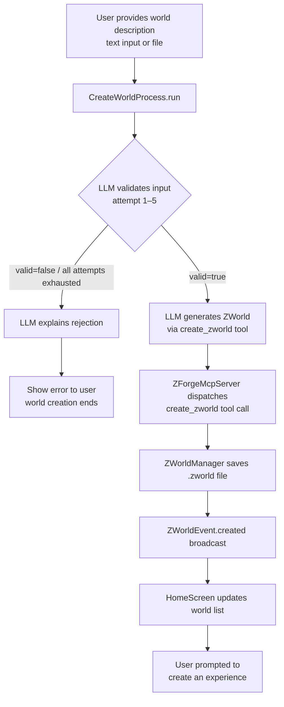
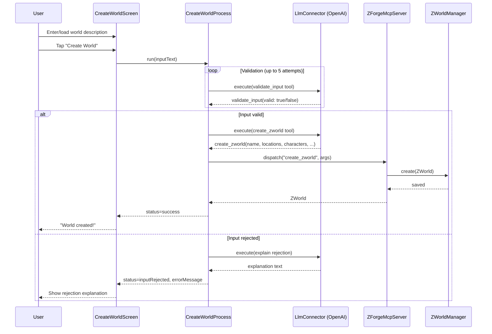

# World Creation Workflow
A ZWorld is generated from a plain-text description by the following process:

- A plain-text world description is provided, either by direct entry or by providing a Word or PDF file.
- A new CreateWorldProcess object is inserted into the ZForgeManager, thus exposing it to the MCP Server; this CreateWorldProcess is responsible for the following steps
- The configured LLM is given a system prompt of "You are a literature editor. You are to determine whether the following is a clear description of a fictional world, listing characters and their relationships with one another, locations, and events: {given description}", an action prompt to "evaluate the given world description", and a tool to answer yes or no by calling a function that sets InputValid = true or false on the CreateWorldProcess
- The above is repeated up to five times until the given answer is yes; InputValid will be set to null between attempts so that the true/false will be recognized as a change
- If the above has failed after five attempts, the user LLM will be asked to describe why the given text is inadequate or inappropriate; the user will then be shown a message indicating the failure and including the LLM's explanation; the world creation attempt then ends.
- If the above succeeds, the LLM will be given a system prompt of "You are a designer for an interactive fiction system. ZWorlds, used as the basis of your interactive fiction experiences, consist of the following: {zworld spec from ZWorld.md} Create a ZWorld from the following description of a fictional world: {given description}", an action prompt of "build the specified ZWorld", and a tool that calls the "create zworld" method on the ZForgeManager, which delegates it to the ZWorldManager
- The ZWorld is created in memory and saved to storage (configured folder on Mac/PC; application storage on mobile)
- The user is asked if they would like to [generate an experience]("Experience Generation.md") from this new world

## CreateWorldProcess State Machine
The process tracks its current state via a `status` enum:
- `awaitingValidation` — Initial state; LLM is evaluating input validity
- `awaitingGeneration` — Input validated; LLM is generating ZWorld
- `complete` — ZWorld created successfully
- `failed` — Process failed (invalid input after 5 attempts, or generation error)

## CreateWorldProcess Properties
- **Inputs**: `inputText`: String — the plain-text world description
- **State**: `inputValid`: bool? — result of last validation (null between attempts)
- **Counters**: `validationIterations`: int — attempts at validation (max 5)
- **Status**: `status`: CreateWorldStatus, `failureReason`: String?

## MCP Tool Derivation
Per [Managers, Processes, and MCP Server](Managers,%20Processes,%20and%20MCP%20Server.md), implementation agents derive MCP tools from this specification:

| Tool | Called By | Accepts | Performs | Advances To |
|------|-----------|---------|----------|-------------|
| `world_validate_input` | LLM (Editor role) | valid: bool | Sets `inputValid`, increments counter | `awaitingGeneration` (valid) or retry/`failed` |
| `world_create_zworld` | LLM (Designer role) | name, locations, characters, relationships, events | Creates ZWorld via ZWorldManager | `complete` |
| `world_explain_rejection` | LLM (Editor role) | explanation: String | Sets `failureReason` | `failed` |

## Flow Diagram

## Sequence Diagram

## Implementation Files
- `lib/processes/create_world_process.dart` — `CreateWorldProcess`
- `lib/services/llm/llm_connector.dart` — `LlmConnector` abstract class
- `lib/services/llm/openai_connector.dart` — `OpenAiConnector`
- `lib/services/mcp/zforge_mcp_server.dart` — `ZForgeMcpServer`
- `lib/services/managers/zworld_manager.dart` — `ZWorldManager`
- `lib/ui/screens/create_world_screen.dart` — `CreateWorldScreen`
