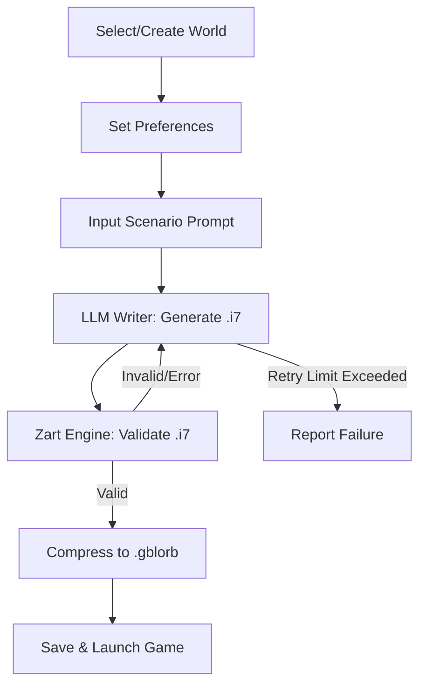

# World Creation Workflow
- **Input:** Plain-text world description (user or external source)
- **Process:** LLM parses and generates .zworld JSON
- **Output:** Structured .zworld file
- **Use Case:** Bootstrapping from summaries, e.g. Wikipedia

## 3. User Preferences
- Set directly or via quiz (Ultima "Virtues" style)
- **Preference Fields:**
  - `focus`: "plot" | "character" | "balanced"
  - `challenge_level`: integer (1-5)
  - `genre`: string (optional)
  - `mood`: string (optional)
- **Quiz:**
  - Shown on first launch
  - Can be skipped for manual setup
  - Example question: "Do you prefer solving puzzles or exploring character motivations?"

## 4. Scenario Generation & Game Flow

- **Step Details:**
  1. User selects or creates a World (.zworld)
  2. User sets preferences (direct or quiz)
  3. User provides scenario prompt (situation, genre, mood)
  4. LLM Writer receives:
     - World file
     - ZWorld and Inform format descriptions
     - User preferences
  5. Writer generates .i7 file (5-15 rooms)
  6. Zart engine validates .i7
     - If invalid, error is sent to Writer for repair (up to 10 times)
  7. Valid .i7 is compressed to .gblorb and saved
  8. Game starts automatically (default)

## 5. Gameplay Interface
- **Input:** One-line at bottom
- **Output:** Scrolling text above
- **Display:**
  - Game output: left-justified
  - Player input: right-justified (like chat, no bubbles)
  - Font: Veteran Typewriter or similar (monospace, typewriter aesthetic)
- **Save/Load:**
  - PC/Mac: main menu bar
  - Mobile/Web: hamburger menu left of input
  - User specifies save file name
- **Input Submission:**
  - "Return" key submits
  - Button with return/line feed icon also submits (right of input)
- **Accessibility:**
  - All controls keyboard-accessible
  - High-contrast and large-text modes recommended

## 6. Error Handling & Agentic Flow
- LLM Writer is prompted with error details if .i7 is invalid
- Retry up to 10 times, with error context each time
- On repeated failure, user is notified and can:
  - Edit prompt
  - Edit world
  - Retry

## 7. Extensibility & Future Directions
- **World Format:**
  - Allow for custom fields (e.g. magic systems, technology levels)
- **Preferences:**
  - Add more nuanced sliders (e.g. humor, darkness, pacing)
- **Game Output:**
  - Support for images, sound, and multimedia in Glulx
- **LLM Integration:**
  - Pluggable LLM backends
  - Fine-tuning for specific genres or worlds
