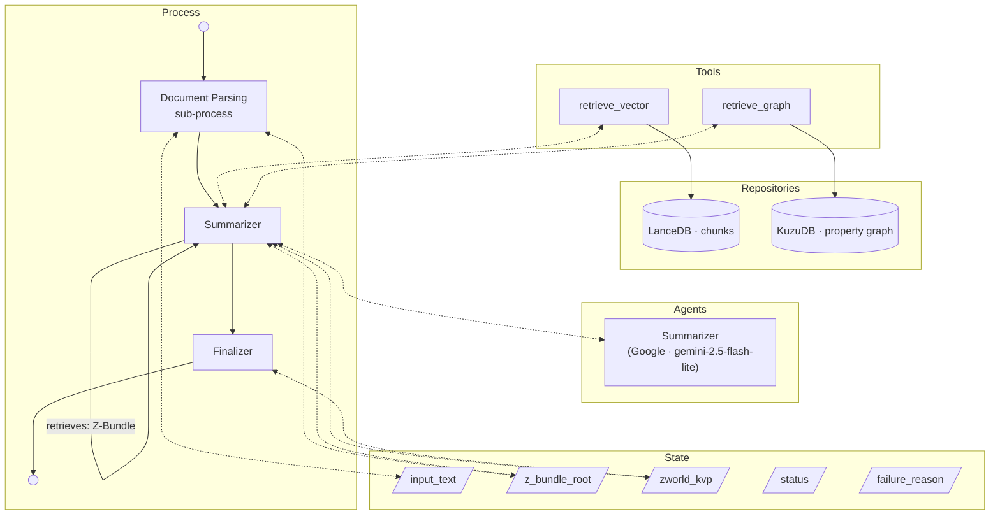

# World Generation Process
The following [Process](Processes.md) generates a [Z-World](Z-World.md) from an unstructured description of a fictional world, [parsing](Parsing%20Documents%20to%20Z-Bundles.md) it to a [Z-Bundle](RAG%20and%20GRAG%20Implementation.md).



## Input
The user provides a large, unstructured text — typically a "world bible" or similar document describing a fictional world's characters, locations, events, and narrative conventions.

## Pipeline
### Step 1: Document Parsing
The input text is run through the general [Document Parsing pipeline](Parsing%20Documents%20to%20Z-Bundles.md) (process slug: `document_parsing`), which populates the Z-Bundle's vector store and property graph.

This step uses the following `LLMGraphTransformer` configuration, derived directly from the [Z-World entity types](Z-World.md#vector) and [property graph edges](Z-World.md#property-graph):

**`allowed_nodes`:**
`Character`, `Location`, `Event`, `Faction`, `Artifact`, `Era`, `Culture`, `Deity`, `Prophecy`, `Concept`, `Mechanic`, `Trope`, `Species`, `Occupation`

**`allowed_relationships`:**
`friends_with`, `enemy_of`, `parent_of`, `mentor_of`, `present_at`, `born_in`, `member_of`, `leads`, `is_a`, `owns`, `seeks`, `subject_to`, `embodies`, `west_of`, `inside_of`, `controls`, `native_to`, `located_at`, `occurred_at`, `allied_with`, `at_war_with`, `caused`, `preceded`

### Step 2: LLM Node — Summarizer

After the hybrid data store is populated, an LLM node queries it to produce the KVP metadata for the Z-World (all KVP fields except `slug` and `uuid`, which are derived deterministically in Step 3). Default: `gemini-2.5-flash-lite` (Google).

The Summarizer LLM is given access to the Z-Bundle via **LangChain retriever tools** bound through the standard [LLM Abstraction Layer](LLM%20Abstraction%20Layer.md) tool-binding mechanism:
- A **vector retriever tool** backed by the LanceDB `chunks` table (semantic similarity search over entity text).
- A **graph retriever tool** backed by the KuzuDB property graph (structured lookup by entity type or name).

The LLM freely invokes these tools as needed before producing its final JSON output.

**Prompt (authoritative):**

> You are a junior script editor with access to a hybrid data store describing a fictional world. Look up appropriate details to produce the following information about the world in a JSON document:
> - `title`: the full display name of the world (e.g. "Discworld")
> - `summary`: 3–5 sentences describing the world in diegetic terms, suitable for helping a player understand the world at a glance
> - `setting_era`: a brief label for when the world is nominally set (e.g. "pre-industrial fantasy", "far future", "alternate 1920s")
> - `source_canon`: a list of source work titles — books, films, games — the world is drawn from
> - `content_advisories`: a list of thematic flags relevant to experience generation (e.g. "moderate violence", "political intrigue", "body horror")

**JSON schema (authoritative):** The Summarizer must return a single JSON object with exactly these keys, matching the [ZWorld](../src/zforge/models/zworld.py) object schema with `uuid` and `slug` omitted:

```json
{
  "title": "...",
  "summary": "...",
  "setting_era": "...",
  "source_canon": ["..."],
  "content_advisories": ["..."]
}
```

### Step 3: Finalisation (non-LLM)

A deterministic post-processing step takes the Summarizer's JSON output and:
1. Constructs a `ZWorld` object populated with `title`, `summary`, `setting_era`, `source_canon`, and `content_advisories`.
2. Derives the `slug` by converting the title to kebab-case (e.g. `"The Dragonet Prophecy"` → `"the-dragonet-prophecy"`).
3. Generates a fresh UUID for the world.
4. Writes all KVP fields (`title`, `summary`, `setting_era`, `source_canon`, `content_advisories`, `slug`, `uuid`) to the Z-Bundle KVP store (`kvp.json`).

## Implementation

Most parsing implementation details are covered in the [Document Parsing](Parsing%20Documents%20to%20Z-Bundles.md) spec.

- **Process slug:** `world_generation`
- **LLM nodes** (defined in `process_config.py`):
  - `summarizer` — Step 2 metadata extraction; default `Google` / `gemini-2.5-flash-lite`
- **Implementation file:** `src/zforge/graphs/world_creation_graph.py` (full rewrite)
- **`allowed_nodes` / `allowed_relationships`:** Listed in Step 1 above; authoritative source is [Z-World.md](Z-World.md).
- **`ZWorld` Python model** (`src/zforge/models/zworld.py`) — Replace the existing entity-heavy model (which holds `Character`, `Location`, `Event`, etc. as Python objects) with a simple KVP dataclass. All entity data is now stored in LanceDB and KuzuDB by the document-parsing pipeline; the Python object only represents the KVP fields:
  ```python
  @dataclass
  class ZWorld:
      title: str
      slug: str
      uuid: str
      summary: str
      setting_era: str = ""
      source_canon: list[str] = field(default_factory=list)
      content_advisories: list[str] = field(default_factory=list)
  ```
  Remove the `CharacterName`, `Character`, `Location`, `Event`, `Mechanic`, `Trope`, `Species`, `Occupation`, and `Relationship` dataclasses from this file.
- **`ZWorldManager.create()`** — Under this pipeline, the vector store and property graph are fully populated by the document-parsing step before `create()` is called. Therefore `create()` accepts only the `ZWorld` KVP object and the raw input text string; it writes `kvp.json` and `source.txt` to the bundle root and does **not** interact with LanceDB or KuzuDB. `ZWorldManager.__init__` still accepts an `EmbeddingConnector` so that `create()` can append `embedding_model_name` and `embedding_model_size_bytes` to `kvp.json` (required by the [Z-Bundle spec](RAG%20and%20GRAG%20Implementation.md)). `ZWorldManager.read()` returns KVP metadata only; `list_all()` and `check_embedding_mismatch()` are unchanged in behaviour. A full tidy of `ZWorldManager` (removing all now-superseded vector/graph write-and-read logic) is included in this build.
- **`CreateWorldState`** (in `src/zforge/graphs/state.py`) — Replace the old chunking/validation state with:
  ```python
  class CreateWorldState(TypedDict):
      input_text: str               # Raw source text (input)
      z_bundle_root: str | None     # Bundle path; set by the document-parsing sub-graph
      zworld_kvp: dict | None       # Summarizer JSON output; set by the summarizer node
      status: str                   # e.g. "parsing", "summarizing", "complete", "failed"
      status_message: str
      failure_reason: str | None
      messages: Annotated[list, add_messages]
  ```
