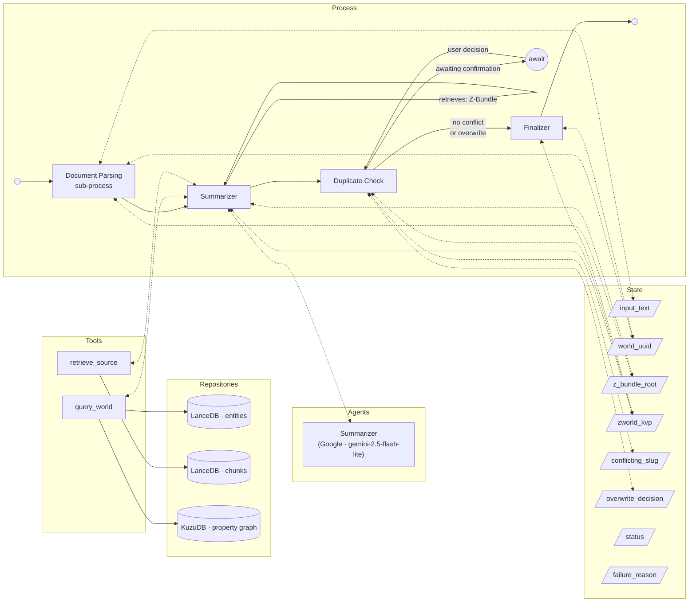

# World Generation Process
The following [Process](Processes.md) generates a [Z-World](Z-World.md) from an unstructured description of a fictional world, [parsing](Parsing%20Documents%20to%20Z-Bundles.md) it to a [Z-Bundle](RAG%20and%20GRAG%20Implementation.md).



## Input
The user provides a large, unstructured text — typically a "world bible" or similar document describing a fictional world's characters, locations, events, and narrative conventions.

## Pipeline
### Step 1: Document Parsing
The input text is run through the general [Document Parsing pipeline](Parsing%20Documents%20to%20Z-Bundles.md) (process slug: `document_parsing`), which populates the Z-Bundle's vector store and property graph.

The authoritative `allowed_nodes`, `allowed_relationships`, `relationship_properties`, and macro expansion table for this step are defined in [Z-World § Implementation](Z-World.md#implementation). The World Generation process passes these values directly to the Document Parsing pipeline; they must not be redefined here.

### Step 2: LLM Node — Summarizer

After the hybrid data store is populated, an LLM node queries it to produce the KVP metadata for the Z-World (all KVP fields except `slug` and `uuid`, which are derived deterministically in Step 3). Default: `gemini-2.5-flash-lite` (Google).

The Summarizer LLM is given access to the Z-Bundle via **LangChain retriever tools** bound through the standard [LLM Abstraction Layer](LLM%20Abstraction%20Layer.md) tool-binding mechanism:
- A **`query_world` tool** — returns matched entity summaries, 1-hop graph relationships, and optionally adjacent node summaries in a single call (see [Unified Entity Query](RAG%20and%20GRAG%20Implementation.md#unified-entity-query-query_world--primary-tool)). Primary tool for all entity and relationship lookups.
- A **`retrieve_source` tool** — returns raw verbatim source passages from the `chunks` table. For use when exact wording matters (see [Verbatim Source Retrieval](RAG%20and%20GRAG%20Implementation.md#verbatim-source-retrieval-retrieve_source)).

The LLM freely invokes these tools as needed before producing its final JSON output.

### Implementation

**Prompt (authoritative):**

> You are a junior script editor with access to a hybrid data store describing a fictional world. Look up appropriate details to produce the following information about the world in a JSON document:
> - `title`: the full display name of the world (e.g. "The Dragonet Prophecy")
> - `summary`: 3–5 sentences describing the world in diegetic terms, suitable for helping a player understand the world at a glance
> - `setting_era`: a brief label for when the world is nominally set (e.g. "pre-industrial fantasy", "far future", "alternate 1920s")
> - `source_canon`: a list of source work titles — books, films, games — the world is drawn from
> - `content_advisories`: a list of thematic flags relevant to experience generation (e.g. "moderate violence", "political intrigue", "body horror")
>
> Use the retriever tools to look up information before producing your final answer. DO NOT use information from these examples in your final output. ONLY use data retrieved via your tools. When you are ready, respond with ONLY a JSON object (no markdown fencing) with exactly these keys: title, summary, setting_era, source_canon, content_advisories.

**Hard-Won Knowledge: Local LLM Hallucinations**

When using local models (e.g. DeepSeek-R1-Distill-Qwen), there is a significant risk that the model will copy literal example text from the system prompt (e.g. "Discworld") into its output, especially if the retriever returns no results or if the prompt is insufficiently assertive. To prevent this:
1. **Avoid iconic examples**: Use less "sticky" examples or generic placeholders like "[World Name]".
2. **Explicitly forbid example usage**: Add a strict negative constraint ("DO NOT use...").
3. **Assertive Human Message**: Ensure the first user turn explicitly commands the model to use tools first before summarizing.

**JSON schema (authoritative):** The Summarizer must return a single JSON object with exactly these keys, matching the [ZWorld](../src/zforge/models/zworld.py) object schema with `uuid` and `slug` omitted:

```json
{
  "title": "...",
  "summary": "...",
  "setting_era": "...",
  "source_canon": ["..."],
  "content_advisories": ["..."]
}
```

### Step 3: Duplicate Check (non-LLM)

Before writing any output, the pipeline checks whether an existing world shares the same title as the newly summarised world. The check normalises both titles to kebab-case slugs and compares them; if a match is found and no user decision is recorded in the state yet (`overwrite_decision is None`), the graph sets `status = "awaiting_confirmation"` and exits.

`ZForgeManager.start_world_creation` senses the `awaiting_confirmation` status, invokes its `on_confirm_duplicate` async callback (provided by the UI), and re-invokes the graph with `overwrite_decision = "overwrite"` or `"cancel"`. Because `z_bundle_root` and `zworld_kvp` are already set in the resumed state, the document-parsing and summariser nodes early-exit without repeating their expensive work.

When invoked via `ZForgeManager.reindex_world`, `overwrite_decision` is pre-set to `"overwrite"` in the initial state, so the duplicate check falls through immediately without suspending.

If the decision is `"cancel"`, the pipeline completes with `status = "cancelled"` and the in-progress bundle is left in `worlds-in-progress/` for eventual clean-up. If the decision is `"overwrite"`, the existing world is deleted before the final move (see Step 4).

### Step 4: Finalisation (non-LLM)

A deterministic post-processing step takes the Summariser's JSON output and:
1. Constructs a `ZWorld` object populated with `title`, `summary`, `setting_era`, `source_canon`, and `content_advisories`.
2. Derives the `slug` by converting the title to kebab-case (e.g. `"The Dragonet Prophecy"` → `"the-dragonet-prophecy"`) — **unless `locked_slug` is set in state, in which case that value is used directly without derivation**. If `locked_title` is also set, it overrides the Summariser's `title` field in the final KVP.
3. Uses the UUID that was assigned at graph entry (stored in `world_uuid` state field) — no new UUID is generated here.
4. If `overwrite_decision == "overwrite"`, deletes the existing world bundle at `worlds/{conflicting_slug}/` before moving.
5. **Moves the in-progress Z-Bundle** from `worlds-in-progress/{uuid}/` to `worlds/{slug}/` (see [In-progress Z-Bundle path](#in-progress-z-bundle-path)).
6. Writes all KVP fields (`title`, `summary`, `setting_era`, `source_canon`, `content_advisories`, `slug`, `uuid`) to the Z-Bundle KVP store (`kvp.json`).

## Reindex World

The Reindex World feature re-runs the World Generation pipeline against the saved `raw.txt` of an existing Z-World, replacing it in place. The resulting world retains the same `slug` and `title` as the original; all other KVP fields (`summary`, `setting_era`, `source_canon`, `content_advisories`) are re-extracted fresh by the Summariser. The existing Z-Bundle (vector store, property graph, KVP) is fully replaced.

**Entry point:** `ZForgeManager.reindex_world(slug: str, on_progress: Callable[[str], None] | None = None) -> ZWorld | None` — no `on_confirm_duplicate` callback is needed.

**How it works:**
1. `ZForgeManager.reindex_world` reads `raw.txt` and `kvp.json` from the existing bundle at `worlds/{slug}/` via `ZWorldManager`. If the bundle does not exist, the method raises `ValueError`.
2. It invokes the world creation graph with:
   - `input_text` = contents of `raw.txt`
   - `locked_slug` = existing `slug`
   - `locked_title` = existing `title` from `kvp.json`
   - `overwrite_decision` = `"overwrite"` (pre-approved — no confirmation dialog)
3. The pipeline runs identically to a normal world creation through all four steps.
4. Step 3 (Duplicate Check) finds the existing world, but since `overwrite_decision` is already `"overwrite"`, proceeds immediately.
5. Step 4 (Finaliser) uses `locked_slug` and `locked_title` from state instead of deriving them from the Summariser output. The existing bundle is deleted and the new one moved into place.

## Implementation

Most parsing implementation details are covered in the [Document Parsing](Parsing%20Documents%20to%20Z-Bundles.md) spec.

- **Process slug:** `world_generation`
- **LLM nodes** (defined in `process_config.py`):
  - `summarizer` — Step 2 metadata extraction; default `Google` / `gemini-2.5-flash-lite`
- **Implementation file:** `src/zforge/graphs/world_creation_graph.py` (full rewrite)
- **`allowed_nodes` / `allowed_relationships`:** Listed in Step 1 above; authoritative source is [Z-World.md](Z-World.md).
- **`ZWorld` Python model** (`src/zforge/models/zworld.py`) — Replace the existing entity-heavy model (which holds `Character`, `Location`, `Event`, etc. as Python objects) with a simple KVP dataclass. All entity data is now stored in LanceDB and KuzuDB by the document-parsing pipeline; the Python object only represents the KVP fields:
  ```python
  @dataclass
  class ZWorld:
      title: str
      slug: str
      uuid: str
      summary: str
      setting_era: str = ""
      source_canon: list[str] = field(default_factory=list)
      content_advisories: list[str] = field(default_factory=list)
  ```
  Remove the `CharacterName`, `Character`, `Location`, `Event`, `Mechanic`, `Trope`, `Species`, `Occupation`, and `Relationship` dataclasses from this file.
- **`ZWorldManager.create()`** — Under this pipeline, the vector store and property graph are fully populated by the document-parsing step before `create()` is called. Therefore `create()` accepts only the `ZWorld` KVP object and the raw input text string; it writes `kvp.json` and `raw.txt` to the bundle root and does **not** interact with LanceDB or KuzuDB. `ZWorldManager.__init__` still accepts an `EmbeddingConnector` so that `create()` can append `embedding_model_name` and `embedding_model_size_bytes` to `kvp.json` (required by the [Z-Bundle spec](RAG%20and%20GRAG%20Implementation.md)). `ZWorldManager.read()` returns KVP metadata only; `list_all()` and `check_embedding_mismatch()` are unchanged in behaviour. A full tidy of `ZWorldManager` (removing all now-superseded vector/graph write-and-read logic) is included in this build.
- **`CreateWorldState`** (in `src/zforge/graphs/state.py`) — Replace the old chunking/validation state with:
  ```python
  class CreateWorldState(TypedDict):
      input_text: str               # Raw source text (input)
      world_uuid: str | None        # Assigned at graph entry; stable across resume
      z_bundle_root: str | None     # worlds-in-progress/{uuid}/ until finalised
      zworld_kvp: dict | None       # Summarizer JSON output; set by the summarizer node
      conflicting_slug: str | None  # Set by duplicate_check if same-title world exists
      overwrite_decision: str | None  # "overwrite" | "cancel" | None
      locked_slug: str | None       # If set, Finalizer uses this slug instead of deriving from title (reindex)
      locked_title: str | None      # If set, Finalizer uses this title instead of LLM output (reindex)
      status: str                   # e.g. "parsing", "summarizing", "awaiting_confirmation", "complete", "cancelled", "failed"
      status_message: str
      failure_reason: str | None
      messages: Annotated[list, add_messages]
  ```

- **Async nodes required:** `document_parsing_node` and `summarizer_node` must be `async def` and use `await parsing_graph.ainvoke(...)` / `await bound_model.ainvoke(...)`. See the [Document Parsing async pitfall note](Parsing%20Documents%20to%20Z-Bundles.md#async-nodes-required--afc-deadlock-pitfall) for the full explanation — the same AFC deadlock applies here.

### In-progress Z-Bundle path

**Why it exists:** The canonical slug is derived from the LLM-generated title (Step 2), but the vector store and property graph must be written during Step 1 — before the title is known. This is resolved by writing to a stable, UUID-keyed holding directory and moving to the final location only at the very end.

**How it works:**
1. At entry to the `document_parsing_node`, a UUID is generated (`world_uuid = str(uuid.uuid4())`) and stored in `CreateWorldState.world_uuid`. The full Z-Bundle path (`<bundles_root>/worlds-in-progress/<uuid>/`) is stored in `CreateWorldState.z_bundle_root`.
2. All document-parsing writes (LanceDB vector store, KuzuDB property graph) target this in-progress path.
3. In the Finaliser, once the canonical slug has been derived from the title, `os.rename(<in_progress_path>, <final_path>)` moves the bundle to `<bundles_root>/world/<slug>/`. `z_bundle_root` in state is updated to the final path before `ZWorldManager.create()` is invoked.

**Resume on duplicate confirmation:** When the graph is re-invoked after a duplicate confirmation, `z_bundle_root` is already set in the initial state. The `document_parsing_node` detects this and skips immediately; the summariser does the same when `zworld_kvp` is already set. This avoids reprocessing the document for the second graph invocation.
